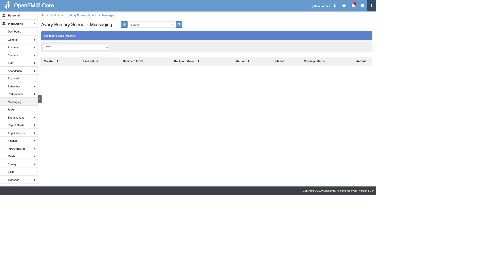

# OpenEMIS Alerts — Administrator Manual

This manual is the authoritative reference for the OpenEMIS Core Alerts module, introduced and extended under POCOR-9509. It covers every alert type, every configuration option, and every operational procedure an administrator requires. Use the table of contents to navigate directly to the section relevant to your task. Worked examples and troubleshooting decision trees are provided throughout for rapid resolution of common issues.

---

## Table of Contents

1. [Introduction](#1-introduction)
   - [1.1 What the Alerts Module Does](#11-what-the-alerts-module-does)
   - [1.2 Who Should Read This Manual](#12-who-should-read-this-manual)
   - [1.3 What Is New in POCOR-9509](#13-what-is-new-in-pocor-9509)
   - [1.4 How to Read This Manual](#14-how-to-read-this-manual)
2. [Architecture at a Glance](#2-architecture-at-a-glance)
   - [2.1 The Five-Stage Pipeline](#21-the-five-stage-pipeline)
   - [2.2 Event-Based vs. Scheduled Alerts](#22-event-based-vs-scheduled-alerts)
   - [2.3 The Two Dispatch Paths](#23-the-two-dispatch-paths)
   - [2.4 Database Tables Involved](#24-database-tables-involved)
3. [Navigation and UI](#3-navigation-and-ui)
   - [3.1 Module Location](#31-module-location)
   - [3.2 The Four Screens](#32-the-four-screens)
   - [3.3 Permissions](#33-permissions)
4. [Managing Alert Schedules](#4-managing-alert-schedules)
   - [4.1 The Alert Types List](#41-the-alert-types-list)
   - [4.2 Frequency Options](#42-frequency-options)
   - [4.3 Starting and Stopping an Alert](#43-starting-and-stopping-an-alert)
   - [4.4 Why "Never" Is the Safe Default](#44-why-never-is-the-safe-default)
5. [Alert Rules — Configuring What to Send](#5-alert-rules--configuring-what-to-send)
   - [5.1 Rule Anatomy](#51-rule-anatomy)
   - [5.2 Creating a Rule](#52-creating-a-rule)
   - [5.3 Editing and Deleting a Rule](#53-editing-and-deleting-a-rule)
   - [5.4 Multiple Rules per Alert Type](#54-multiple-rules-per-alert-type)
   - [5.5 Rule Conditions That Stop Execution](#55-rule-conditions-that-stop-execution)
6. [Placeholders](#6-placeholders)
   - [6.1 Placeholder Syntax](#61-placeholder-syntax)
   - [6.2 Common Tokens](#62-common-tokens)
   - [6.3 Student Tokens](#63-student-tokens)
   - [6.4 Staff and User Tokens](#64-staff-and-user-tokens)
   - [6.5 Case Tokens](#65-case-tokens)
   - [6.6 License Tokens](#66-license-tokens)
   - [6.7 Scholarship Tokens](#67-scholarship-tokens)
   - [6.8 System Update Tokens](#68-system-update-tokens)
   - [6.9 Behaviour When a Placeholder Is Null or Missing](#69-behaviour-when-a-placeholder-is-null-or-missing)
7. [Thresholds](#7-thresholds)
   - [7.1 Threshold Formats Overview](#71-threshold-formats-overview)
   - [7.2 The `value` Field](#72-the-value-field)
   - [7.3 The `condition` Field](#73-the-condition-field)
   - [7.4 Workflow-Step Thresholds](#74-workflow-step-thresholds)
   - [7.5 Category and Type Filters](#75-category-and-type-filters)
   - [7.6 Creating Paired Before/After Rules](#76-creating-paired-beforeafter-rules)
8. [Alert Types Reference](#8-alert-types-reference)
   - [8.1 Student Absence](#81-student-absence)
   - [8.2 Student Admission](#82-student-admission)
   - [8.3 Student Enrolment](#83-student-enrolment)
   - [8.4 Student Status Change](#84-student-status-change)
   - [8.5 Retirement Warning](#85-retirement-warning)
   - [8.6 Staff Employment End](#86-staff-employment-end)
   - [8.7 Staff Leave End](#87-staff-leave-end)
   - [8.8 Staff Type](#88-staff-type)
   - [8.9 License Validity](#89-license-validity)
   - [8.10 License Renewal](#810-license-renewal)
   - [8.11 Scholarship Application](#811-scholarship-application)
   - [8.12 Scholarship Disbursement](#812-scholarship-disbursement)
   - [8.13 Case Escalation](#813-case-escalation)
   - [8.14 System Updates](#814-system-updates)
   - [8.15 Staff Attendance — Not Implemented](#815-staff-attendance--not-implemented)
9. [Workflow-Triggered Alerts](#9-workflow-triggered-alerts)
   - [9.1 How Workflow Alerts Differ from Rule-Based Alerts](#91-how-workflow-alerts-differ-from-rule-based-alerts)
   - [9.2 Conditions That Suppress a Workflow Alert](#92-conditions-that-suppress-a-workflow-alert)
   - [9.3 Setting Up a Workflow Alert](#93-setting-up-a-workflow-alert)
10. [Alert Queue — Delivery Pipeline](#10-alert-queue--delivery-pipeline)
    - [10.1 Purpose of the Queue Screen](#101-purpose-of-the-queue-screen)
    - [10.2 Queue Columns](#102-queue-columns)
    - [10.3 Status Codes](#103-status-codes)
    - [10.4 Mass Deleting Queue Items](#104-mass-deleting-queue-items)
    - [10.5 Queue Lifecycle Diagram](#105-queue-lifecycle-diagram)
11. [Alert Logs — Audit Trail](#11-alert-logs--audit-trail)
    - [11.1 Purpose of Alert Logs](#111-purpose-of-alert-logs)
    - [11.2 Deduplication via SHA-256 Checksums](#112-deduplication-via-sha-256-checksums)
    - [11.3 Viewing and Deleting Single Log Entries](#113-viewing-and-deleting-single-log-entries)
    - [11.4 Mass Deleting Log Entries](#114-mass-deleting-log-entries)
12. [Messaging — Institution-Level](#12-messaging--institution-level)
    - [12.1 Difference Between Alerts and Messaging](#121-difference-between-alerts-and-messaging)
    - [12.2 Composing a Message](#122-composing-a-message)
    - [12.3 Message History](#123-message-history)
13. [Operational Configuration](#13-operational-configuration)
    - [13.1 Configuration Keys](#131-configuration-keys)
    - [13.2 Throttling via ALERTS_PROCESS_LIMIT](#132-throttling-via-alerts_process_limit)
    - [13.3 Restricting Dispatch to Working Hours](#133-restricting-dispatch-to-working-hours)
    - [13.4 Respecting Local Weekends](#134-respecting-local-weekends)
    - [13.5 Cron Setup](#135-cron-setup)
14. [Testing and Dry-Run Procedures](#14-testing-and-dry-run-procedures)
    - [14.1 Running a Command Directly](#141-running-a-command-directly)
    - [14.2 Checking the Queue and System Processes](#142-checking-the-queue-and-system-processes)
    - [14.3 Populating Missing Emails and Phone Numbers (Dev/Test Databases Only)](#143-populating-missing-emails-and-phone-numbers-devtest-databases-only)
    - [14.4 Verifying Database Is Anonymised](#144-verifying-database-is-anonymised)
    - [14.5 Force-Running All Scheduled Alerts Now](#145-force-running-all-scheduled-alerts-now)
15. [Troubleshooting](#15-troubleshooting)
    - [15.1 Alert Fired but No Email Received](#151-alert-fired-but-no-email-received)
    - [15.2 Alert Rule Enabled but Never Fires](#152-alert-rule-enabled-but-never-fires)
    - [15.3 Workflow Alert Not Firing](#153-workflow-alert-not-firing)
    - [15.4 Duplicate Alerts in Queue](#154-duplicate-alerts-in-queue)
    - [15.5 Mass Delete Does Not Remove All Selected Rows](#155-mass-delete-does-not-remove-all-selected-rows)
    - [15.6 Queue Backing Up — Messages Not Sending](#156-queue-backing-up--messages-not-sending)
    - [15.7 Reading the Command Log Files](#157-reading-the-command-log-files)
16. [Appendices](#16-appendices)
    - [A. Full Artisan Command Reference](#a-full-artisan-command-reference)
    - [B. Three Command-Maps Checklist](#b-three-command-maps-checklist)
    - [C. SQL Reference Queries](#c-sql-reference-queries)
    - [D. Glossary](#d-glossary)
    - [E. Further Reading](#e-further-reading)

---

## 1. Introduction

### 1.1 What the Alerts Module Does

The OpenEMIS Alerts module delivers automated notifications to school and ministry staff when critical conditions arise. Notifications are dispatched by email, SMS, or both, depending on the rule configuration. Examples of monitored conditions include a student accumulating more than a configured number of absence days, a staff contract reaching its end date, a professional license approaching expiry, a scholarship application deadline drawing near, and an unresolved case exceeding its escalation threshold. The module operates continuously without manual intervention once configured, and maintains a permanent audit trail of every message sent.

### 1.2 Who Should Read This Manual

This manual is intended for three audiences. Ministry IT administrators who deploy and maintain the OpenEMIS installation will find the architecture, configuration, and troubleshooting sections most relevant. Senior system managers responsible for communications policy will use the alert types reference and the rules configuration sections. Deployment engineers performing initial activation will follow the operational configuration and testing sections. All three audiences will benefit from reading §2 and §8 before working on specific tasks.

### 1.3 What Is New in POCOR-9509

POCOR-9509 delivers the following changes to the alerts infrastructure:

- **Five new alert types**: Case Escalation, License Validity, License Renewal, Scholarship Application, and Scholarship Disbursement. Each is documented in full in §8.
- **Alert Queue screen**: a new screen under Administration → Communications → Alert Queue provides real-time visibility into the delivery pipeline status for every pending, sent, and failed message.
- **Mass delete for Alert Logs and Alert Queue**: administrators can now select multiple records and delete them in a single operation, enabling rapid cleanup after a misconfigured rule produces unwanted queue entries.
- **Laravel-based command runtime**: all alert processing has been ported from CakePHP shell scripts to clean Laravel artisan commands under `api/app/Console/Commands/Alerts/`. This provides consistent error handling, process tracking, and testability.
- **Throttling via `ALERTS_PROCESS_LIMIT`**: a single `.env` variable controls the maximum number of messages processed per scheduler run, enabling administrators to prevent overspam without touching code.

### 1.4 How to Read This Manual

This manual is structured for scanning, not linear reading. Reference tables appear at the top of each major section for quick lookup. Worked examples follow the reference tables for readers who learn by example. The troubleshooting section (§15) uses a symptom-first decision-tree format — navigate directly to the symptom heading, then follow the numbered checks in order. For any single alert type, go to §8 and find the corresponding H3; each entry is self-contained and includes its trigger, threshold, recipients, placeholders, a worked example, and the exact artisan command for testing.

---

## 2. Architecture at a Glance

### 2.1 The Five-Stage Pipeline

All alert delivery passes through the following five stages, regardless of whether the alert is event-based or scheduled:

```
┌───────────────┐     ┌─────────────┐     ┌──────────────┐     ┌───────────┐     ┌──────────┐
│   1. Trigger  │────►│ 2. Rule     │────►│ 3. Data      │────►│ 4. Queue  │────►│ 5. Deliv-│
│               │     │    Match    │     │    Query     │     │           │     │    ery   │
│ afterSave /   │     │             │     │              │     │           │     │          │
│ cron job      │     │ alert_rules │     │ getPending   │     │ alert_    │     │ Email /  │
│               │     │ lookup      │     │ Items()      │     │ queue     │     │ SMS      │
└───────────────┘     └─────────────┘     └──────────────┘     └───────────┘     └──────────┘
```

**Stage 1 — Trigger:** A domain event fires (a record is saved in CakePHP) or the scheduler invokes `alerts:check` on a timed cycle.

**Stage 2 — Rule Match:** The system loads all `alert_rules` records whose `feature` matches the triggering alert type. Rules marked `Enabled = No` are skipped.

**Stage 3 — Data Query:** The artisan command calls `getPendingItems()` to fetch the records that satisfy the threshold condition. For each record, `fillPlaceholders()` builds a personalised message from the template.

**Stage 4 — Queue:** The command calls `processContactList()` for each resolved recipient. A SHA-256 checksum of the subject and message body is computed. If an identical checksum already exists in `alert_logs` with status `PENDING`, the item is silently skipped. Otherwise, a row is inserted into `alert_queue`.

**Stage 5 — Delivery:** The `alerts:send` command, run every minute by the Laravel scheduler, reads `alert_queue` rows with status `PROCESSING` and dispatches them to the mail service (SMTP) or SMS gateway (Twilio). Status is updated to `SENT` or `FAILED` on completion.

### 2.2 Event-Based vs. Scheduled Alerts

| Property | Event-Based | Scheduled |
|----------|-------------|-----------|
| Trigger source | CakePHP model `afterSave()` callback | `alerts:check` cron command |
| Frequency in UI | `Once` (fires per triggering event) | `Daily`, `Weekly`, or `Monthly` |
| Latency | Near-real-time (seconds after save) | Up to one scheduling cycle |
| Start/Stop in UI | Not applicable — fires from data events | Controlled by frequency setting |
| Examples | Student Absence, Admission, Enrolment, Status Change | Retirement Warning, License Validity, Case Escalation |

### 2.3 The Two Dispatch Paths

| Path | Trigger | Commands |
|------|---------|---------|
| **Event-based** | CakePHP model `afterSave` → `AlertLogsTable::triggerLaravelAlertFromCakePHP()` | `alerts:student-absence`, `alerts:student-admission`, `alerts:student-enrolment`, `alerts:student-status-change` |
| **Scheduled** | `alerts:check` (cron or manual) | `alerts:retirement-warning`, `alerts:staff-employment`, `alerts:staff-leave`, `alerts:staff-type`, `alerts:system-updates`, `alerts:case-escalation`, `alerts:license-validity`, `alerts:license-renewal`, `alerts:scholarship-application`, `alerts:scholarship-disbursement` |

### 2.4 Database Tables Involved

| Table | Role in the pipeline |
|-------|----------------------|
| `alerts` | One row per alert type; stores frequency and enabled status |
| `alert_rules` | One or more rows per alert type; stores threshold, roles, subject, message |
| `alert_queue` | Transient delivery rows; status `0` (pending), `1` (sent), `-1` (failed) |
| `alert_logs` | Permanent audit trail; one row per dispatched message with SHA-256 checksum |
| `alert_logs_roles` | Junction table linking `alert_logs` to `security_roles` |
| `security_groups` | Role-based user groupings for recipient resolution |
| `security_group_users` | Membership of users in security groups |
| `security_users` | Contact records; `email` and `mobile_number` fields drive delivery |
| `system_processes` | One row per artisan command execution; stores status and log file path |

---

## 3. Navigation and UI

### 3.1 Module Location

The Alerts module is located under **Administration → Communications** in the left sidebar. All alert-related screens share this parent path.

### 3.2 The Four Screens

**Screenshot 3.1** — The Alerts list showing all registered alert types.


| Screen | Path | Purpose |
|--------|------|---------|
| **Alerts** | Administration → Communications → Alerts | Enable or disable each alert type; set frequency |
| **Alert Rules** | Administration → Communications → Alert Rules | Create, edit, and delete alert rules |
| **Alert Logs** | Administration → Communications → Alert Logs | View the permanent audit trail of all dispatched notifications |
| **Alert Queue** | Administration → Communications → Alert Queue | Monitor and manage pending, sent, and failed delivery items |

### 3.3 Permissions

Three permission levels control access to alert administration:

| Level | Capabilities | Configuration |
|-------|-------------|---------------|
| Full access | View, create, edit, delete alerts, rules, logs, and queue items | Security → Roles → assign all alert-related `_view`, `_add`, `_edit`, `_delete` functions |
| Execute only | View and run alerts; cannot create or delete rules | Assign `_view` and `_execute` without `_add`, `_edit`, `_delete` |
| View only | Read-only access to all four screens | Assign `_view` functions only |

Configure permissions at **Security → Roles**, then assign roles to users at **Security → Users**.

---

## 4. Managing Alert Schedules

### 4.1 The Alert Types List

**Screenshot 4.1** — The Alerts list with frequency column and status indicators.


The Alerts screen lists every alert type registered in the system. Each row displays the alert name, current frequency, and running status. Rows for event-based alerts show frequency `Once` and do not have Start/Stop controls, because they fire automatically on data changes rather than on a schedule.

### 4.2 Frequency Options

| Option | Behaviour |
|--------|-----------|
| `Never` | Completely disabled; no alerts fire regardless of rule configuration |
| `Once` | Fires once per triggering event; used exclusively by event-based alerts |
| `Daily` | Runs at most once per calendar day per matching record |
| `Weekly` | Runs at most once per 7-day period per matching record |
| `Monthly` | Runs at most once per calendar month per matching record |

> **Note:** `SystemUpdates` is the only alert type that ships with `Daily` as its default frequency. All other alert types default to `Never`.

### 4.3 Starting and Stopping an Alert

To enable a scheduled alert:

1. Navigate to **Administration → Communications → Alerts**.
2. Click **View** on the alert type you want to enable.
3. Verify that the frequency is set to `Daily`, `Weekly`, or `Monthly`.
4. Click **Start** in the Action Bar.

To disable the alert, open the same record and click **Stop**. The alert type reverts to a stopped state but retains its frequency setting. No existing rules are deleted.

> **Note:** Event-based alert types (Student Absence, Student Admission, Student Enrolment, Student Status Change) do not display Start/Stop controls. They fire automatically when their triggering records are saved. To disable them, set the frequency to `Never`.

### 4.4 Why "Never" Is the Safe Default

All alert types except `SystemUpdates` default to `Never`. This prevents accidental alert delivery on new installations or after migrations where rules may not yet be configured. Before setting any alert type to `Daily` or `Weekly`, confirm that at least one enabled rule exists for it and that the threshold and recipient roles are correctly configured.

---

## 5. Alert Rules — Configuring What to Send {#alert-rules-configuring-what-to-send}

### 5.1 Rule Anatomy

**Screenshot 5.1** — The Alert Rules list showing all configured rules.


Each alert rule record contains the following fields:

| Field | Type | Purpose |
|-------|------|---------|
| **Name** | Text | A descriptive label for this rule; make it unique when multiple rules share the same feature |
| **Enabled** | Yes/No | Disabled rules never execute, regardless of alert frequency |
| **Feature** | Select | The alert type this rule governs; must match the exact feature key (see §8) |
| **Method** | Select | `Email`, `SMS`, or both |
| **Threshold** | Text/JSON | The condition defining which records qualify; format varies by alert type (see §7) |
| **Security Roles** | Multi-select | The roles whose members receive this notification |
| **Subject** | Text | The notification subject line; supports `${placeholder}` tokens |
| **Message** | Text | The notification body; supports `${placeholder}` tokens |

### 5.2 Creating a Rule

**Screenshot 5.2** — The Add Alert Rule form with all fields visible.


1. Navigate to **Administration → Communications → Alert Rules**.
2. Click **Add** in the Action Bar.
3. Enter a descriptive **Name** for the rule.
4. Set **Enabled** to `Yes`.
5. Select the **Feature** (alert type) from the dropdown.
6. Select the **Method**: `Email`, `SMS`, or both.
7. Enter the **Threshold** in the format required by the selected feature (see §7 and §8).
8. Select one or more **Security Roles** whose members will receive the notification.
9. Enter the **Subject** template, using `${placeholder}` tokens where appropriate.
10. Enter the **Message** template, using `${placeholder}` tokens where appropriate.
11. Click **Save**.

> **Important:** All of the following fields are required: Method, Security Roles, Threshold (for alert types that use it), Subject, and Message. Saving a rule with missing required fields will produce a validation error.

### 5.3 Editing and Deleting a Rule

**Screenshot 5.3** — The Edit Alert Rule form showing a Case Escalation rule.


To edit an existing rule, navigate to **Alert Rules**, click **View** on the target rule, then click **Edit** in the Action Bar. Modify any field and click **Save**.

To delete a rule, open the rule record and click **Delete** in the Action Bar. Deletion is permanent. Associated `alert_logs` records are retained for audit purposes.

> **Important:** Deleting the only rule for an alert type effectively disables that alert type. No deletion confirmation references associated log entries — verify the rule is no longer needed before deleting.

### 5.4 Multiple Rules per Alert Type

This is the most important configuration concept in the alerts module. A single alert type can have any number of rules, each with a different threshold, different recipient roles, and a different message. The rules execute independently — a single record may match several rules on the same day.

**Example 1 — License Validity: four-layer escalation strategy**

| Rule Name | Threshold | Frequency | Roles | Purpose |
|-----------|-----------|-----------|-------|---------|
| License Validity — 60 Days | `{"value": 60, "license_type": 3, "condition": 1}` | Weekly | HR Officer | Early planning horizon |
| License Validity — 30 Days | `{"value": 30, "license_type": 3, "condition": 1}` | Daily | HR Officer, Principal | Active reminder phase |
| License Validity — 7 Days | `{"value": 7, "license_type": 3, "condition": 1}` | Daily | HR Officer, Principal, District HR | Urgent pre-expiry escalation |
| License Validity — Expired | `{"value": 7, "license_type": 3, "condition": 2}` | Daily | HR Officer, Principal, District HR, Ministry | Post-expiry compliance alert |

A staff member with a license expiring in 5 days triggers all three pre-expiry rules simultaneously. Once the license has expired, the post-expiry rule activates. All four rules share the same `LicenseValidity` feature key.

**Example 2 — Case Escalation: tiered management notification**

| Rule Name | Threshold | Roles | Purpose |
|-----------|-----------|-------|---------|
| Case Escalation — 3 Days | `{"value": 3, "workflow_steps": [12]}` | Principal | Immediate nudge to case owner |
| Case Escalation — 7 Days | `{"value": 7, "workflow_steps": [12]}` | Principal, Coordinator | Standard escalation path |
| Case Escalation — 21 Days | `{"value": 21, "workflow_steps": [12]}` | Principal, District Officer, Ministry | Critical escalation to senior management |

A case that is 25 days old triggers all three rules on the same day and continues to do so every day until the case status changes.

### 5.5 Rule Conditions That Stop Execution

A rule does not execute if any of the following conditions apply:

| Condition | Effect |
|-----------|--------|
| `Enabled = No` on the rule | Rule is skipped entirely during processing |
| Alert type frequency set to `Never` | No rules for that alert type execute |
| Threshold JSON is malformed or unparseable | Rule is silently skipped; check logs |
| No Security Roles assigned | No recipients can be resolved; no messages are queued |
| No `security_users` records match the assigned roles | No messages are queued; this is not an error |

---

## 6. Placeholders

### 6.1 Placeholder Syntax

Placeholders use the format `${entity.field}`. They are case-sensitive. A placeholder is replaced at message generation time with the corresponding value from the resolved data record. If a placeholder token is not recognised or the field value is null, the token is left as a literal string in the output — it is not removed silently.

The same placeholder tokens appear identically in subject and message templates.

### 6.2 Common Tokens

| Token | Example Value | Source |
|-------|--------------|--------|
| `${institution.name}` | `Sunrise Academy` | `institutions.name` |
| `${institution.code}` | `SA-001` | `institutions.code` |
| `${institution.address}` | `12 Education Street` | `institutions.address` |
| `${institution.phone}` | `+1-555-0100` | `institutions.telephone` |
| `${days.remaining}` | `14` | Computed: `ABS(DATEDIFF(NOW(), target_date))` |

### 6.3 Student Tokens

| Token | Example Value | Source |
|-------|--------------|--------|
| `${student.name}` | `Ali Hassan` | Concatenated first + last name |
| `${student.openemis_no}` | `OE-20241001` | `security_users.openemis_no` |
| `${student.first_name}` | `Ali` | `security_users.first_name` |
| `${student.middle_name}` | `Mohammed` | `security_users.middle_name` |
| `${student.last_name}` | `Hassan` | `security_users.last_name` |
| `${student.date_of_birth}` | `2010-05-14` | `security_users.date_of_birth` |
| `${student.gender}` | `Male` | `genders.name` |
| `${student.nationality}` | `Jordanian` | `nationalities.name` |
| `${student.identity_number}` | `A123456` | `security_users.identity_number` |
| `${student.identity_type}` | `National ID` | `identity_types.name` |
| `${student.status}` | `Enrolled` | `student_statuses.name` |
| `${total.days}` | `5` | Aggregated absence count in period |
| `${total.times}` | `7` | Aggregated absence occurrence count |
| `${admission.status}` | `Approved` | Workflow step name |
| `${enrolment.status}` | `Enrolled` | Workflow step name |

### 6.4 Staff and User Tokens

| Token | Example Value | Source |
|-------|--------------|--------|
| `${staff.name}` | `Fatima Al-Rashid` | Concatenated name from `security_users` |
| `${staff.openemis_no}` | `OE-ST-20190012` | `security_users.openemis_no` |
| `${staff_type.name}` | `Permanent` | `staff_types.name` |
| `${employment.type}` | `Contract` | `staff_position_types.name` |
| `${status.date}` | `2026-06-30` | `institution_staff.end_date` |
| `${end.date}` | `2026-06-30` | `institution_staff.end_date` |
| `${staff_leave.type}` | `Annual Leave` | `staff_leave_types.name` |
| `${leave.start}` | `2026-08-01` | `staff_leaves.date_from` |
| `${leave.end}` | `2026-08-10` | `staff_leaves.date_to` |
| `${retirement.date}` | `2027-01-01` | Computed from `security_users.date_of_birth` |

### 6.5 Case Tokens

| Token | Example Value | Source |
|-------|--------------|--------|
| `${case.reference}` | `CASE-2026-0042` | `institution_cases.case_number` |
| `${case.status}` | `Open` | Workflow step name |
| `${escalation.reason}` | `Unresolved for 7 days` | Generated by alert command |
| `${assignee.name}` | `Noor Ibrahim` | Resolved from `institution_cases.assignee_id` |

### 6.6 License Tokens

| Token | Example Value | Source |
|-------|--------------|--------|
| `${license.type}` | `Teaching License` | `license_types.name` |
| `${license.number}` | `LIC-20240099` | `staff_licenses.number` |
| `${validity.date}` | `2026-09-01` | `staff_licenses.validity` |
| `${expiry.date}` | `2026-09-01` | `staff_licenses.expiry` |

### 6.7 Scholarship Tokens

| Token | Example Value | Source |
|-------|--------------|--------|
| `${scholarship.name}` | `Excellence Award 2026` | `scholarships.name` |
| `${application.status}` | `Pending` | Workflow step name |
| `${applicant.name}` | `Yousef Al-Farsi` | Resolved from `scholarship_applications.applicant_id` |
| `${application.date}` | `2026-03-15` | `scholarship_applications.application_date` |
| `${recipient.name}` | `Sara Nour` | `scholarship_recipients.name` |
| `${disbursement.date}` | `2026-07-01` | `scholarship_recipient_payment_structure_estimates.payment_date` |
| `${disbursement.amount}` | `5000.00` | `scholarship_recipient_payment_structure_estimates.amount` |

### 6.8 System Update Tokens

| Token | Example Value | Source |
|-------|--------------|--------|
| `${new_version}` | `5.7.0` | Version API |
| `${release_date}` | `11.12.2025` | Version API `date_released` (formatted `dd.mm.yyyy`) |
| `${current_version}` | `5.5.0` | `config_items.db_version` |
| `${update.title}` | `OpenEMIS Core 5.7.0 Released` | Version API title |
| `${update.description}` | `Fixes critical security issue...` | Version API description |
| `${update.severity}` | `Critical` | Version API severity classification |

### 6.9 Behaviour When a Placeholder Is Null or Missing

| Situation | Result |
|-----------|--------|
| Token exists, field value is null | Token remains as literal text in the output (e.g., `${staff.middle_name}` if middle name is null) |
| Token is misspelled (not recognised) | Token remains as literal text — no error is raised |
| Token exists, field value is empty string | Empty string is substituted (token disappears from output) |
| Token used in subject, field not available for that alert type | Token remains as literal text |

> **Important:** Always test message templates with real records in a dev environment before deploying to production. Unresolved tokens in subject lines do not prevent delivery — they appear as literal `${...}` text in the recipient's inbox.

---

## 7. Thresholds

### 7.1 Threshold Formats Overview

| Alert | Feature Key | Format | Example |
|-------|-------------|--------|---------|
| Student Absence | `StudentAttendance` | Integer | `5` |
| Student Admission | `StudentAdmission` | None | _(not used)_ |
| Student Enrolment | `StudentEnrolment` | None | _(not used)_ |
| Student Status Change | `StudentStatus` | JSON (status transition) | `{"old_status_id": 1, "new_status_id": 5}` |
| Retirement Warning | `RetirementWarning` | JSON (days window) | `{"value": 90}` |
| Staff Employment End | `StaffEmployment` | JSON (days window) | `{"value": 30}` |
| Staff Leave End | `StaffLeave` | JSON (days + leave type) | `{"value": 3, "staff_leave_type": 2}` |
| Staff Type | `StaffType` | JSON (days + staff type) | `{"value": 30, "staff_type_id": 2}` |
| License Validity | `LicenseValidity` | JSON (days + type + condition) | `{"value": 30, "license_type": 3, "condition": 1}` |
| License Renewal | `LicenseRenewal` | JSON (days + type + condition + CPD) | `{"value": 60, "license_type": 3, "condition": 1, "training_categories": [1,2], "hour": 20}` |
| Scholarship Application | `ScholarshipApplication` | JSON (days + condition + category) | `{"value": 7, "condition": 1, "category": "PENDING"}` |
| Scholarship Disbursement | `ScholarshipDisbursement` | JSON (days + condition) | `{"value": 7, "condition": 1}` |
| Case Escalation | `CaseEscalation` | JSON (days + workflow steps) | `{"value": 7, "workflow_steps": [12]}` |
| System Updates | `SystemUpdates` | None | _(not used)_ |

### 7.2 The `value` Field

The `value` field is a positive integer expressing a number of days. Its meaning is specific to each alert type:

| Alert | `value` means |
|-------|--------------|
| `RetirementWarning` | Days before computed retirement date |
| `StaffEmployment` | Days before employment contract end date |
| `StaffLeave` | Days before approved leave end date |
| `StaffType` | Days before contract review or end date |
| `LicenseValidity` | Days before (condition 1) or after (condition 2) license expiry |
| `LicenseRenewal` | Days before license expiry to begin checking CPD hours |
| `ScholarshipApplication` | Days before scholarship application close date |
| `ScholarshipDisbursement` | Days before (condition 1) or after (condition 2) disbursement date |
| `CaseEscalation` | Age of case in days; cases older than this value are escalated |

A `value` of `0` or a negative number is not meaningful for any alert type. Use a positive integer.

### 7.3 The `condition` Field

The `condition` field controls whether the alert fires for records approaching a date (before) or records that have already passed it (after).

| Value | Direction | SQL pattern |
|-------|-----------|-------------|
| `1` | Before date — date is in the future, within `value` days | `DATEDIFF(target_date, NOW()) BETWEEN 0 AND value` |
| `2` | After date — date has already passed, within `value` days | `DATEDIFF(NOW(), target_date) BETWEEN 0 AND value` |

Used by: `LicenseValidity`, `LicenseRenewal`, `ScholarshipApplication`, `ScholarshipDisbursement`.

### 7.4 Workflow-Step Thresholds

The `workflow_steps` field, used by `CaseEscalation`, is a JSON array of integer IDs from the `workflow_steps` table. Step IDs are deployment-specific and must be queried from the database before configuring any rule.

```sql
SELECT ws.id, ws.name, w.name AS workflow
FROM workflow_steps ws
JOIN workflows w ON w.id = ws.workflow_id
ORDER BY w.name, ws.name;
```

Multiple step IDs can be specified. A case whose `status_id` matches any ID in the array is eligible for escalation.

```json
{"value": 7, "workflow_steps": [12, 13]}
```

### 7.5 Category and Type Filters

Several alert types support optional or required filter fields that restrict matching to specific record types:

| Field | Alert | Behaviour when omitted | Query to find valid IDs |
|-------|-------|----------------------|------------------------|
| `staff_leave_type` | `StaffLeave` | All leave types matched | `SELECT id, name FROM staff_leave_types ORDER BY name;` |
| `staff_type_id` | `StaffType` | Required — omitting causes no records to match | `SELECT id, name FROM staff_types ORDER BY name;` |
| `license_type` | `LicenseValidity`, `LicenseRenewal` | Required — without it, all license types are scanned simultaneously | `SELECT id, name FROM license_types ORDER BY name;` |
| `training_categories` | `LicenseRenewal` | Required array — only trainings in listed categories count toward `hour` | `SELECT id, name FROM staff_training_categories ORDER BY name;` |
| `category` | `ScholarshipApplication` | Required — filters to workflow step category (e.g., `"PENDING"`) | `SELECT DISTINCT category FROM workflow_steps WHERE category IS NOT NULL;` |

### 7.6 Creating Paired Before/After Rules

For alert types that support `condition`, create two separate rules to cover both the approaching and the overdue window:

```json
// Rule A — advance warning (condition 1)
{
  "value": 30,
  "license_type": 3,
  "condition": 1
}
```

```json
// Rule B — post-expiry compliance follow-up (condition 2)
{
  "value": 7,
  "license_type": 3,
  "condition": 2
}
```

Both rules reference the same feature key. They execute independently. Rule A fires while the license is still valid but approaching expiry. Rule B fires after the license has expired. Different subjects, messages, and recipient roles can be configured on each, enabling different communication tones for upcoming versus overdue situations.

---

## 8. Alert Types Reference

Each alert type is documented below using a consistent structure. The Artisan command shown in the Testing Command block requires the full `docker exec` wrapper when run from the host machine. Substitute `<id>` placeholders with real database IDs.

### 8.1 Student Absence

**Trigger:** Event-based — fires when `InstitutionStudentAbsencesTable::afterSave()` records an absence.
**Feature Key:** `StudentAttendance`
**Artisan Command:** `alerts:student-absence`
**Threshold:** Integer — the minimum number of absence days before the alert fires.
**Recipients:** Class teachers (Homeroom Teacher, Teacher roles) plus Principal and Deputy Principal if assigned in `alert_rules` for the institution and class.
**Placeholders:**
- `${student.name}`, `${student.openemis_no}`, `${student.first_name}`, `${student.last_name}`
- `${student.date_of_birth}`, `${student.gender}`, `${student.nationality}`
- `${student.identity_number}`, `${student.identity_type}`
- `${total.days}` — total absence days in the academic period
- `${total.times}` — total absence occurrence count
- `${institution.name}`, `${institution.code}`

**Worked Example:**

> **Rule Name:** `Student Absence — 5 Days`
>
> **Threshold:**
> ```
> 5
> ```
>
> **Subject:** `Absence Alert: ${student.name} — ${total.days} Days`
>
> **Message:** `Student ${student.name} (${student.openemis_no}) at ${institution.name} has accumulated ${total.days} absence days this academic period. Please review attendance records and contact the guardian.`
>
> **Resolved Example:**
> `Student Ali Hassan (OE-20241001) at Sunrise Academy has accumulated 5 absence days this academic period. Please review attendance records and contact the guardian.`

**Testing Command:**
```bash
docker exec poe-application /bin/sh -c \
  "cd /var/www/html/emis/core/api && php artisan alerts:student-absence \
   --user_id=1 --rule_id=<id> --process_id=0 \
   --student_id=<id> --academic_period_id=<id>"
```

**Notes:** All absences for the student in the given academic period are aggregated into a single queue item. The command does not fire per individual absence record.

---

### 8.2 Student Admission

**Trigger:** Event-based — fires when `StudentAdmissionTable::afterSave()` processes an admission record change.
**Feature Key:** `StudentAdmission`
**Artisan Command:** `alerts:student-admission`
**Threshold:** None — the threshold field is not used. Leave it empty.
**Recipients:** Role-based per institution; also includes student guardians.
**Placeholders:**
- `${student.name}`, `${student.openemis_no}`, `${student.first_name}`, `${student.last_name}`
- `${institution.name}`, `${institution.code}`
- `${admission.status}` — current workflow step name

**Worked Example:**

> **Rule Name:** `Student Admission — Status Notification`
>
> **Threshold:** _(none)_
>
> **Subject:** `Admission Status Update: ${student.name}`
>
> **Message:** `The admission application for ${student.name} (${student.openemis_no}) at ${institution.name} has been updated. Current status: ${admission.status}. Please log in to review the full record.`
>
> **Resolved Example:**
> `The admission application for Ali Hassan (OE-20241001) at Sunrise Academy has been updated. Current status: Approved. Please log in to review the full record.`

**Testing Command:**
```bash
docker exec poe-application /bin/sh -c \
  "cd /var/www/html/emis/core/api && php artisan alerts:student-admission \
   --user_id=1 --rule_id=<id> --process_id=0 --entity_id=<admission_id>"
```

**Notes:** Optionally filter to specific workflow steps by adding a `workflow_steps` array to the threshold JSON.

---

### 8.3 Student Enrolment

**Trigger:** Event-based — fires when `StudentEnrolmentTable::afterSave()` processes an enrolment change.
**Feature Key:** `StudentEnrolment`
**Artisan Command:** `alerts:student-enrolment`
**Threshold:** None — the threshold field is not used. Leave it empty.
**Recipients:** Role-based per institution.
**Placeholders:**
- `${student.name}`, `${student.openemis_no}`, `${student.first_name}`, `${student.last_name}`
- `${institution.name}`
- `${enrolment.status}` — current workflow step name

**Worked Example:**

> **Rule Name:** `Student Enrolment — Status Change`
>
> **Threshold:** _(none)_
>
> **Subject:** `Enrolment Update: ${student.name} — ${enrolment.status}`
>
> **Message:** `${student.name} (${student.openemis_no}) has had an enrolment status change at ${institution.name}. New status: ${enrolment.status}.`
>
> **Resolved Example:**
> `Ali Hassan (OE-20241001) has had an enrolment status change at Sunrise Academy. New status: Enrolled.`

**Testing Command:**
```bash
docker exec poe-application /bin/sh -c \
  "cd /var/www/html/emis/core/api && php artisan alerts:student-enrolment \
   --user_id=1 --rule_id=<id> --process_id=0 --entity_id=<enrolment_id>"
```

**Notes:** Optionally filter to specific workflow steps using `workflow_steps` in the threshold JSON.

---

### 8.4 Student Status Change

**Trigger:** Event-based — fires when a student record is saved with a changed status.
**Feature Key:** `StudentStatus`
**Artisan Command:** `alerts:student-status-change`
**Threshold:** JSON specifying the status transition to monitor.

```json
{"old_status_id": 1, "new_status_id": 5}
```

Omit either field to match any change from or to that status. Omit both to match any status change.

**Recipients:** Role-based per institution.
**Placeholders:**
- `${student.name}`, `${student.openemis_no}`, `${student.first_name}`, `${student.last_name}`
- `${institution.name}`
- `${student.status}` — new status name

**Worked Example:**

> **Rule Name:** `Student Status — Transferred Out`
>
> **Threshold:**
> ```json
> {"old_status_id": 1, "new_status_id": 3}
> ```
>
> **Subject:** `Student Transfer: ${student.name}`
>
> **Message:** `${student.name} (${student.openemis_no}) has been transferred out from ${institution.name}. New status: ${student.status}. Update records accordingly.`
>
> **Resolved Example:**
> `Ali Hassan (OE-20241001) has been transferred out from Sunrise Academy. New status: Transferred. Update records accordingly.`

**Testing Command:**
```bash
docker exec poe-application /bin/sh -c \
  "cd /var/www/html/emis/core/api && php artisan alerts:student-status-change \
   --user_id=1 --rule_id=<id> --process_id=0 --entity_id=<student_uuid>"
```

**Notes:** The `entity_id` value is the UUID from `institution_students.id`, not an integer. The feature key is `StudentStatus`, not `StudentStatusChange`.

---

### 8.5 Retirement Warning

**Trigger:** Scheduled — runs via `alerts:check`.
**Feature Key:** `RetirementWarning`
**Artisan Command:** `alerts:retirement-warning`
**Threshold:** JSON with `value` specifying the number of days before the computed retirement date.

```json
{"value": 90}
```

**Recipients:** Role-based per institution.
**Placeholders:**
- `${staff.name}`, `${staff.openemis_no}`
- `${retirement.date}` — computed retirement date
- `${days.remaining}` — days until retirement
- `${institution.name}`

**Worked Example:**

> **Rule Name:** `Retirement Warning — 90 Days`
>
> **Threshold:**
> ```json
> {"value": 90}
> ```
>
> **Subject:** `Retirement Approaching: ${staff.name} in ${days.remaining} Days`
>
> **Message:** `${staff.name} (${staff.openemis_no}) at ${institution.name} is due to retire on ${retirement.date} — ${days.remaining} days from today. Initiate succession planning and handover procedures.`
>
> **Resolved Example:**
> `Fatima Al-Rashid (OE-ST-20190012) at Sunrise Academy is due to retire on 2027-01-01 — 90 days from today. Initiate succession planning and handover procedures.`

**Testing Command:**
```bash
docker exec poe-application /bin/sh -c \
  "cd /var/www/html/emis/core/api && php artisan alerts:retirement-warning \
   --user_id=1 --rule_id=<id> --process_id=0"
```

**Notes:** Retirement date is computed from `security_users.date_of_birth` plus the statutory retirement age configured in the system.

---

### 8.6 Staff Employment End

**Trigger:** Scheduled — runs via `alerts:check`.
**Feature Key:** `StaffEmployment`
**Artisan Command:** `alerts:staff-employment`
**Threshold:** JSON with `value` for the day window and optional `condition` for direction.

```json
{"value": 30}
```

**Recipients:** Role-based per institution.
**Placeholders:**
- `${staff.name}`, `${employment.type}`, `${status.date}`, `${institution.name}`

**Worked Example:**

> **Rule Name:** `Employment End — 30 Days`
>
> **Threshold:**
> ```json
> {"value": 30}
> ```
>
> **Subject:** `Employment Contract Ending: ${staff.name}`
>
> **Message:** `The employment contract for ${staff.name} (${employment.type}) at ${institution.name} ends on ${status.date} — 30 days from today. Begin renewal or separation procedures.`
>
> **Resolved Example:**
> `The employment contract for Fatima Al-Rashid (Contract) at Sunrise Academy ends on 2026-06-30 — 30 days from today. Begin renewal or separation procedures.`

**Testing Command:**
```bash
docker exec poe-application /bin/sh -c \
  "cd /var/www/html/emis/core/api && php artisan alerts:staff-employment \
   --user_id=1 --rule_id=<id> --process_id=0"
```

**Notes:** The DATEDIFF condition: `1` = days before `status_date`, `2` = days after `status_date`.

---

### 8.7 Staff Leave End

**Trigger:** Scheduled — runs via `alerts:check`.
**Feature Key:** `StaffLeave`
**Artisan Command:** `alerts:staff-leave`
**Threshold:** JSON with `value` and optional `staff_leave_type` to filter by leave type.

```json
{"value": 3, "staff_leave_type": 2}
```

**Recipients:** Role-based per institution.
**Placeholders:**
- `${staff.name}`, `${staff_leave.type}`, `${leave.start}`, `${leave.end}`, `${institution.name}`

**Worked Example:**

> **Rule Name:** `Annual Leave Ending — 3 Days`
>
> **Threshold:**
> ```json
> {"value": 3, "staff_leave_type": 1}
> ```
>
> **Subject:** `Leave Ending Soon: ${staff.name} — ${staff_leave.type}`
>
> **Message:** `${staff.name} at ${institution.name} is due to return from ${staff_leave.type} on ${leave.end}. Confirm shift rosters and coverage arrangements.`
>
> **Resolved Example:**
> `Fatima Al-Rashid at Sunrise Academy is due to return from Annual Leave on 2026-08-10. Confirm shift rosters and coverage arrangements.`

**Testing Command:**
```bash
docker exec poe-application /bin/sh -c \
  "cd /var/www/html/emis/core/api && php artisan alerts:staff-leave \
   --user_id=1 --rule_id=<id> --process_id=0"
```

**Notes:** Omitting `staff_leave_type` causes the alert to fire for all approved leave types. The command filters to leaves in an approved workflow step.

---

### 8.8 Staff Type

**Trigger:** Scheduled — runs via `alerts:check`.
**Feature Key:** `StaffType`
**Artisan Command:** `alerts:staff-type`
**Threshold:** JSON with `value` for the day window and required `staff_type_id`.

```json
{"value": 30, "staff_type_id": 2}
```

**Recipients:** Role-based per institution.
**Placeholders:**
- `${staff.name}`, `${staff_type.name}`, `${end.date}`, `${institution.name}`

**Worked Example:**

> **Rule Name:** `Contract Staff Type — 30 Days`
>
> **Threshold:**
> ```json
> {"value": 30, "staff_type_id": 2}
> ```
>
> **Subject:** `Staff Contract Review: ${staff.name} — ${staff_type.name}`
>
> **Message:** `${staff.name} at ${institution.name} has a ${staff_type.name} contract ending on ${end.date}. Review status and initiate renewal if required.`
>
> **Resolved Example:**
> `Fatima Al-Rashid at Sunrise Academy has a Contract contract ending on 2026-06-30. Review status and initiate renewal if required.`

**Testing Command:**
```bash
docker exec poe-application /bin/sh -c \
  "cd /var/www/html/emis/core/api && php artisan alerts:staff-type \
   --user_id=1 --rule_id=<id> --process_id=0"
```

**Notes:** `staff_type_id` is required. Without it, the query will not match any records. Use `SELECT id, name FROM staff_types ORDER BY name;` to find valid IDs. `end_date IS NOT NULL` is required on the `institution_staff` record.

---

### 8.9 License Validity ⭐

**Trigger:** Scheduled — runs via `alerts:check`.
**Feature Key:** `LicenseValidity`
**Artisan Command:** `alerts:license-validity`
**Threshold:** JSON with `value`, `license_type`, and `condition`.

```json
{"value": 30, "license_type": 3, "condition": 1}
```

**Recipients:** Role-based per institution. Recipients are resolved through the `institution_staff` lookup for the institution where the staff member holds the license.
**Placeholders:**
- `${staff.name}`, `${license.type}`, `${license.number}`, `${validity.date}`, `${institution.name}`, `${days.remaining}`

**Worked Example:**

> **Rule Name:** `Teaching License — 30 Days`
>
> **Threshold:**
> ```json
> {"value": 30, "license_type": 3, "condition": 1}
> ```
>
> **Subject:** `License Expiry Warning: ${staff.name} — ${days.remaining} Days`
>
> **Message:** `${staff.name} holds license ${license.number} (${license.type}) at ${institution.name} expiring on ${validity.date}. ${days.remaining} days remain. Initiate renewal procedures immediately.`
>
> **Resolved Example:**
> `Fatima Al-Rashid holds license LIC-20240099 (Teaching License) at Sunrise Academy expiring on 2026-09-01. 30 days remain. Initiate renewal procedures immediately.`

**Testing Command:**
```bash
docker exec poe-application /bin/sh -c \
  "cd /var/www/html/emis/core/api && php artisan alerts:license-validity \
   --user_id=1 --rule_id=<id> --process_id=0"
```

**Notes:** `license_type` must match an ID from `license_types`. Create separate rules for each license type that requires monitoring. Refer to §5.4 for the recommended four-layer escalation pattern for this alert type.

---

### 8.10 License Renewal ⭐

**Trigger:** Scheduled — runs via `alerts:check`.
**Feature Key:** `LicenseRenewal`
**Artisan Command:** `alerts:license-renewal`
**Threshold:** JSON with `value`, `license_type`, `condition`, `training_categories` (array), and `hour`.

```json
{
  "value": 60,
  "license_type": 3,
  "condition": 1,
  "training_categories": [1, 2],
  "hour": 20
}
```

**Recipients:** Role-based per institution, resolved via `institution_staff` lookup.
**Placeholders:**
- `${staff.name}`, `${license.type}`, `${license.number}`, `${expiry.date}`, `${institution.name}`, `${days.remaining}`

**Worked Example:**

> **Rule Name:** `License CPD Shortfall — 60 Days`
>
> **Threshold:**
> ```json
> {
>   "value": 60,
>   "license_type": 3,
>   "condition": 1,
>   "training_categories": [1, 2],
>   "hour": 20
> }
> ```
>
> **Subject:** `CPD Hours Shortfall: ${staff.name} — License ${license.number}`
>
> **Message:** `${staff.name} at ${institution.name} holds ${license.type} (${license.number}) expiring on ${expiry.date}. Required CPD hours in mandated categories have not been met. Please enrol in the appropriate training programmes before the license expires.`
>
> **Resolved Example:**
> `Fatima Al-Rashid at Sunrise Academy holds Teaching License (LIC-20240099) expiring on 2026-09-01. Required CPD hours in mandated categories have not been met. Please enrol in the appropriate training programmes before the license expires.`

**Testing Command:**
```bash
docker exec poe-application /bin/sh -c \
  "cd /var/www/html/emis/core/api && php artisan alerts:license-renewal \
   --user_id=1 --rule_id=<id> --process_id=0"
```

**Notes:** The command first finds licenses expiring within `value` days. It then sums `staff_trainings.credit_hours` for the staff member within the license validity period, filtered to the specified `training_categories`. Staff members who have accumulated `hour` or more CPD hours are silently skipped. Only those below the hour requirement receive the notification.

---

### 8.11 Scholarship Application ⭐

**Trigger:** Scheduled — runs via `alerts:check`.
**Feature Key:** `ScholarshipApplication`
**Artisan Command:** `alerts:scholarship-application`
**Threshold:** JSON with `value`, `condition`, and `category`.

```json
{"value": 7, "condition": 1, "category": "PENDING"}
```

**Recipients:** ⚠️ **Assignee-only** — this alert does not use role-based recipient resolution. It sends directly to the `assignee_id` on the scholarship application record. The Security Roles field in the rule UI is not used. This is the only alert type with this behaviour.
**Placeholders:**
- `${scholarship.name}`, `${application.status}`, `${applicant.name}`, `${application.date}`, `${institution.name}`

**Worked Example:**

> **Rule Name:** `Scholarship Application — 7 Days to Deadline`
>
> **Threshold:**
> ```json
> {"value": 7, "condition": 1, "category": "PENDING"}
> ```
>
> **Subject:** `Action Required: Scholarship Application Closing in ${scholarship.name}`
>
> **Message:** `The scholarship application for ${applicant.name} under ${scholarship.name} is in ${application.status} status and the application window closes in 7 days. Log in to review and process this application before the deadline.`
>
> **Resolved Example:**
> `The scholarship application for Yousef Al-Farsi under Excellence Award 2026 is in Pending status and the application window closes in 7 days. Log in to review and process this application before the deadline.`

**Testing Command:**
```bash
docker exec poe-application /bin/sh -c \
  "cd /var/www/html/emis/core/api && php artisan alerts:scholarship-application \
   --user_id=1 --rule_id=<id> --process_id=0"
```

**Notes:** Because this alert targets the application assignee directly, configuring Security Roles on the rule has no effect. The `category` field must match a workflow step category value (e.g., `"PENDING"`). Query valid values with: `SELECT DISTINCT category FROM workflow_steps WHERE category IS NOT NULL;`

---

### 8.12 Scholarship Disbursement ⭐

**Trigger:** Scheduled — runs via `alerts:check`.
**Feature Key:** `ScholarshipDisbursement`
**Artisan Command:** `alerts:scholarship-disbursement`
**Threshold:** JSON with `value` and `condition`.

```json
{"value": 7, "condition": 1}
```

**Recipients:** Role-based, **global — no institution filter**. Scholarships are system-wide entities with no institution scope. Recipients are resolved from the configured Security Roles across the entire system, not restricted to a specific institution.
**Placeholders:**
- `${scholarship.name}`, `${recipient.name}`, `${disbursement.date}`, `${disbursement.amount}`, `${days.remaining}`

**Worked Example:**

> **Rule Name:** `Scholarship Disbursement — 7 Days Prior`
>
> **Threshold:**
> ```json
> {"value": 7, "condition": 1}
> ```
>
> **Subject:** `Disbursement Scheduled: ${scholarship.name} — ${recipient.name}`
>
> **Message:** `A disbursement of ${disbursement.amount} for ${recipient.name} under ${scholarship.name} is scheduled for ${disbursement.date} — ${days.remaining} days from today. Verify payment details and confirm fund availability.`
>
> **Resolved Example:**
> `A disbursement of 5000.00 for Sara Nour under Excellence Award 2026 is scheduled for 2026-07-01 — 7 days from today. Verify payment details and confirm fund availability.`

**Testing Command:**
```bash
docker exec poe-application /bin/sh -c \
  "cd /var/www/html/emis/core/api && php artisan alerts:scholarship-disbursement \
   --user_id=1 --rule_id=<id> --process_id=0"
```

**Notes:** No `institution_id` is passed to the recipient resolver. Assign Security Roles representing ministry-level finance staff to the rule to ensure appropriate recipients.

---

### 8.13 Case Escalation ⭐

**Trigger:** Scheduled — runs via `alerts:check`.
**Feature Key:** `CaseEscalation`
**Artisan Command:** `alerts:case-escalation`
**Threshold:** JSON with `value` (days the case must remain open) and `workflow_steps` (array of step IDs to monitor).

```json
{"value": 7, "workflow_steps": [12]}
```

**Recipients:** Case assignee **plus** role-based escalation recipients at the institution. This alert combines both recipient patterns: the case's `assignee_id` is always included, and role-based recipients from the Security Roles configuration are added on top.
**Placeholders:**
- `${case.reference}`, `${case.status}`, `${institution.name}`, `${escalation.reason}`, `${assignee.name}`

**Worked Example:**

> **Rule Name:** `Case Escalation — 7 Days Unresolved`
>
> **Threshold:**
> ```json
> {"value": 7, "workflow_steps": [12]}
> ```
>
> **Subject:** `Case Escalation: ${case.reference} — Open for 7+ Days`
>
> **Message:** `Case ${case.reference} at ${institution.name} has remained in ${case.status} status for more than 7 days without modification. Assigned to: ${assignee.name}. Immediate review is required.`
>
> **Resolved Example:**
> `Case CASE-2026-0042 at Sunrise Academy has remained in Open status for more than 7 days without modification. Assigned to: Noor Ibrahim. Immediate review is required.`

**Testing Command:**
```bash
docker exec poe-application /bin/sh -c \
  "cd /var/www/html/emis/core/api && php artisan alerts:case-escalation \
   --user_id=1 --rule_id=<id> --process_id=0"
```

**Notes:** The query targets `institution_cases` records where `status_id IN (workflow_steps)` AND `modified IS NULL` AND `modified_user_id IS NULL` AND `DATEDIFF(NOW(), created) > value`. A case that has been modified but not resolved does not trigger this alert. Use the SQL query in §C to find valid `workflow_steps` IDs for the Cases workflow.

---

### 8.14 System Updates

**Trigger:** Scheduled — runs via `alerts:check`.
**Feature Key:** `SystemUpdates`
**Artisan Command:** `alerts:system-updates`
**Threshold:** None — the threshold field is not used.
**Recipients:** Global system administrators only. No institution scope. This is the only alert type that targets system-level roles.
**Placeholders:**
- `${new_version}`, `${release_date}`, `${current_version}`
- `${update.title}`, `${update.description}`, `${update.severity}`

**Worked Example:**

> **Rule Name:** `System Update Notification`
>
> **Threshold:** _(none)_
>
> **Subject:** `OpenEMIS Update Available: Version ${new_version}`
>
> **Message:** `A new version of OpenEMIS Core is available. Version ${new_version} was released on ${release_date}. Your current installed version is ${current_version}. Please plan and apply the update at the earliest opportunity.`
>
> **Resolved Example:**
> `A new version of OpenEMIS Core is available. Version 5.7.0 was released on 11.12.2025. Your current installed version is 5.5.0. Please plan and apply the update at the earliest opportunity.`

**Testing Command:**
```bash
docker exec poe-application /bin/sh -c \
  "cd /var/www/html/emis/core/api && php artisan alerts:system-updates \
   --user_id=1 --rule_id=<id> --process_id=0"
```

**Notes:** This is the only alert type that ships with `Daily` as its default frequency. It is the only alert with no institution scope. Recipients must hold a system-level administrator role.

---

### 8.15 Staff Attendance — Not Implemented

> **Note:** The Staff Attendance alert type appears in the Alerts list but is not operational. It is locked to frequency `Never` and cannot be enabled. No artisan command exists for it.

| Property | Value |
|----------|-------|
| Feature Key | `StaffAttendance` |
| Process Name | `AlertStaffAbsence` |
| Status | Not implemented |
| Reason | No CakePHP shell was ever written for this feature. No Laravel artisan command was created during POCOR-9509. The row is locked in `AlertsTable::NON_IMPLEMENTED_ALERTS` to prevent accidental activation. |

Do not attempt to create alert rules for `StaffAttendance`. Any rule created for this feature will never execute. If staff attendance monitoring is required, contact the OpenEMIS development team to request implementation in a future release.

---

## 9. Workflow-Triggered Alerts

### 9.1 How Workflow Alerts Differ from Rule-Based Alerts

Workflow-triggered alerts are a separate notification channel that operates independently of the rule-based alert system documented in §5 and §8. A workflow alert fires when a record transitions from one workflow step to another. The notification is attached directly to the workflow step configuration, not to an alert rule. No threshold, feature key, or artisan command is involved. The recipient is the user who has been assigned to that step in the workflow configuration.

### 9.2 Conditions That Suppress a Workflow Alert

A workflow step transition does not produce a notification if any of the following conditions apply:

1. The destination step is the first step in the workflow (the "Open" step). Notifications are not sent when a workflow is initiated.
2. No security role is configured on the destination workflow step.
3. The resolved recipient user has no `preferred_email` set in their `security_users` record.

### 9.3 Setting Up a Workflow Alert

1. Navigate to **Administration → Workflows**.
2. Open the workflow for the entity you want to monitor (e.g., Cases, Admissions).
3. Click the workflow step that should trigger a notification when a record enters it.
4. Enable the notification option and configure the recipient role.
5. Save the workflow step.

The notification fires automatically on the next record transition into that step.

---

## 10. Alert Queue — Delivery Pipeline

### 10.1 Purpose of the Queue Screen

**Screenshot 10.1** — The Alert Queue showing delivery status of pending and processed items.


The Alert Queue screen provides real-time visibility into the delivery pipeline. Every message generated by an alert command is inserted into the queue before delivery. The queue screen allows administrators to monitor delivery progress, identify failed items, and intervene when a misconfigured rule has generated unwanted queue entries.

### 10.2 Queue Columns

| Column | Description |
|--------|-------------|
| **Feature** | The alert type that generated this queue item |
| **Destination** | The recipient email address or phone number |
| **Method** | `Email` or `SMS` |
| **Subject** | The resolved message subject |
| **Status** | Current delivery status (see §10.3) |
| **Created** | Timestamp when the queue item was created |
| **Modified** | Timestamp of the last status update |

### 10.3 Status Codes

| Code | Label | Meaning | Retry Behaviour |
|------|-------|---------|-----------------|
| `0` | Pending | Queued; awaiting processing by `alerts:send` | Will be processed on the next scheduler run |
| `1` | Sent | Successfully delivered | No further action |
| `-1` | Failed | Delivery error — SMTP refused, SMS gateway rejected, or network timeout | Does not retry automatically; requires manual investigation |

> **Important:** A status of `-1` (Failed) indicates a delivery infrastructure problem, not a configuration error. Check SMTP credentials, gateway availability, and the recipient contact record before re-queuing manually.

### 10.4 Mass Deleting Queue Items

To prevent a misconfigured rule from dispatching a large volume of messages:

1. Navigate to **Administration → Communications → Alert Queue**.
2. Use the checkboxes to select all relevant queue items. Use the header checkbox to select all visible rows.
3. Click **Delete** in the Action Bar.
4. Confirm the deletion.

> **Warning:** Deleting queue items with status `0` (Pending) permanently prevents those messages from being delivered. This is the intended use case — use it only when the queued items were generated by a misconfigured rule and should not be sent.

### 10.5 Queue Lifecycle Diagram

```
                          ┌─────────────────────┐
                          │ alerts:student-      │
                          │ absence (or any      │
                          │ alert command)       │
                          └──────────┬──────────┘
                                     │
                              INSERT into
                              alert_queue
                              status = 0
                                     │
                          ┌──────────▼──────────┐
                          │    Status: Pending   │
                          │    (status = 0)      │
                          └──────────┬──────────┘
                                     │
                         alerts:send (every minute,
                         weekdays 08:00–17:00)
                                     │
                    ┌────────────────┴─────────────────┐
                    │                                  │
           ┌────────▼────────┐               ┌────────▼────────┐
           │  Delivery OK    │               │ Delivery Failed │
           │  status = 1     │               │  status = -1    │
           │  (Sent)         │               │  (Failed)       │
           └─────────────────┘               └─────────────────┘
```

---

## 11. Alert Logs — Audit Trail

### 11.1 Purpose of Alert Logs

**Screenshot 11.1** — The Alert Logs screen showing the permanent audit trail.


Alert Logs is the permanent record of every notification dispatched by the system. A log entry is created for every message that passes the deduplication check, regardless of whether delivery ultimately succeeds or fails. Log entries are never automatically purged. They serve as the definitive audit trail for compliance and troubleshooting purposes.

### 11.2 Deduplication via SHA-256 Checksums

Before inserting a new queue item, the system computes a SHA-256 hash of the combined subject and message body for that recipient. If an entry with the same checksum already exists in `alert_logs` with status `PENDING`, the new message is silently discarded. This prevents duplicate delivery when:

- An artisan command is manually re-run.
- A scheduled command runs more frequently than the deduplication window.
- A retry is triggered after a transient failure.

The checksum is stored in `alert_logs.checksum`. Once a log entry transitions to `SENT`, subsequent identical messages for the same recipient are not blocked by deduplication and will be queued normally.

### 11.3 Viewing and Deleting Single Log Entries

To view a single log entry, navigate to **Administration → Communications → Alert Logs** and click **View** on the relevant row. The detail view shows the full resolved message, recipient, timestamp, and delivery status.

To delete a single entry, open the log record and click **Delete** in the Action Bar. Deletion is permanent. This is appropriate for removing test entries or erroneous records from the audit trail.

### 11.4 Mass Deleting Log Entries

To delete multiple log entries simultaneously:

1. Navigate to **Administration → Communications → Alert Logs**.
2. Select the rows to delete using the checkboxes.
3. Click **Delete** in the Action Bar.
4. Confirm the deletion.

> **Note:** Mass deletion of log entries does not affect the corresponding queue items. Use the Alert Queue screen (§10.4) to manage pending delivery items separately.

---

## 12. Messaging — Institution-Level

### 12.1 Difference Between Alerts and Messaging

| Property | Alerts | Messaging |
|----------|--------|-----------|
| Initiation | Automatic — system-driven | Manual — staff-initiated |
| Trigger | Data event or schedule | Human decision |
| Audience | Resolved by role and threshold | Selected by the composer |
| Use case | Compliance notifications, welfare alerts | Announcements, event notices, ad-hoc reminders |
| Audit trail | Alert Logs | Alert Logs (shared infrastructure) |

Alerts and Messaging share the same delivery pipeline and audit trail. Both types of outgoing messages appear in Alert Logs.

### 12.2 Composing a Message

**Screenshot 12.1** — The Messaging list showing sent and draft messages.



**Screenshot 12.2** — The Compose Message form.


To compose and send a message:

1. Navigate to **Administration → Communications → Messaging** (institution-level).
2. Click **Add** in the Action Bar.
3. Enter the **Subject** and **Message** body.
4. Select the **Delivery Method**: `Email`, `SMS`, or both.
5. Select the **Recipient Level**: class, grade, programme, or entire institution.
6. Click **Send** to dispatch immediately, or **Save as Draft** to return to it later.

The system resolves recipient contacts from `security_users` based on the selected audience level and delivers via the same queue infrastructure as alert messages.

### 12.3 Message History

All sent messages appear in the Messaging list with their sent timestamp and recipient count. Click **View** on any row to see the full message content and delivery summary. Messages cannot be recalled after sending.

---

## 13. Operational Configuration

### 13.1 Configuration Keys

All alert configuration is stored in `api/config/alerts.php` and overridable via `.env`. The following keys control system behaviour:

| Key | Default | Source | Purpose |
|-----|---------|--------|---------|
| `alerts.enabled` | `true` | `config/alerts.php` | Master switch; set `ALERTS_ENABLED=false` in `.env` to disable all alerts |
| `alerts.process_limit` | `50` | `config/alerts.php` | Max messages per `alerts:send` run; override with `ALERTS_PROCESS_LIMIT` |
| `alerts.batch_delay` | `2` seconds | `config/alerts.php` | Pause between batch sends for rate limiting |
| `alerts.deduplication` | `true` | `config/alerts.php` | Enable SHA-256 deduplication (disable only for debugging) |
| `alerts.email.enabled` | `true` | `config/alerts.php` | Enable email delivery |
| `alerts.email.queue` | `'alerts'` | `config/alerts.php` | Laravel queue name for email jobs |
| `alerts.sms.enabled` | `false` | `config/alerts.php` | Enable SMS delivery |
| `alerts.sms.gateway` | `'twilio'` | `config/alerts.php` | SMS provider |
| `alerts.sms.from` | `env('SMS_FROM_NUMBER')` | `config/alerts.php` | Sender phone number |

After changing any `.env` key, run `php artisan config:cache` to apply it.

### 13.2 Throttling via ALERTS_PROCESS_LIMIT

`alerts:send` processes a fixed number of queue rows per run, controlled by `ALERTS_PROCESS_LIMIT` in `.env`. The default is `50` per minute, equating to approximately 3,000 messages per hour at full load.

| `ALERTS_PROCESS_LIMIT` | Max messages per hour | Recommended use case |
|------------------------|-----------------------|---------------------|
| `20` | ~1,200 | Safe default for free-tier mail/SMS providers |
| `50` | ~3,000 | High-throughput production with a paid provider |
| `5` | ~300 | Active overspam investigation or throttled testing |
| `0` | 0 | Emergency pause — queue accumulates and resumes when limit is raised |

To throttle:

```env
# In .env
ALERTS_PROCESS_LIMIT=20
```

Then apply:

```bash
php artisan config:cache
```

No code change or deployment is required. The scheduler reads the new value on its next run.

> **Note:** Setting `ALERTS_PROCESS_LIMIT=0` pauses delivery without stopping the cron. Messages accumulate in `alert_queue` with status `0` (Pending). Raise the limit and run `config:cache` to resume delivery.

### 13.3 Restricting Dispatch to Working Hours

Alerts delivered outside working hours — at 3 am, or on a Saturday — damage user trust and may violate local communication policies. Restrict dispatch to working hours by configuring the scheduler in `Kernel.php`:

```php
// api/app/Console/Kernel.php
// POCOR-9509: Alert queue processing — weekdays, working hours only
$schedule->command('alerts:send', ['--limit=' . config('alerts.process_limit', 50)])
    ->everyMinute()
    ->weekdays()
    ->between('08:00', '17:00')
    ->withoutOverlapping();
```

This configuration processes the queue every minute, only on Monday through Friday, only between 08:00 and 17:00 server time. Messages generated outside these hours accumulate in the queue and are processed on the next working-hours window.

### 13.4 Respecting Local Weekends

The `->weekdays()` Laravel scheduler constraint treats Monday through Friday as working days and Saturday through Sunday as the weekend. This is standard for most countries. For countries where the weekend falls on Friday–Saturday (common in Gulf states, Middle East, and North Africa), adjust the cron scheduling accordingly by replacing `->weekdays()` with an explicit day-of-week constraint targeting Sunday through Thursday.

Consult the Laravel Scheduler documentation for the correct `->days()` syntax for your deployment region.

### 13.5 Cron Setup

The Laravel task scheduler must be invoked every minute by the host system cron. Add the following entry to the server's crontab:

```cron
* * * * *  cd /var/www/html/emis/core/api && php artisan schedule:run >> /dev/null 2>&1
```

Verify the crontab is active with `crontab -l`. Confirm the scheduler is running by checking `system_processes` for recent `alerts:send` entries.

---

## 14. Testing and Dry-Run Procedures

> **Warning:** All procedures in this section must be performed on development or test databases only. Running alert commands on a database that contains real email addresses or phone numbers will dispatch real messages to real people. Verify anonymisation before proceeding (see §14.4). Do not run these commands against a copy of production data without completing anonymisation first.

### 14.1 Running a Command Directly

Any artisan alert command can be executed directly inside the Docker container, bypassing the scheduler and the `alerts:check` intermediary:

```bash
docker exec poe-application /bin/sh -c \
  "cd /var/www/html/emis/core/api && php artisan alerts:<command-name> \
   --user_id=1 --rule_id=<alert_rules.id> --process_id=0"
```

Replace `<command-name>` with the artisan name from §A. Replace `<alert_rules.id>` with the real ID from the `alert_rules` table. Use `--process_id=0` for manual testing runs — the system will create a new `system_processes` record automatically.

### 14.2 Checking the Queue and System Processes

After running a command, verify the results in the database:

```sql
-- Check what was queued:
SELECT id, feature, destination, subject, status, created
FROM alert_queue
ORDER BY created DESC
LIMIT 20;

-- Check the system process record:
SELECT id, name, status, created, modified
FROM system_processes
ORDER BY created DESC
LIMIT 5;
```

A `system_processes` record with `status = 1` indicates the command ran successfully. A value of `-1` indicates a failure — check the log file at `logs/system_processes/<id>.log`.

### 14.3 Populating Missing Emails and Phone Numbers (Dev/Test Databases Only)

> **Warning:** This section describes deliberate modification of contact data in a development database. Never run these queries on a production database. After running them, the database contacts are altered permanently — they will not revert unless the database is restored from a backup.

On fresh or anonymised development databases, many `security_users` records have empty `email` and `mobile_number` fields. Recipient resolution returns no contacts, so no alerts are dispatched and end-to-end testing is impossible.

The delivery layer has built-in safety blockers to prevent accidental real-world delivery:
- `EmailSender` silently skips any address ending in `.comz`.
- `SmsSender` silently skips any number ending in `zz`.

Use the following queries to populate every user with a fake-but-unique contact that triggers the full pipeline without delivering any real message:

```sql
-- Fill missing or invalid emails with a fake-but-unique address ending in .comz
UPDATE security_users
SET email = CONCAT(
    IF(REGEXP_REPLACE(openemis_no, '[^a-zA-Z0-9]', '') = '',
       id,
       REGEXP_REPLACE(openemis_no, '[^a-zA-Z0-9]', '')),
    '@gmail.comz'
)
WHERE email IS NULL OR email NOT LIKE '%@%';
```

```sql
-- Fill missing mobile numbers with a fake-but-unique number ending in zz
UPDATE security_users
SET mobile_number = CONCAT(
    IF(REGEXP_REPLACE(openemis_no, '[^a-zA-Z0-9]', '') = '',
       id,
       REGEXP_REPLACE(openemis_no, '[^a-zA-Z0-9]', '')),
    'zz'
)
WHERE mobile_number IS NULL OR mobile_number = '';
```

**How the values are constructed:** `REGEXP_REPLACE(openemis_no, '[^a-zA-Z0-9]', '')` strips all non-alphanumeric characters from `openemis_no`. If the result is empty (when `openemis_no` is null or contains only symbols), `id` is used instead — it is guaranteed unique and numeric. The `.comz` and `zz` suffixes are the signals that the senders check before dispatching.

After running these queries, execute the alert command. Recipients will be resolved, the queue will be populated, placeholders will be substituted, and the full pipeline will execute — without sending a single real email or SMS.

### 14.4 Verifying Database Is Anonymised

Before running any alert command on a database copied from production, run the following two queries. If either returns a non-zero count, real contact information is present and delivery must not proceed.

```sql
-- Check for real email addresses (not ending in .comz)
SELECT COUNT(*) AS real_emails
FROM security_users
WHERE email NOT LIKE '%.comz'
  AND email LIKE '%@%';
```

```sql
-- Check for real phone numbers (not ending in zz)
SELECT COUNT(*) AS real_phones
FROM security_users
WHERE mobile_number IS NOT NULL
  AND mobile_number != ''
  AND mobile_number NOT LIKE '%zz';
```

If `real_emails` or `real_phones` is greater than zero, either run the anonymisation queries from §14.3, disconnect the mail and SMS providers from the `.env` configuration, or restore a properly anonymised database before proceeding.

### 14.5 Force-Running All Scheduled Alerts Now

To trigger all scheduled alert checks immediately, bypassing the frequency schedule:

```bash
docker exec poe-application /bin/sh -c \
  "cd /var/www/html/emis/core/api && php artisan alerts:check \
   --user_id=1 --force --sync"
```

The `--force` flag overrides frequency checks and runs all enabled scheduled alert rules regardless of when they last ran. The `--sync` flag runs the command synchronously rather than dispatching to the background. Use this during testing to verify rule configuration without waiting for the scheduler.

---

## 15. Troubleshooting

### 15.1 Alert Fired but No Email Received

Check in this order:

1. Verify the recipient's `email` in `security_users` is populated and contains `@`. An empty or malformed address silently skips delivery.
2. Check `alert_queue` for the expected row. If it exists with `status = -1` (Failed), delivery was attempted and rejected — check SMTP configuration.
3. Confirm `alerts:send` is running. Query `system_processes` for recent `AlertsProcess` entries. If none exist, the scheduler is not running — check the host crontab.
4. Verify `ALERTS_PROCESS_LIMIT` is not set to `0` in `.env`. A value of `0` pauses all delivery.
5. Check `->weekdays()->between('08:00', '17:00')` in `Kernel.php`. If the test is run outside working hours, delivery is intentionally paused.
6. Check `logs/alert_<command>.log` for errors during the alert command execution phase.

### 15.2 Alert Rule Enabled but Never Fires

Check in this order:

1. Verify the alert type frequency is not `Never` — navigate to **Alerts** and confirm frequency is set to `Daily`, `Weekly`, or `Monthly`.
2. Confirm the rule has `Enabled = Yes`.
3. Validate the threshold JSON. Paste it into a JSON validator. A malformed threshold causes the rule to be silently skipped.
4. Verify the threshold IDs (e.g., `license_type`, `staff_type_id`, `workflow_steps`) exist in the database. Use the SQL queries in §C.
5. Confirm at least one `security_users` record holds one of the configured Security Roles at the target institution and has a valid email or phone number.
6. For scheduled alerts: verify `alerts:check` has been run. Check `system_processes` for a recent entry with the relevant process name.

### 15.3 Workflow Alert Not Firing

Check in this order:

1. Confirm the workflow step is not the first (Open) step in the workflow. Notifications are suppressed on initial step.
2. Verify a security role is configured on the destination workflow step in **Administration → Workflows**.
3. Confirm the resolved recipient user has a `preferred_email` in their `security_users` record.
4. Check that the workflow transition actually occurred — open the record and verify the current step matches the expected destination.

### 15.4 Duplicate Alerts in Queue

If identical messages appear multiple times in `alert_queue`:

1. Check whether deduplication is enabled. Query `config('alerts.deduplication')` or check `config/alerts.php`. It should be `true`.
2. Verify the subject and message templates are identical across both queue items. Deduplication is based on SHA-256 of the exact subject+message text for that recipient. Minor differences (e.g., different `${days.remaining}` values) produce different checksums and do not deduplicate.
3. Check whether `alert_logs` already has a `SENT` (status = 1) entry for the previous message. Once a message is marked `SENT`, subsequent identical messages for the same recipient are not blocked.

### 15.5 Mass Delete Does Not Remove All Selected Rows

1. Confirm you have the `_delete` permission for the Alert Queue or Alert Logs module. View-only users cannot delete.
2. Check whether any selected rows have changed status between page load and deletion. Refresh the page and retry if rows have moved to `SENT` status.
3. If a partial deletion occurs, note which rows remain and check their `status` value — `SENT` rows may be protected from mass delete in some configurations.

### 15.6 Queue Backing Up — Messages Not Sending

If `alert_queue` has a growing number of `status = 0` (Pending) rows that are not being processed:

1. Confirm the host crontab is active and calling `php artisan schedule:run` every minute.
2. Check `Kernel.php` for the `->weekdays()->between()` constraint. If the current time is outside the configured window, processing is intentionally paused.
3. Verify `ALERTS_PROCESS_LIMIT` is not `0`.
4. Check SMTP credentials in `.env` (`MAIL_HOST`, `MAIL_PORT`, `MAIL_USERNAME`, `MAIL_PASSWORD`). A single bad credential blocks all email delivery.
5. Check `logs/alert_alerts_process.log` for repeated failure entries.

### 15.7 Reading the Command Log Files

Each alert artisan command writes a log file for diagnostic purposes:

| Log type | Path pattern |
|----------|-------------|
| Command output | `logs/alert_<command_slug>.log` — e.g., `logs/alert_alerts_student_absence.log` |
| System process detail | `logs/system_processes/<process_id>.log` |

The `<process_id>` value corresponds to `system_processes.id`. Query `SELECT id, name, created FROM system_processes ORDER BY created DESC LIMIT 10;` to find recent process IDs.

---

## 16. Appendices

### A. Full Artisan Command Reference

| Command | Feature Key | Trigger | Required Options |
|---------|-------------|---------|-----------------|
| `alerts:student-absence` | `StudentAttendance` | Event (afterSave) | `--user_id`, `--rule_id`, `--process_id`, `--student_id`, `--academic_period_id` |
| `alerts:student-admission` | `StudentAdmission` | Event (afterSave) | `--user_id`, `--rule_id`, `--process_id`, `--entity_id` |
| `alerts:student-enrolment` | `StudentEnrolment` | Event (afterSave) | `--user_id`, `--rule_id`, `--process_id`, `--entity_id` |
| `alerts:student-status-change` | `StudentStatus` | Event (afterSave) | `--user_id`, `--rule_id`, `--process_id`, `--entity_id` |
| `alerts:retirement-warning` | `RetirementWarning` | Scheduled | `--user_id`, `--rule_id`, `--process_id` |
| `alerts:staff-employment` | `StaffEmployment` | Scheduled | `--user_id`, `--rule_id`, `--process_id` |
| `alerts:staff-leave` | `StaffLeave` | Scheduled | `--user_id`, `--rule_id`, `--process_id` |
| `alerts:staff-type` | `StaffType` | Scheduled | `--user_id`, `--rule_id`, `--process_id` |
| `alerts:license-validity` | `LicenseValidity` | Scheduled | `--user_id`, `--rule_id`, `--process_id` |
| `alerts:license-renewal` | `LicenseRenewal` | Scheduled | `--user_id`, `--rule_id`, `--process_id` |
| `alerts:scholarship-application` | `ScholarshipApplication` | Scheduled | `--user_id`, `--rule_id`, `--process_id` |
| `alerts:scholarship-disbursement` | `ScholarshipDisbursement` | Scheduled | `--user_id`, `--rule_id`, `--process_id` |
| `alerts:case-escalation` | `CaseEscalation` | Scheduled | `--user_id`, `--rule_id`, `--process_id` |
| `alerts:system-updates` | `SystemUpdates` | Scheduled | `--user_id`, `--rule_id`, `--process_id` |

> **Note:** `StaffAttendance` (`alerts:staff-attendance`) does not exist and is not listed — see §8.15.

### B. Three Command-Maps Checklist

When adding a new alert type to the system, three source locations must be updated. Omitting any one of them will cause the new alert to fail silently or not appear in the correct dispatch path.

**Map 1 — Event-based alerts (CakePHP side):**
File: `plugins/Alert/src/Model/Table/AlertLogsTable.php`
Method: `triggerAlertCommand()`
Purpose: Maps `process_name` to the artisan command string for alerts dispatched from CakePHP `afterSave()` events.

**Map 2 — Scheduled alerts (Laravel side):**
File: `api/app/Console/Commands/CheckAndQueueAlerts.php`
Method: `queueAlertCommand()`
Purpose: Maps `process_name` to the artisan command string for scheduled alerts only. Event-based commands must be commented out in this map to avoid double-dispatch.

**Map 3 — Event-based alerts (Laravel side):**
File: `api/app/Services/AlertTriggerService.php`
Method: `triggerAlertCommand()`
Purpose: Maps process names for event-based commands triggered from the Laravel side of the application. Only event-based commands belong in this map.

### C. SQL Reference Queries

```sql
-- Find workflow step IDs for use in CaseEscalation threshold
SELECT ws.id, ws.name, w.name AS workflow
FROM workflow_steps ws
JOIN workflows w ON w.id = ws.workflow_id
ORDER BY w.name, ws.name;
```

```sql
-- List staff leave types for use in StaffLeave threshold
SELECT id, name FROM staff_leave_types ORDER BY name;
```

```sql
-- List staff training categories for use in LicenseRenewal threshold
SELECT id, name FROM staff_training_categories ORDER BY name;
```

```sql
-- List staff types for use in StaffType threshold
SELECT id, name FROM staff_types ORDER BY name;
```

```sql
-- List license types for use in LicenseValidity and LicenseRenewal threshold
SELECT id, name FROM license_types ORDER BY name;
```

```sql
-- List student statuses for use in StudentStatus threshold
SELECT id, name FROM student_statuses ORDER BY name;
```

```sql
-- List workflow step categories for use in ScholarshipApplication threshold
SELECT DISTINCT category FROM workflow_steps
WHERE category IS NOT NULL
ORDER BY category;
```

### D. Glossary

| Term | Definition |
|------|-----------|
| **Feature Key** | The exact string identifier for an alert type as it appears in the `alert_rules.feature` column. Case-sensitive. Examples: `StudentAttendance`, `CaseEscalation`. |
| **Process Name** | The PHP class name used internally to identify an artisan command and map it to its dispatch path. Example: `AlertStudentAbsence`. Distinct from the artisan command name. |
| **Checksum** | A SHA-256 hash of the resolved subject and message body for a specific recipient. Used to detect and prevent duplicate delivery in `alert_logs.checksum`. |
| **Recipient Resolver** | The Laravel service class (`RecipientResolver`) responsible for querying `security_groups`, `security_group_users`, and `security_users` to produce a list of contact email addresses and phone numbers for a given set of security roles and an institution. |
| **Threshold JSON** | The JSON-formatted value stored in `alert_rules.threshold` that controls which records qualify for notification. Format and required fields vary by alert type. |
| **Queue Item** | A single row in `alert_queue` representing one pending, sent, or failed message delivery attempt for one recipient. |
| **System Process** | A row in `system_processes` representing one execution of an artisan alert command. Stores the command name, status, and path to the execution log file. |

### E. Further Reading

| Document | Location | Description |
|----------|----------|-------------|
| `README.md` | `api/storage/release-docs/POCOR-9509/README.md` | Release summary, deployment checklist, and getting-started links for POCOR-9509 |
| `ALERTS_GUIDE.md` | `api/storage/release-docs/POCOR-9509/ALERTS_GUIDE.md` | Technical implementation guide for developers; covers architecture internals, three command maps, and activation checklist |
| `thresholds.md` | `api/storage/release-docs/POCOR-9509/thresholds.md` | Complete threshold configuration reference with validation rules and multi-rule strategy patterns |

---

*Document version: POCOR-9509 · 2026-04-15 · Authored by Xéphyrin Xirdal*
