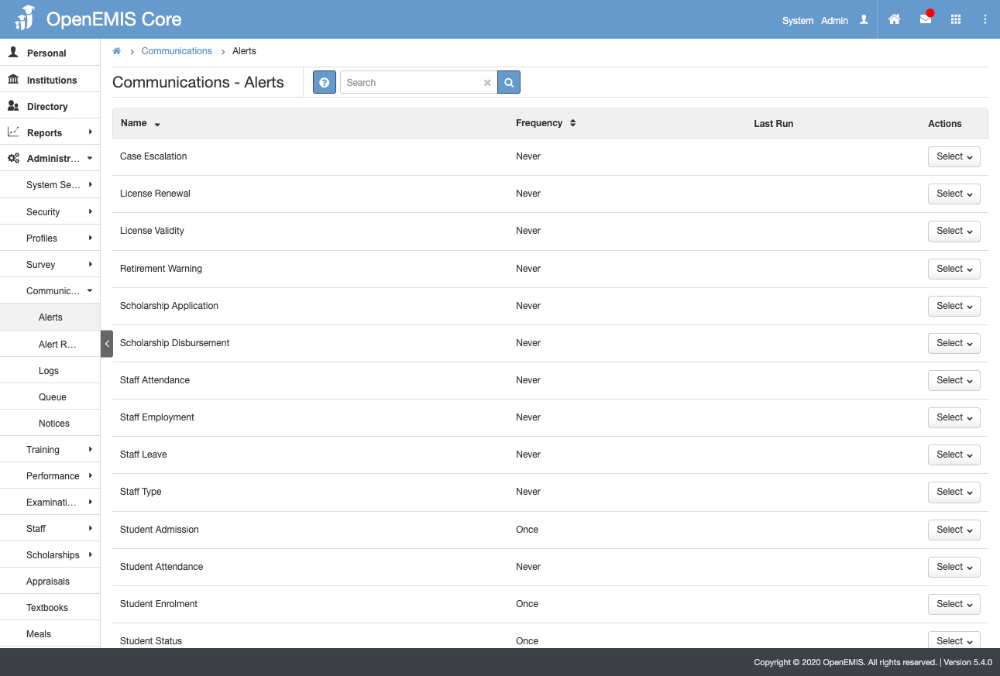
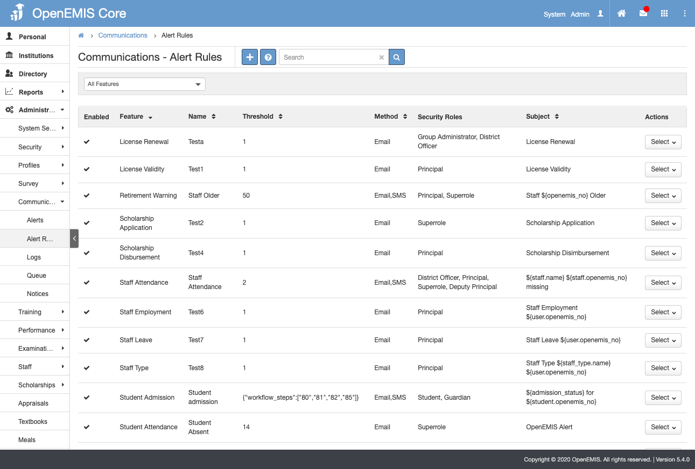
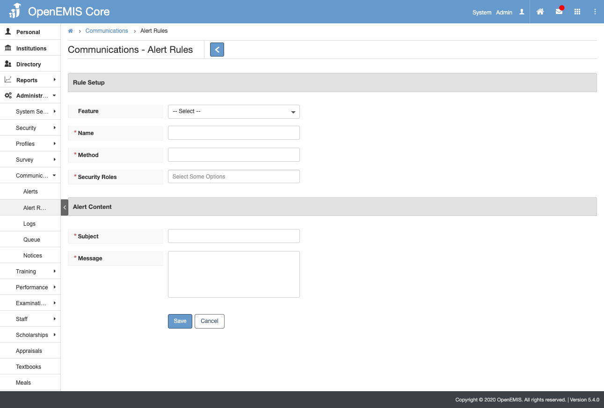
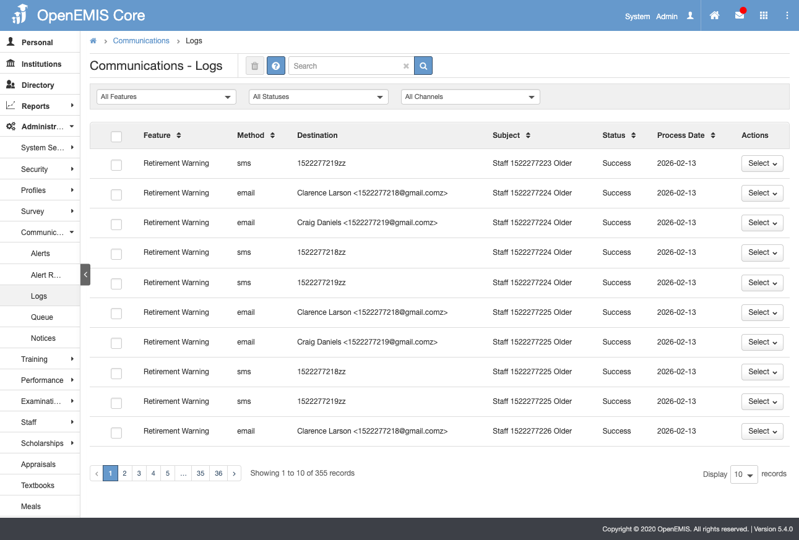
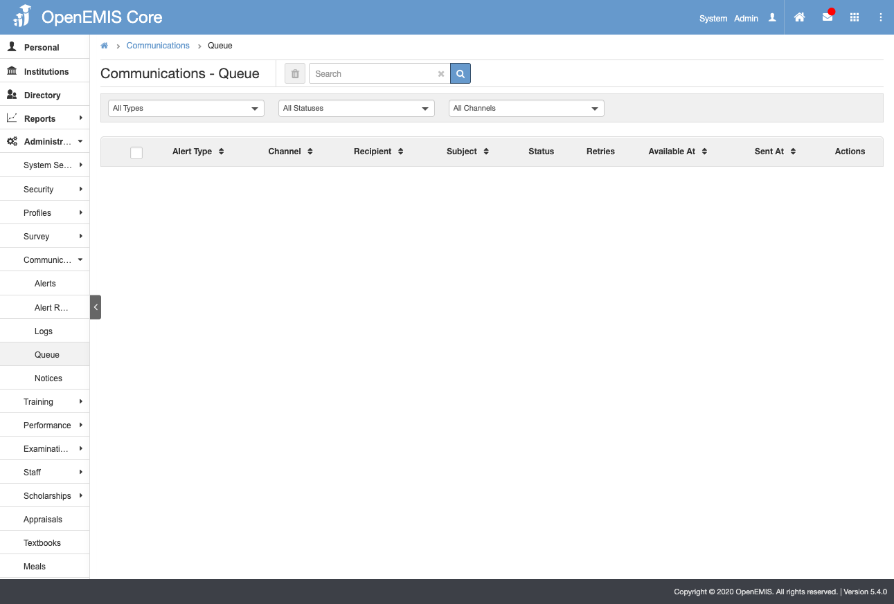
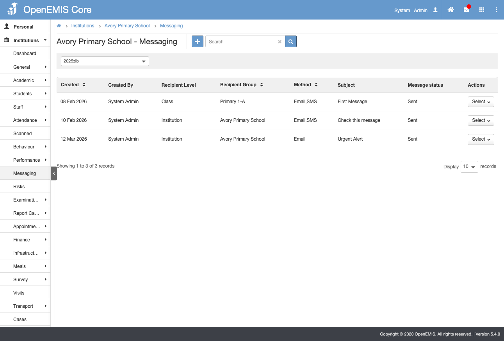
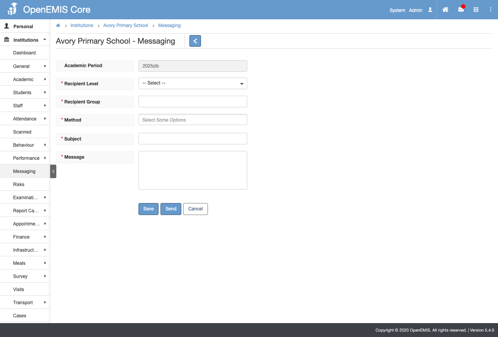

# OpenEMIS Core — Alerts & Messaging
## System Administrator Guide
### POCOR-9509 · 2026-03-13

---

## Table of Contents

- **Part 1: Introduction**
  - What Are Alerts?
  - What Is School Messaging?
  - How the Two Systems Work Together
- **Part 2: Setting Up Alerts**
  - The Alerts Screen
  - Alert Rules
  - Creating an Alert Rule
  - The Power of Multiple Rules
- **Part 3: Alert Types Reference**
  - Student Absence
  - Student Admission
  - Student Enrolment
  - Student Status Change
  - Retirement Warning
  - Staff Employment End
  - Staff Leave End
  - Staff Type
  - License Validity
  - License Renewal
  - Case Escalation
  - Scholarship Application
  - Scholarship Disbursement
  - System Updates
  - Staff Attendance — Not Implemented
- **Part 4: Monitoring & Delivery**
  - Alert Logs
  - Alert Queue
  - Delivery Troubleshooting
- **Part 5: School Messaging**
  - What Is School Messaging?
  - The Messaging Screen
  - Composing a Message
  - Recipient Levels Explained
  - Draft vs Send
  - How School Messaging Differs From Alerts
- **Part 6: Technical Reference**
  - Architecture Overview
  - Command Inventory
  - Threshold Field Reference
  - Activation Checklist
- **Appendix**
  - Placeholder Reference
  - Quick SQL Lookups

---

# Part 1: Introduction

The OpenEMIS alerts and messaging systems exist to solve a straightforward problem: important things happen in your school system every day, and the right people do not always find out in time. A student reaches a worrying level of absences. A staff contract is about to expire. A scholarship deadline is two days away. Without a notification layer, each of these events sits silently in a database until someone happens to run a report — often too late for effective action.

This guide covers both the automated Alerts module and the manual School Messaging tool. Together they form the communications layer of OpenEMIS, giving you control over what gets communicated, to whom, when, and how.

## What Are Alerts?

Alerts are automatic notifications triggered either by something happening in the system (a student being marked absent, an enrolment being recorded) or by a scheduled scan that runs daily, weekly, or monthly and checks for records approaching critical dates or conditions.

Every alert is governed by one or more **alert rules** that you configure. A rule defines what threshold to check, who receives the notification, what the message says, and whether it is delivered by email, SMS, or both. Once configured, alerts require no ongoing manual attention — they fire on their own as soon as the conditions are met.

The system supports fourteen distinct alert types, covering student welfare, staff management, professional licensing, scholarship workflows, case management, and system administration.

## What Is School Messaging?

School Messaging is a manual broadcast tool for institution staff. A teacher, administrator, or principal composes a free-form message, selects the audience (a specific class, grade, programme, or the whole institution), chooses a delivery method (email or SMS), and sends. The message goes out immediately to the resolved recipients.

Unlike alerts, School Messaging is always initiated by a person making a deliberate communication decision. It is the right tool for announcements, event notices, reminders that do not fit a rule template, or any time you need to say something specific to a specific group right now.

## How the Two Systems Work Together

Both alerts and school messages share the same delivery infrastructure and the same audit trail. Every notification — whether it fired automatically from a license expiry check or was composed manually by a teacher — is recorded in **Alert Logs** under **Administration → Communications → Alert Logs**. This gives you a single, unified view of all outbound communications from your OpenEMIS installation.

Delivery for both systems passes through the same `ProcessAlertsQueue` worker, which means the same troubleshooting steps apply when a delivery fails, and the same queue screen shows you the status of pending and failed items for both types of communication.

---

# Part 2: Setting Up Alerts

Before any alert fires, two things must be in place: the alert type must be enabled with a frequency, and at least one alert rule must be created for it. This part walks you through both steps and explains the concept of multiple rules — one of the most powerful and underused features of the system.

## The Alerts Screen



Navigate to **Administration → Communications → Alerts** to see every alert type registered in the system.

Each row in the list represents one alert type. The key columns are:

| Column | What it tells you |
|--------|------------------|
| **Name** | The alert type (e.g., "Student Absence", "Retirement Warning") |
| **Frequency** | How often this alert runs: Never, Once, Daily, Weekly, or Monthly |
| **Status** | Whether the alert is currently running or stopped |

An alert with frequency **Never** is completely disabled — even if you have configured rules for it, nothing will fire. You must change the frequency to something other than Never before the alert can run.

### Frequency options

| Option | Behaviour |
|--------|-----------|
| `Never` | Disabled — no alerts sent under any circumstance |
| `Once` | Fires once per triggering event, no repeat (used by event-based alerts) |
| `Daily` | At most once per calendar day |
| `Weekly` | At most once per 7-day period |
| `Monthly` | At most once per month |

### Starting and stopping an alert

To enable a scheduled alert:

1. Go to **Administration → Communications → Alerts**
2. Click **View** on the alert you want to enable
3. Confirm the frequency is set to Daily, Weekly, or Monthly (not Never)
4. Click **Start** in the Action Bar

To disable it again, open the alert record and click **Stop**.

> **Note:** Event-based alerts (those with frequency `Once` — Student Absence, Student Admission, Student Enrolment, Student Status Change) do not have Start/Stop controls. They fire automatically when relevant records are saved in the system.

## Alert Rules



Navigate to **Administration → Communications → Alert Rules** to see all configured rules.

An **alert rule** is the configuration record that tells an alert what to look for, what to say, and who to tell. One alert type can have many rules — see the next section for why this matters.

Each rule record contains:

| Field | Purpose |
|-------|---------|
| **Name** | A label for this rule — make it descriptive, especially if you have several rules for the same alert type |
| **Feature** | Which alert type this rule applies to |
| **Enabled** | Yes/No — a disabled rule never executes even if the alert is running |
| **Method** | Email, SMS, or both |
| **Threshold** | The condition that must be met — format varies by alert type |
| **Security Roles** | The roles whose members receive this notification |
| **Subject** | The email/SMS subject line — supports `${placeholder}` tokens |
| **Message** | The notification body — supports `${placeholder}` tokens |

### Important details about rules

- A **disabled rule** (`Enabled = No`) never executes, regardless of whether the alert is running
- **Placeholder tokens** are case-sensitive: `${student.name}` is not the same as `${Student.Name}`
- If a placeholder value is `NULL` in the database, the token is left as-is in the sent message
- If a placeholder value is an empty string, the token is replaced with a blank

## Creating an Alert Rule



1. Go to **Administration → Communications → Alert Rules**
2. Click **Add** in the toolbar
3. Select the **Feature** (the alert type this rule is for)
4. Fill in the **Rule Setup** section:

   | Field | Required | Notes |
   |-------|----------|-------|
   | Name | Yes | Use a name that identifies the threshold and audience, e.g., "Retirement Warning — 90 Days" |
   | Enabled | Yes | Set to Yes to activate immediately |
   | Method | Yes | Email, SMS, or both |
   | Threshold | Yes | Format varies by alert type — see Part 3 for each type |
   | Security Roles | Yes (most alerts) | Roles that receive this notification; not required for Scholarship Application |

5. Fill in the **Alert Content** section:

   | Field | Notes |
   |-------|-------|
   | Subject | Plain text or with `${placeholder}` tokens |
   | Message | Plain text or with `${placeholder}` tokens |

6. Click **Save**

To edit an existing rule: click **Edit** in the Action Bar on the target rule.
To delete a rule: click **Delete** in the Action Bar and confirm.

## The Power of Multiple Rules

You can create as many rules as you need for the same alert type. Each rule is completely independent — it has its own threshold, its own message, its own recipient roles, and its own delivery method. This lets you build layered notification strategies that would be impossible with a single rule.

| Rule property | Can differ between rules for the same alert type |
|---------------|--------------------------------------------------|
| Name | Yes |
| Threshold | Yes — different day windows, different conditions |
| Subject | Yes — escalating urgency, different language |
| Message body | Yes — different detail level, different instructions |
| Security Roles | Yes — narrow audience for early warnings, wider for critical |
| Method | Yes — Email for early warnings, SMS + Email for critical |
| Enabled | Yes — disable one rule without affecting others |

### Example: License Validity — four-layer strategy

Instead of one rule that alerts 30 days before expiry, configure four independent rules:

| Rule Name | Threshold | Roles | Method |
|-----------|-----------|-------|--------|
| License Warning — 60 days | `{"value": 60, "license_type": 3, "condition": 1}` | HR Officer | Email |
| License Warning — 30 days | `{"value": 30, "license_type": 3, "condition": 1}` | HR Officer, Principal | Email |
| License Warning — 7 days | `{"value": 7, "license_type": 3, "condition": 1}` | HR Officer, Principal, District HR | Email + SMS |
| License Expired — Follow Up | `{"value": 7, "license_type": 3, "condition": 2}` | HR Officer, Principal, District HR, Ministry | Email |

Each rule fires independently. A staff member with a license expiring in 5 days satisfies the 60-day, 30-day, and 7-day rules simultaneously — all three notifications go out on the same day.

### Example: Case Escalation — tiered management escalation

| Rule Name | Threshold | Roles |
|-----------|-----------|-------|
| Case Inactive — 3 days | `{"value": 3, "workflow_steps": [12]}` | Institution Principal |
| Case Inactive — 7 days | `{"value": 7, "workflow_steps": [12]}` | Principal, Coordinator |
| Case Critical — 21 days | `{"value": 21, "workflow_steps": [12]}` | Principal, District, Ministry |

A case open for 25 days triggers all three rules every single day until someone updates it.

> **Best practice:** Name your rules clearly — "Retirement Warning — 90 Days" is far more useful than just "Retirement" when you are looking at a list of twelve rules.

---

# Part 3: Alert Types Reference

This part documents every alert type available in OpenEMIS. Each section is self-contained — you can turn directly to the alert you need without reading the others. For each alert you will find: what it does, when it fires, how to configure the threshold, which placeholders you can use in your message templates, and worked example rules with complete subject lines and message bodies you can use as starting points.

---

### Student Absence

**Feature key:** `StudentAttendance`

**What it does:** Notifies teachers and administrators the moment a student's total absence count in the current academic period reaches or exceeds a configured number of days. Chronic absenteeism is one of the strongest early predictors of academic failure — this alert surfaces the problem at the moment the data is recorded, not months later during a report review.

**When it fires:** Automatically, immediately after an absence record is saved for a student. The system counts the student's total absences in the current academic period and compares to the rule threshold. If the count has just reached or exceeded the threshold, the alert fires. If the student already triggered this alert today, deduplication prevents a repeat.

**Frequency:** `Once` per event (event-based, not scheduled).

**Who receives it:** Security roles scoped to the student's institution and class. Class teachers receive it first — they have the closest relationship and are best placed to act. Administrators can be included for escalation.

**Threshold format:** A single integer — the number of absence days that must be reached.

```
5
```

| Value | Meaning |
|-------|---------|
| `3` | Early warning — fire after just 3 days missed |
| `5` | Standard warning — moderate absence level |
| `10` | Late-stage warning — significant absenteeism |
| `15` | Critical threshold — near-chronic |

**Available placeholders:**

| Placeholder | Value |
|-------------|-------|
| `${student.name}` | Student's full name |
| `${student.openemis_no}` | OpenEMIS ID |
| `${student.first_name}` | First name |
| `${student.last_name}` | Last name |
| `${student.email}` | Email address |
| `${student.date_of_birth}` | Date of birth |
| `${student.gender}` | Gender |
| `${institution.name}` | Institution name |
| `${institution.code}` | Institution code |
| `${institution.address}` | Institution address |
| `${institution.telephone}` | Institution telephone |
| `${institution.email}` | Institution email |
| `${total_days}` | Total absence days in the current academic period |
| `${threshold}` | The configured threshold value |

**Example rules:**

**Rule 1 — Early warning at 5 days**

| Field | Value |
|-------|-------|
| **Name** | Early Absence Warning — 5 Days |
| **Feature** | StudentAttendance |
| **Enabled** | Yes |
| **Method** | Email |
| **Threshold** | `5` |
| **Security Roles** | Class Teacher, Institution Principal |

Subject:
```
Attendance Warning: ${student.name} has reached ${total_days} absences
```

Message body:
```
Dear Colleague,

This is an automated alert from OpenEMIS.

Student ${student.name} (OpenEMIS ID: ${student.openemis_no}) at ${institution.name}
has now accumulated ${total_days} absence days in the current academic period,
reaching the alert threshold of ${threshold} days.

Please review the student's attendance record and take the appropriate action:
- Contact the student's guardian to discuss the absences
- Schedule a meeting if there is an underlying issue
- Document any agreed actions in the student's case record

This notification was triggered automatically when the threshold was reached.
```

**Rule 2 — Critical threshold at 15 days**

| Field | Value |
|-------|-------|
| **Name** | Critical Absence Warning — 15 Days |
| **Feature** | StudentAttendance |
| **Enabled** | Yes |
| **Threshold** | `15` |
| **Security Roles** | Institution Principal, District Coordinator |

Subject:
```
CRITICAL: ${student.name} has ${total_days} unexcused absences — immediate action required
```

Message body:
```
ATTENTION — ACTION REQUIRED

${student.name} (${student.openemis_no}) at ${institution.name} has now missed
${total_days} days. This exceeds the critical threshold of ${threshold} days.

This student is at serious risk of academic failure and may require a formal
intervention, referral, or transfer review.

Please escalate this case immediately.
```

---

### Student Admission

**Feature key:** `StudentAdmission`

**What it does:** Notifies responsible staff immediately when a student admission application is created or updated. In many systems, admissions are processed centrally and the receiving school may not know an application has been submitted. This alert ensures the right people are informed the moment an application enters the pipeline.

**When it fires:** Automatically, immediately after a `StudentAdmission` record is saved. The command then checks the admission's current `status_id` against the `workflow_steps` list in the threshold. If the status is not in the list, the alert is suppressed.

**Frequency:** `Once` per event (event-based).

**Who receives it:** Student-associated contacts only — the student themselves (if role ID `8` is in the rule's security roles) and/or their guardians (if role ID `9` is in the rule's security roles). Other roles are ignored.

**Threshold format:** A JSON object with an array of workflow step IDs from the `Student Admission` workflow.

```json
{"workflow_steps": [82]}
```

Student Admission workflow step IDs (query your DB to confirm — IDs vary by deployment):

| ID | Step |
|----|------|
| 80 | Open |
| 81 | Pending Approval |
| 82 | Approved |
| 83 | Rejected |
| 84 | Pending Cancellation |
| 85 | Cancelled |

**Available placeholders:**

| Placeholder | Value |
|-------------|-------|
| `${admission_status}` | Current admission workflow step name |
| `${academic_period.name}` | Academic period name |
| `${start_date}` | Student study start date |
| `${end_date}` | Student study end date |
| `${student.name}` | Student's full name |
| `${student.openemis_no}` | OpenEMIS ID |
| `${student.first_name}` | First name |
| `${student.middle_name}` | Middle name |
| `${student.third_name}` | Third name |
| `${student.last_name}` | Last name |
| `${student.preferred_name}` | Preferred name |
| `${student.email}` | Email address |
| `${student.address}` | Address |
| `${student.postal_code}` | Postal code |
| `${student.date_of_birth}` | Date of birth |
| `${institution.name}` | Institution name |
| `${institution.code}` | Institution code |
| `${institution.address}` | Institution address |
| `${institution.postal_code}` | Institution postal code |
| `${institution.contact_person}` | Institution contact person |
| `${institution.telephone}` | Telephone |
| `${institution.email}` | Institution email |
| `${institution.website}` | Institution website |
| `${grade.name}` | Education grade name |
| `${guardian.name}` | Guardian full name |
| `${guardian.relation}` | Guardian relation type |
| `${guardian.contact}` | Guardian contact |

**Example rules:**

**Rule 1 — Approved notification to student and guardian**

| Field | Value |
|-------|-------|
| **Name** | Student Admission — Approved |
| **Feature** | StudentAdmission |
| **Enabled** | Yes |
| **Method** | Email |
| **Threshold** | `{"workflow_steps": [82]}` |
| **Security Roles** | Student (role 8), Guardian (role 9) |

Subject:
```
Your Admission Application Has Been Approved — ${institution.name}
```

Message body:
```
Dear ${student.name},

Your admission application to ${institution.name} has been approved.

OpenEMIS ID: ${student.openemis_no}
Academic Period: ${academic_period.name}
Grade: ${grade.name}
Start Date: ${start_date}
Status: ${admission_status}

This is an automated notification from OpenEMIS.
```

**Rule 2 — Rejected notification to student and guardian**

| Field | Value |
|-------|-------|
| **Name** | Student Admission — Rejected |
| **Feature** | StudentAdmission |
| **Enabled** | Yes |
| **Method** | Email |
| **Threshold** | `{"workflow_steps": [83]}` |
| **Security Roles** | Student (role 8), Guardian (role 9) |

Subject:
```
Your Admission Application — ${institution.name}
```

Message body:
```
Dear ${student.name},

Your admission application to ${institution.name} has not been approved at this time.
Please contact ${institution.name} directly for further information.

This is an automated notification from OpenEMIS.
```

---

### Student Enrolment

**Feature key:** `StudentEnrolment`

**What it does:** Notifies teachers and administrators at the receiving institution the moment a student is formally enroled into a class or academic period. When enrolment is processed centrally, the school may not know a student has been assigned until they appear in person. This alert gives them advance notice to prepare.

**When it fires:** Automatically, immediately after a `StudentEnrolment` record is saved. The command checks the enrolment's current `status_id` against the `workflow_steps` list in the threshold. If the status is not in the list, the alert is suppressed.

**Frequency:** `Once` per event (event-based).

**Who receives it:** Student-associated contacts only — the student themselves (if role ID `8` is in the rule's security roles) and/or their guardians (if role ID `9` is in the rule's security roles). Other roles are ignored.

**Threshold format:** A JSON object with an array of workflow step IDs from the `Student Enrolment` workflow.

```json
{"workflow_steps": [136]}
```

Student Enrolment workflow step IDs (query your DB to confirm — IDs vary by deployment):

| ID | Step |
|----|------|
| 134 | Open |
| 135 | Pending Approval |
| 136 | Approved |
| 137 | Rejected |
| 138 | Pending Cancellation |
| 139 | Cancelled |

**Available placeholders:**

| Placeholder | Value |
|-------------|-------|
| `${enrolment_status}` | Current enrolment workflow step name |
| `${academic_period.name}` | Academic period name |
| `${start_date}` | Student study start date |
| `${end_date}` | Student study end date |
| `${student.name}` | Student's full name |
| `${student.openemis_no}` | OpenEMIS ID |
| `${student.first_name}` | First name |
| `${student.middle_name}` | Middle name |
| `${student.third_name}` | Third name |
| `${student.last_name}` | Last name |
| `${student.preferred_name}` | Preferred name |
| `${student.email}` | Email address |
| `${student.address}` | Address |
| `${student.postal_code}` | Postal code |
| `${student.date_of_birth}` | Date of birth |
| `${institution.name}` | Institution name |
| `${institution.code}` | Institution code |
| `${institution.address}` | Institution address |
| `${institution.postal_code}` | Institution postal code |
| `${institution.contact_person}` | Institution contact person |
| `${institution.telephone}` | Telephone |
| `${institution.email}` | Institution email |
| `${institution.website}` | Institution website |
| `${grade.name}` | Education grade name |
| `${guardian.name}` | Guardian full name |
| `${guardian.relation}` | Guardian relation type |
| `${guardian.contact}` | Guardian contact |

**Example rules:**

**Rule 1 — Approved notification to student and guardian**

| Field | Value |
|-------|-------|
| **Name** | Student Enrolment — Approved |
| **Feature** | StudentEnrolment |
| **Enabled** | Yes |
| **Method** | Email |
| **Threshold** | `{"workflow_steps": [136]}` |
| **Security Roles** | Student (role 8), Guardian (role 9) |

Subject:
```
Your Enrolment Has Been Approved — ${institution.name}
```

Message body:
```
Dear ${student.name},

Your enrolment at ${institution.name} has been approved.

OpenEMIS ID: ${student.openemis_no}
Academic Period: ${academic_period.name}
Grade: ${grade.name}
Start Date: ${start_date}
Status: ${enrolment_status}

This is an automated notification from OpenEMIS.
```

**Rule 2 — Rejected notification to student and guardian**

| Field | Value |
|-------|-------|
| **Name** | Student Enrolment — Rejected |
| **Feature** | StudentEnrolment |
| **Enabled** | Yes |
| **Method** | Email |
| **Threshold** | `{"workflow_steps": [137]}` |
| **Security Roles** | Student (role 8), Guardian (role 9) |

Subject:
```
Enrolment Application Update — ${institution.name}
```

Message body:
```
Dear ${student.name},

Your enrolment application to ${institution.name} has not been approved at this time.
Please contact ${institution.name} directly for further information.

This is an automated notification from OpenEMIS.
```

---

### Student Status Change

**Feature key:** `StudentStatus`

**What it does:** Notifies staff immediately when a student's enrolment status changes — for example from Active to Transferred, Withdrawn, Graduated, or Promoted. Status changes carry downstream consequences: a transferred student must be removed from class lists, a withdrawal may require intervention to prevent dropout, a graduation triggers certification processing. This alert surfaces the change at the moment it is recorded.

**When it fires:** Automatically, immediately after a student's status field is updated in the system. The threshold determines which specific status transitions trigger the alert.

**Frequency:** `Once` per event (event-based).

**Who receives it:** Student-associated contacts only — the student themselves (if role ID `8` is in the rule's security roles) and/or their guardians (if role ID `9` is in the rule's security roles). Other roles are ignored.

**Threshold format:** A JSON object with an array of `student_statuses.id` values that should trigger the alert.

```json
{"statuses": [4]}
```

| Field | Description |
|-------|-------------|
| `statuses` | Array of `student_statuses.id` values — the alert fires when the record's `student_status_id` is in this list |

To find status IDs in your database:
```sql
SELECT id, name FROM student_statuses ORDER BY id;
```

Status IDs for this deployment (IDs vary by deployment — always query before configuring):

| ID | Status |
|----|--------|
| 1 | Enrolled |
| 3 | Transferred |
| 4 | Withdrawn |
| 6 | Graduated |
| 7 | Promoted |
| 8 | Repeated |

> **Important:** IDs on older deployments may differ from the above. Alert rules configured with wrong status IDs will silently not fire.

**Available placeholders:**

| Placeholder | Value |
|-------------|-------|
| `${student_status}` | Student status name (e.g., "Withdrawn") |
| `${academic_period.name}` | Academic period name |
| `${start_date}` | Student study start date |
| `${end_date}` | Student study end date |
| `${student.name}` | Student's full name |
| `${student.openemis_no}` | OpenEMIS ID |
| `${student.first_name}` | First name |
| `${student.middle_name}` | Middle name |
| `${student.third_name}` | Third name |
| `${student.last_name}` | Last name |
| `${student.preferred_name}` | Preferred name |
| `${student.email}` | Email address |
| `${student.address}` | Address |
| `${student.postal_code}` | Postal code |
| `${student.date_of_birth}` | Date of birth |
| `${institution.name}` | Institution name |
| `${institution.code}` | Institution code |
| `${institution.address}` | Institution address |
| `${institution.postal_code}` | Institution postal code |
| `${institution.contact_person}` | Institution contact person |
| `${institution.telephone}` | Telephone |
| `${institution.email}` | Institution email |
| `${institution.website}` | Institution website |
| `${grade.name}` | Education grade name |
| `${guardian.name}` | Guardian full names (comma-separated if multiple) |
| `${guardian.relation}` | Guardian relation types (comma-separated) |
| `${guardian.contact}` | Guardian contacts (comma-separated) |

**Example rules:**

**Rule 1 — Withdrawal notification to guardian**

| Field | Value |
|-------|-------|
| **Name** | Student Withdrawal — Notify Guardian |
| **Feature** | StudentStatus |
| **Enabled** | Yes |
| **Method** | Email |
| **Threshold** | `{"statuses": [4]}` |
| **Security Roles** | Guardian (role 9) |

Subject:
```
Important: ${student.name} has been marked as Withdrawn
```

Message body:
```
Dear ${guardian.name},

${student.name} (${student.openemis_no}) has been marked as ${student_status}
at ${institution.name}.

If you have questions about this change, please contact the institution directly.

This is an automated notification from OpenEMIS.
```

**Rule 2 — Transfer notification to student and guardian**

| Field | Value |
|-------|-------|
| **Name** | Student Transfer — Notify Student and Guardian |
| **Feature** | StudentStatus |
| **Enabled** | Yes |
| **Method** | Email |
| **Threshold** | `{"statuses": [3]}` |
| **Security Roles** | Student (role 8), Guardian (role 9) |

Subject:
```
Transfer Confirmation: ${student.name} — ${institution.name}
```

Message body:
```
Dear ${student.name},

Your transfer from ${institution.name} has been recorded in OpenEMIS.

Academic Period: ${academic_period.name}
Grade: ${grade.name}

This is an automated notification from OpenEMIS.
```

**Rule 3 — Graduation notification to student**

| Field | Value |
|-------|-------|
| **Name** | Student Graduation — Notify Student |
| **Feature** | StudentStatus |
| **Enabled** | Yes |
| **Method** | Email |
| **Threshold** | `{"statuses": [6]}` |
| **Security Roles** | Student (role 8) |

Subject:
```
Graduation Recorded: ${student.name} — ${institution.name}
```

Message body:
```
Dear ${student.name},

Your graduation from ${institution.name} has been recorded in OpenEMIS.

OpenEMIS ID: ${student.openemis_no}

This is an automated notification from OpenEMIS.
```

---

### Retirement Warning

**Feature key:** `RetirementWarning`

**What it does:** Reminds HR officers and management when a staff member's retirement date is approaching. Succession planning in education requires significant lead time — advertising the post, recruiting, interviewing, completing paperwork, onboarding a replacement, and managing knowledge transfer. This alert provides the advance warning needed to start that process before a vacancy appears unexpectedly.

**When it fires:** On a schedule (Daily, Weekly, or Monthly depending on the rule). The system queries all staff whose retirement date falls within the next configured number of days. Every eligible staff member generates a separate notification.

**Frequency:** `Monthly` for an early planning window (e.g., 90 days out); `Daily` for a final reminder window (e.g., 30 days out). Using two separate rules at different frequencies is the recommended approach.

**Who receives it:** Security roles scoped to the staff member's institution — HR officers and administrators responsible for succession planning at that school. A ministry-level HR role can also be included for system-wide oversight.

**Threshold format:**

```json
{"value": 90}
```

| Field | Type | Required | Description |
|-------|------|----------|-------------|
| `value` | Integer | Yes | Number of days before the retirement date |

| Threshold | Frequency | Meaning |
|-----------|-----------|---------|
| `{"value": 90}` | Monthly | Fire once when retirement is 90 days away |
| `{"value": 60}` | Weekly | Fire weekly when retirement is within 60 days |
| `{"value": 30}` | Daily | Fire daily when retirement is within 30 days |
| `{"value": 7}` | Daily | Final urgent reminder in the last week |

**Available placeholders:**

| Placeholder | Value |
|-------------|-------|
| `${threshold.value}` | Configured day threshold |
| `${age}` | Staff member's current age (calculated) |
| `${openemis_no}` | Staff OpenEMIS ID |
| `${first_name}` | First name |
| `${middle_name}` | Middle name |
| `${third_name}` | Third name |
| `${last_name}` | Last name |
| `${preferred_name}` | Preferred name |
| `${email}` | Email address |
| `${address}` | Address |
| `${postal_code}` | Postal code |
| `${date_of_birth}` | Date of birth |
| `${institution.name}` | Institution name |
| `${institution.code}` | Institution code |
| `${institution.address}` | Institution address |
| `${institution.postal_code}` | Institution postal code |
| `${institution.contact_person}` | Institution contact person |
| `${institution.telephone}` | Telephone |
| `${institution.email}` | Institution email |
| `${institution.website}` | Institution website |

**Example rules:**

**Rule 1 — 90-day advance notice**

| Field | Value |
|-------|-------|
| **Name** | Retirement Warning — 90 Days |
| **Feature** | RetirementWarning |
| **Enabled** | Yes |
| **Method** | Email |
| **Threshold** | `{"value": 90}` |
| **Security Roles** | HR Officer, Institution Principal |

Subject:
```
Retirement Notice (90 days): ${user.first_name} ${user.last_name} — ${institution.name}
```

Message body:
```
Dear HR Officer,

This is an advance notice that the following staff member is approaching their
retirement date within the next ${threshold.value} days.

Staff Member: ${user.first_name} ${user.last_name}
OpenEMIS ID: ${user.openemis_no}
Institution: ${institution.name}

Recommended actions at this stage:
- Review the staff member's position and assess succession requirements
- Begin the process of advertising and recruiting for the vacancy
- Plan knowledge transfer activities with the retiring staff member
- Coordinate with the district HR office if required

Please log in to OpenEMIS for full staff details.

This is an automated notification from OpenEMIS.
```

**Rule 2 — 30-day final reminder**

| Field | Value |
|-------|-------|
| **Name** | Retirement Warning — Final 30 Days |
| **Feature** | RetirementWarning |
| **Enabled** | Yes |
| **Method** | Email |
| **Threshold** | `{"value": 30}` |
| **Security Roles** | HR Officer, Institution Principal, District HR Director |

Subject:
```
REMINDER: ${user.first_name} ${user.last_name} retires within ${threshold.value} days — ${institution.name}
```

Message body:
```
Dear Colleague,

FINAL REMINDER: The following staff member retires within ${threshold.value} days.

Staff Member: ${user.first_name} ${user.last_name} (${user.openemis_no})
Institution: ${institution.name}

Immediate actions required:
1. Confirm the replacement or interim arrangement is in place
2. Complete all HR paperwork and benefits processing
3. Schedule a formal handover session
4. Update the staff records in OpenEMIS once the retirement is finalised

If succession planning has not yet started, escalate immediately to district HR.

This is an automated notification from OpenEMIS.
```

---

### Staff Employment End

**Feature key:** `StaffEmployment`

**What it does:** Warns HR officers and administrators when a staff member's employment contract or institution assignment end date is approaching. Without automated tracking, contract expiry dates must be monitored manually — a process that fails when HR is busy or when there are many contracts. This alert converts passive date tracking into active advance notification.

**When it fires:** On a schedule. The system queries `institution_staff` records whose employment end date falls within the configured number of days. Every eligible staff record generates a separate notification.

**Frequency:** `Daily` is recommended. Employment contracts expire on specific dates — daily scanning ensures no end date is missed regardless of when the contract was originally entered.

**Who receives it:** Security roles scoped to the staff member's institution. The institution's HR officer and administrator are the decision-makers for contract renewal.

**Threshold format:**

```json
{"value": 30}
```

| Field | Type | Required | Description |
|-------|------|----------|-------------|
| `value` | Integer | Yes | Days before employment end date |

**Available placeholders:**

| Placeholder | Value |
|-------------|-------|
| `${threshold.value}` | Configured threshold (days) |
| `${employment_type.name}` | Employment status type name |
| `${employment_date}` | Employment status date |
| `${user.openemis_no}` | Staff OpenEMIS ID |
| `${user.first_name}` | First name |
| `${user.middle_name}` | Middle name |
| `${user.third_name}` | Third name |
| `${user.last_name}` | Last name |
| `${user.preferred_name}` | Preferred name |
| `${user.email}` | Email address |
| `${user.address}` | Address |
| `${user.postal_code}` | Postal code |
| `${user.date_of_birth}` | Date of birth |
| `${institution.name}` | Institution name |
| `${institution.code}` | Institution code |
| `${institution.address}` | Institution address |
| `${institution.postal_code}` | Institution postal code |
| `${institution.contact_person}` | Institution contact person |
| `${institution.telephone}` | Telephone |
| `${institution.email}` | Institution email |
| `${institution.website}` | Institution website |

**Example rules:**

**Rule 1 — 30-day advance notice**

| Field | Value |
|-------|-------|
| **Name** | Employment End — 30 Day Notice |
| **Feature** | StaffEmployment |
| **Enabled** | Yes |
| **Method** | Email |
| **Threshold** | `{"value": 30}` |
| **Security Roles** | HR Officer, Institution Principal |

Subject:
```
Contract Expiry Notice: ${user.first_name} ${user.last_name} — ends in ${threshold.value} days
```

Message body:
```
Dear HR Officer,

This is an automated reminder that the following staff member's employment
contract or assignment at ${institution.name} is due to end within
${threshold.value} days.

Staff Member: ${user.first_name} ${user.last_name}
OpenEMIS ID: ${user.openemis_no}
Institution: ${institution.name}

Recommended actions:
- Review whether the contract should be renewed, extended, or allowed to lapse
- If renewing: initiate the renewal process and update the end date in OpenEMIS
- If not renewing: begin recruitment or interim arrangement planning
- Ensure the staff member is informed of the decision in advance

Please log in to OpenEMIS → Staff → [Staff Member] → Employment to review
the contract details.

This is an automated notification from OpenEMIS.
```

**Rule 2 — 7-day critical alert**

| Field | Value |
|-------|-------|
| **Name** | Employment End — Critical 7 Days |
| **Feature** | StaffEmployment |
| **Enabled** | Yes |
| **Method** | Email + SMS |
| **Threshold** | `{"value": 7}` |
| **Security Roles** | HR Officer, Institution Principal, District HR Director |

Subject:
```
URGENT — Contract Expiry in 7 Days: ${user.first_name} ${user.last_name} at ${institution.name}
```

Message body:
```
URGENT ACTION REQUIRED

${user.first_name} ${user.last_name} (${user.openemis_no}) at ${institution.name}
has a contract ending in ${threshold.value} days.

If no renewal or replacement is in place, this position will become
vacant in one week.

Please ensure this has been resolved immediately. If this is a known
planned departure, no action is needed — this is a final automated reminder.

Log in to OpenEMIS to update the contract record.
```

---

### Staff Leave End

**Feature key:** `StaffLeave`

**What it does:** Reminds institution administrators a set number of days before a staff member's approved leave period ends. When a staff member is on leave, a substitute is usually in place and the timetable has been adjusted. Without advance warning of the return, the substitute may not be informed, handover tasks go unscheduled, and the returning staff member finds their workspace unprepared.

**When it fires:** On a schedule. The system queries approved leave records where the end date equals today plus the configured number of days. Only approved leave records are included — pending or rejected applications are ignored.

**Frequency:** `Daily` is standard. The target date is precise — daily scanning ensures the alert fires on the correct day.

**Who receives it:** Security roles scoped to the staff member's institution. School administrators and HR officers hold the operational responsibility for scheduling around leave absences.

**Threshold format:**

```json
{"value": 3, "staff_leave_type": 2}
```

| Field | Type | Required | Description |
|-------|------|----------|-------------|
| `value` | Integer | Yes | Days before leave end date |
| `staff_leave_type` | Integer | No | ID from `staff_leave_types` table — omit to alert for all leave types |

To find leave type IDs:
```sql
SELECT id, name FROM staff_leave_types ORDER BY name;
```

**Available placeholders:**

| Placeholder | Value |
|-------------|-------|
| `${threshold.value}` | Configured threshold (days) |
| `${staff_leave_type.name}` | Leave type name |
| `${date_from}` | Leave start date |
| `${date_to}` | Leave end date |
| `${day_difference}` | Days between today and leave end date |
| `${employment_period}` | Same as day_difference (alias) |
| `${user.openemis_no}` | Staff OpenEMIS ID |
| `${user.first_name}` | First name |
| `${user.middle_name}` | Middle name |
| `${user.third_name}` | Third name |
| `${user.last_name}` | Last name |
| `${user.preferred_name}` | Preferred name |
| `${user.email}` | Email address |
| `${user.address}` | Address |
| `${user.postal_code}` | Postal code |
| `${user.date_of_birth}` | Date of birth |
| `${institution.name}` | Institution name |
| `${institution.code}` | Institution code |
| `${institution.address}` | Institution address |
| `${institution.postal_code}` | Institution postal code |
| `${institution.contact_person}` | Institution contact person |
| `${institution.telephone}` | Telephone |
| `${institution.email}` | Institution email |
| `${institution.website}` | Institution website |

**Example rules:**

**Rule 1 — General leave return notice (3 days)**

| Field | Value |
|-------|-------|
| **Name** | Staff Leave Return — 3 Day Notice |
| **Feature** | StaffLeave |
| **Enabled** | Yes |
| **Method** | Email |
| **Threshold** | `{"value": 3}` |
| **Security Roles** | Institution Administrator, HR Officer |

Subject:
```
Staff Return Notice: ${user.first_name} ${user.last_name} returns in ${threshold.value} days
```

Message body:
```
Dear Administrator,

This is a reminder that the following staff member's leave period is due to
end in ${threshold.value} days.

Staff Member: ${user.first_name} ${user.last_name}
OpenEMIS ID: ${user.openemis_no}
Institution: ${institution.name}

Actions to complete before the staff member returns:
- Notify the current substitute that their engagement is ending
- Prepare the staff member's timetable and room assignments
- Brief the staff member on any changes that occurred during their absence
- Update the leave record in OpenEMIS once the return is confirmed

This is an automated notification from OpenEMIS.
```

**Rule 2 — Extended leave (maternity/paternity) return notice (14 days)**

| Field | Value |
|-------|-------|
| **Name** | Maternity Leave Return — 14 Day Notice |
| **Feature** | StaffLeave |
| **Enabled** | Yes |
| **Method** | Email |
| **Threshold** | `{"value": 14, "staff_leave_type": 1}` |
| **Security Roles** | HR Officer, Institution Principal |

Subject:
```
Maternity Leave Ending: ${user.first_name} ${user.last_name} — return in ${threshold.value} days
```

Message body:
```
Dear HR Officer,

${user.first_name} ${user.last_name} (${user.openemis_no}) is due to return
from maternity leave in ${threshold.value} days at ${institution.name}.

For extended leave returns, please ensure the following have been arranged:
- Formal return-to-work meeting scheduled
- Phased return arrangement confirmed if applicable
- Teaching schedule updated and communicated
- Any statutory rights or benefits reviewed

Please update the leave record in OpenEMIS once the return date is confirmed
or if the leave period is being extended.

This is an automated notification from OpenEMIS.
```

---

### Staff Type

**Feature key:** `StaffType`

**What it does:** Alerts HR and administrators when a staff member on a specific contract type (probationary, temporary, fixed-term) is approaching a review or end-of-type deadline. Probationary and temporary contracts define a review point at which a decision must be made: convert to permanent, extend, or terminate. Without active monitoring, these review points pass silently.

**When it fires:** On a schedule. The system scans `institution_staff` for records matching the configured staff type and approaching the relevant date within the configured window.

**Frequency:** `Daily` is standard.

**Who receives it:** Security roles scoped to the staff member's institution — HR officers and administrators directly responsible for managing that type of contract.

**Threshold format:**

```json
{"value": 30, "staff_type_id": 2}
```

| Field | Type | Required | Description |
|-------|------|----------|-------------|
| `value` | Integer | Yes | Days before the relevant date |
| `staff_type` | Integer | Yes | ID from `staff_types` table |

To find staff type IDs:
```sql
SELECT id, name FROM staff_types ORDER BY name;
```

**Available placeholders:**

| Placeholder | Value |
|-------------|-------|
| `${threshold.value}` | Configured threshold (days) |
| `${staff_type.name}` | Staff type name |
| `${start_date}` | Staff assignment start date |
| `${end_date}` | Staff assignment end date |
| `${day_difference}` | Days between today and end date |
| `${user.openemis_no}` | Staff OpenEMIS ID |
| `${user.first_name}` | First name |
| `${user.middle_name}` | Middle name |
| `${user.third_name}` | Third name |
| `${user.last_name}` | Last name |
| `${user.preferred_name}` | Preferred name |
| `${user.email}` | Email address |
| `${user.address}` | Address |
| `${user.postal_code}` | Postal code |
| `${user.date_of_birth}` | Date of birth |
| `${institution.name}` | Institution name |
| `${institution.code}` | Institution code |
| `${institution.address}` | Institution address |
| `${institution.postal_code}` | Institution postal code |
| `${institution.contact_person}` | Institution contact person |
| `${institution.telephone}` | Telephone |
| `${institution.email}` | Institution email |
| `${institution.website}` | Institution website |

**Example rules:**

**Rule 1 — Probationary contract review**

| Field | Value |
|-------|-------|
| **Name** | Probation Review Due — 30 Days |
| **Feature** | StaffType |
| **Enabled** | Yes |
| **Method** | Email |
| **Threshold** | `{"value": 30, "staff_type_id": 2}` |
| **Security Roles** | HR Officer, Institution Principal |

Subject:
```
Probation Review Due: ${user.first_name} ${user.last_name} — ${threshold.value} days
```

Message body:
```
Dear HR Officer,

A probationary period review is due within ${threshold.value} days for the
following staff member at ${institution.name}.

Staff Member: ${user.first_name} ${user.last_name}
OpenEMIS ID: ${user.openemis_no}
Institution: ${institution.name}

Actions required:
1. Schedule a formal probation review meeting
2. Assess performance against the criteria set at the start of the probationary period
3. Document the outcome: confirm permanent appointment, extend probation, or terminate
4. Update the staff type and employment record in OpenEMIS accordingly

Please complete the review before the probationary end date. Failure to act
may result in automatic contract status changes under local labour regulations.

This is an automated notification from OpenEMIS.
```

**Rule 2 — Temporary contract ending**

| Field | Value |
|-------|-------|
| **Name** | Temporary Contract End — 14 Days |
| **Feature** | StaffType |
| **Enabled** | Yes |
| **Method** | Email |
| **Threshold** | `{"value": 14, "staff_type_id": 3}` |
| **Security Roles** | HR Officer, Institution Administrator |

Subject:
```
Temporary Contract Ending: ${user.first_name} ${user.last_name} in ${threshold.value} days
```

Message body:
```
Dear Administrator,

${user.first_name} ${user.last_name} (${user.openemis_no}) is on a temporary
contract at ${institution.name} that ends in ${threshold.value} days.

Please ensure one of the following actions is taken:
- Issue a contract extension if additional coverage is still required
- Begin recruiting a permanent replacement if applicable
- Arrange a final handover meeting with the staff member
- Update OpenEMIS with the correct end date and status

This is an automated notification from OpenEMIS.
```

---

### License Validity

**Feature key:** `LicenseValidity`

**What it does:** Alerts HR and administrators when a staff member's professional license (teaching certificate, driver's license, first aid certification, or any other tracked credential) is approaching its expiry date or has recently expired. Operating with an expired professional license is a legal and compliance risk for both the individual and the institution. This alert automates the monitoring so no expiry is missed.

**When it fires:** On a schedule. The system queries `staff_licenses` filtered by the configured license type and applies the expiry window. For each license found, the system then checks `institution_staff` to find all institutions where the staff member is actively assigned. One notification is generated per institution assignment — a staff member assigned to two schools triggers notifications at both.

**Frequency:** `Daily` is standard. License expiry is not a system event — it is a date sliding closer day by day. Daily scanning with a rolling window keeps every license in the danger zone visible.

**Who receives it:** Security roles scoped to each institution the staff member is actively assigned to.

**Threshold format:**

```json
{"value": 30, "license_type": 3, "condition": 1}
```

| Field | Type | Required | Description |
|-------|------|----------|-------------|
| `value` | Integer | Yes | Number of days for the expiry window |
| `license_type` | Integer | Yes | ID from `license_types` table |
| `condition` | Integer | Yes | `1` = expiring within `value` days (advance warning) · `2` = expired within the last `value` days (post-expiry follow-up) |

To find license type IDs:
```sql
SELECT id, name FROM license_types ORDER BY name;
```

**Available placeholders:**

| Placeholder | Value |
|-------------|-------|
| `${threshold.value}` | Configured threshold (days) |
| `${license_type.name}` | License type name (e.g., "Teaching Certificate") |
| `${license_number}` | License reference number |
| `${issue_date}` | Date the license was issued |
| `${expiry_date}` | License expiry date |
| `${issuer}` | License issuer |
| `${day_difference}` | Absolute days between today and expiry date |
| `${user.openemis_no}` | Staff OpenEMIS ID |
| `${user.first_name}` | First name |
| `${user.middle_name}` | Middle name |
| `${user.third_name}` | Third name |
| `${user.last_name}` | Last name |
| `${user.preferred_name}` | Preferred name |
| `${user.email}` | Email address |
| `${user.address}` | Address |
| `${user.postal_code}` | Postal code |
| `${user.date_of_birth}` | Date of birth |
| `${institution.name}` | Institution name |
| `${institution.code}` | Institution code |
| `${institution.address}` | Institution address |
| `${institution.postal_code}` | Institution postal code |
| `${institution.contact_person}` | Institution contact person |
| `${institution.telephone}` | Telephone |
| `${institution.email}` | Institution email |
| `${institution.website}` | Institution website |

**Example rules:**

**Rule 1 — Teaching certificate expiring in 30 days**

| Field | Value |
|-------|-------|
| **Name** | Teaching Certificate — 30 Day Expiry Warning |
| **Feature** | LicenseValidity |
| **Enabled** | Yes |
| **Method** | Email |
| **Threshold** | `{"value": 30, "license_type": 3, "condition": 1}` |
| **Security Roles** | HR Officer, Institution Principal |

Subject:
```
License Expiry Warning: ${user.first_name} ${user.last_name} — ${license_type.name} expires in ${day_difference} days
```

Message body:
```
Dear HR Officer,

This is an automated alert regarding a professional license approaching its
expiry date at ${institution.name}.

Staff Member: ${user.first_name} ${user.last_name}
OpenEMIS ID: ${user.openemis_no}
License Type: ${license_type.name}
License Number: ${license_number}
Issue Date: ${issue_date}
Expiry Date: ${expiry_date}
Days Until Expiry: ${day_difference}
Institution: ${institution.name}

Action required:
- Contact the staff member immediately to initiate the renewal process
- Verify what documentation is required by the licensing authority
- Ensure the renewal is submitted well before the expiry date to avoid a gap in coverage
- Update the license record in OpenEMIS once renewal is confirmed

Failure to renew before expiry may result in the staff member being unable
to practise legally.

This is an automated notification from OpenEMIS.
```

**Rule 2 — Post-expiry compliance follow-up**

| Field | Value |
|-------|-------|
| **Name** | Teaching Certificate — Post-Expiry Follow-Up |
| **Feature** | LicenseValidity |
| **Enabled** | Yes |
| **Method** | Email |
| **Threshold** | `{"value": 7, "license_type": 3, "condition": 2}` |
| **Security Roles** | HR Officer, Institution Principal, District HR Director |

Subject:
```
URGENT: Expired License — ${user.first_name} ${user.last_name} at ${institution.name}
```

Message body:
```
URGENT — COMPLIANCE ISSUE

${user.first_name} ${user.last_name} (${user.openemis_no}) holds a ${license_type.name}
(No. ${license_number}) that expired on ${expiry_date} — ${day_difference} days ago.

This staff member may not be authorised to practise until the license is renewed.

Immediate actions:
1. Verify whether the staff member is currently performing duties requiring this license
2. If yes: suspend those duties until the license is renewed
3. Contact the licensing authority to expedite renewal
4. Document the compliance gap in the staff member's record
5. Update OpenEMIS once the renewed license is received

Please escalate to the district HR office if the renewal cannot be completed
within 5 working days.

This is an automated notification from OpenEMIS.
```

**Rule 3 — Driver's license (different license type)**

| Field | Value |
|-------|-------|
| **Name** | Driver's License — 14 Day Warning |
| **Feature** | LicenseValidity |
| **Enabled** | Yes |
| **Method** | Email |
| **Threshold** | `{"value": 14, "license_type": 5, "condition": 1}` |
| **Security Roles** | Transport Coordinator, Institution Administrator |

Subject:
```
Driver License Expiry: ${user.first_name} ${user.last_name} — expires in ${day_difference} days
```

Message body:
```
Dear Transport Coordinator,

${user.first_name} ${user.last_name}'s driver's license (${license_number})
expires on ${expiry_date} — in ${day_difference} days.

This staff member operates a school vehicle at ${institution.name}.

Please arrange renewal immediately and update the vehicle assignment record
in OpenEMIS. The staff member should not operate school vehicles after the
license expiry date until a renewed license is confirmed.
```

---

### License Renewal

**Feature key:** `LicenseRenewal`

**What it does:** Identifies staff members whose professional license is approaching expiry and who have not yet accumulated enough continuing professional development (CPD) training hours to qualify for renewal. In many education systems, renewing a teaching license requires documented CPD evidence — not just a fee. A staff member may not realise they fall short of the required hours until it is too late to arrange the necessary training. This alert flags the gap proactively.

**When it fires:** On a schedule, using two-step logic:
1. Find licenses of the configured type expiring within the configured day window
2. For each license found, sum the staff member's training hours in the configured categories within the license validity period
3. If the total is below the required minimum (`threshold.hour`), the alert fires. Staff who already meet the requirement are silently skipped.

**Frequency:** `Daily` is standard. Training hours balances change as staff complete training — daily scanning automatically stops alerting a staff member once they accumulate sufficient hours.

**Who receives it:** Security roles scoped to the staff member's institution (via `institution_staff` ASSIGNED status). CPD coordinators and HR officers who can facilitate training access.

**Threshold format:**

```json
{
  "value": 60,
  "license_type": 3,
  "condition": 1,
  "training_categories": [1, 2],
  "hour": 20
}
```

| Field | Type | Required | Description |
|-------|------|----------|-------------|
| `value` | Integer | Yes | Days before license expiry to start checking |
| `license_type` | Integer | Yes | ID from `license_types` table |
| `condition` | Integer | Yes | Always `1` for renewal checks (before expiry) |
| `training_categories` | Array of integers | Yes | IDs from `staff_training_categories` — only trainings in these categories count |
| `hour` | Integer | Yes | Minimum credit hours required for renewal |

To find category IDs:
```sql
SELECT id, name FROM staff_training_categories ORDER BY name;
```

To find license type IDs:
```sql
SELECT id, name FROM license_types ORDER BY name;
```

**Available placeholders:**

| Placeholder | Value |
|-------------|-------|
| `${threshold.value}` | Configured day window |
| `${threshold.hour}` | Required CPD hours as configured in the rule |
| `${license_type.name}` | License type name |
| `${license_number}` | License reference number |
| `${issue_date}` | License issue date |
| `${expiry_date}` | License expiry date |
| `${issuer}` | License issuer |
| `${day_difference}` | Absolute days between today and expiry date |
| `${total_credit_hours}` | Total CPD hours accumulated within the license period |
| `${user.openemis_no}` | Staff OpenEMIS ID |
| `${user.first_name}` | First name |
| `${user.middle_name}` | Middle name |
| `${user.third_name}` | Third name |
| `${user.last_name}` | Last name |
| `${user.preferred_name}` | Preferred name |
| `${user.email}` | Email address |
| `${user.address}` | Address |
| `${user.postal_code}` | Postal code |
| `${user.date_of_birth}` | Date of birth |
| `${institution.name}` | Institution name |
| `${institution.code}` | Institution code |
| `${institution.address}` | Institution address |
| `${institution.postal_code}` | Institution postal code |
| `${institution.contact_person}` | Institution contact person |
| `${institution.telephone}` | Telephone |
| `${institution.email}` | Institution email |
| `${institution.website}` | Institution website |
| `${threshold.value}` | Configured day window |

**Example rules:**

**Rule 1 — CPD shortfall warning (60 days)**

| Field | Value |
|-------|-------|
| **Name** | Teaching License Renewal — Insufficient CPD Hours |
| **Feature** | LicenseRenewal |
| **Enabled** | Yes |
| **Method** | Email |
| **Threshold** | `{"value": 60, "license_type": 3, "condition": 1, "training_categories": [1, 2], "hour": 20}` |
| **Security Roles** | HR Officer, CPD Coordinator |

Subject:
```
CPD Hours Shortfall: ${user.first_name} ${user.last_name} — ${license_type.name} at risk
```

Message body:
```
Dear CPD Coordinator,

The following staff member's professional license is expiring in ${day_difference} days,
but they have not yet accumulated the required CPD hours for renewal.

Staff Member: ${user.first_name} ${user.last_name}
OpenEMIS ID: ${user.openemis_no}
Institution: ${institution.name}
License: ${license_type.name} (No. ${license_number})
Issue Date: ${issue_date}
Expiry Date: ${expiry_date}
Days Until Expiry: ${day_difference}

CPD Status:
  Hours Completed (within license period): ${total_credit_hours}
  Hours Required: ${threshold.hour}
  Shortfall: ${total_credit_hours} / ${threshold.hour} hours

Action required:
- Identify suitable CPD courses that count towards the license renewal requirement
- Enrol the staff member in the necessary training as soon as possible
- Ensure training is completed and recorded in OpenEMIS before the license expires
- Confirm that training categories match the licensing authority's requirements

Note: This alert will stop automatically once the staff member's CPD hours
meet the required threshold.

This is an automated notification from OpenEMIS.
```

**Rule 2 — Urgent CPD shortfall (14 days)**

| Field | Value |
|-------|-------|
| **Name** | Teaching License Renewal — URGENT (14 days left) |
| **Feature** | LicenseRenewal |
| **Enabled** | Yes |
| **Method** | Email |
| **Threshold** | `{"value": 14, "license_type": 3, "condition": 1, "training_categories": [1, 2], "hour": 20}` |
| **Security Roles** | HR Officer, CPD Coordinator, Institution Principal, District HR Director |

Subject:
```
URGENT — License Renewal at Risk: ${user.first_name} ${user.last_name} — ${day_difference} days remaining
```

Message body:
```
URGENT — IMMEDIATE ACTION REQUIRED

${user.first_name} ${user.last_name} (${user.openemis_no}) at ${institution.name}
has only ${day_difference} days remaining on their ${license_type.name}
(expires: ${expiry_date}) and has completed only ${total_credit_hours} of the
required ${threshold.hour} CPD hours.

Without the required CPD hours, this license may not be renewable.

Escalation actions:
1. Contact the staff member today to discuss their training status
2. Check whether any completed training has not yet been recorded in OpenEMIS
3. Identify any intensive or online CPD options that can be completed before expiry
4. Contact the licensing authority to understand if a short extension is possible
5. Document all steps taken in the staff member's record

This alert will clear automatically if the CPD hours are recorded in OpenEMIS
and meet the required threshold.

This is an automated notification from OpenEMIS.
```

---

### Case Escalation

**Feature key:** `CaseEscalation`

**What it does:** Surfaces institution cases — student welfare issues, infrastructure problems, compliance matters, or any tracked incident — that have been sitting in a specific workflow step for longer than a configured number of days without any update. Cases are opened with good intentions but can be forgotten under the weight of daily work. This alert creates accountability by firing daily for every case that has never been touched since it was opened. Once a staff member makes any update to the case, it immediately drops out of the alert.

**When it fires:** On a schedule. The system queries `institution_cases` and applies three conditions simultaneously:
1. The case is in one of the monitored workflow steps (e.g., the "Open" step)
2. The case has never been updated (`modified IS NULL` and `modified_user_id IS NULL`)
3. The case has been open longer than the configured number of days

**Frequency:** `Daily` is standard. Staleness is gradual — there is no single moment when a case "becomes" stale. Daily reminders provide intentional, ongoing pressure until someone acts.

**Who receives it:** Security roles scoped to the case's institution — the management staff responsible for case oversight at that school.

**Threshold format:**

```json
{"value": 7, "workflow_steps": [12]}
```

| Field | Type | Required | Description |
|-------|------|----------|-------------|
| `value` | Integer | Yes | Cases older than this many days (and unmodified) will be escalated |
| `workflow_steps` | Array of integers | Yes | IDs from `workflow_steps` table — only cases in these steps are checked |

To find the correct workflow step IDs for your Cases workflow:
```sql
SELECT ws.id, ws.name, w.name AS workflow_name
FROM workflow_steps ws
JOIN workflows w ON w.id = ws.workflow_id
WHERE w.name LIKE '%Case%'
ORDER BY w.name, ws.name;
```

Typical result:

| id | name | workflow_name |
|----|------|---------------|
| 12 | Open | Cases — General |
| 13 | In Progress | Cases — General |
| 14 | Closed | Cases — General |

You would typically monitor only the `Open` step. Including `In Progress` is valid if you want to catch cases that were started but then abandoned.

**Available placeholders:**

| Placeholder | Value |
|-------------|-------|
| `${case.case_number}` | Case reference number |
| `${case.title}` | Case title |
| `${case.description}` | Case description |
| `${case.created}` | Date and time the case was opened |
| `${case.status}` | Current workflow step name |
| `${case.type}` | Case type name |
| `${case.priority}` | Case priority name |
| `${days_open}` | Number of days since the case was created |
| `${assignee.name}` | Full name of the case assignee |
| `${assignee.first_name}` | Assignee first name |
| `${assignee.last_name}` | Assignee last name |
| `${assignee.email}` | Assignee email address |
| `${institution.name}` | Institution name |
| `${institution.code}` | Institution code |
| `${institution.address}` | Institution address |
| `${institution.telephone}` | Telephone |
| `${institution.email}` | Institution email |
| `${threshold.value}` | Configured day threshold |

**Example rules:**

**Rule 1 — Standard escalation (7 days)**

| Field | Value |
|-------|-------|
| **Name** | Case Escalation — 7 Day Inactivity |
| **Feature** | CaseEscalation |
| **Enabled** | Yes |
| **Method** | Email |
| **Threshold** | `{"value": 7, "workflow_steps": [12]}` |
| **Security Roles** | Institution Principal, Institution Coordinator |

Subject:
```
Case Escalation: "${case.title}" — ${days_open} days without action at ${institution.name}
```

Message body:
```
Dear ${institution.name} Management,

The following case has been open for ${days_open} days with no action recorded.
This exceeds the escalation threshold of ${threshold.value} days.

Case Details:
  Reference: ${case.case_number}
  Title: ${case.title}
  Type: ${case.type}
  Priority: ${case.priority}
  Status: ${case.status}
  Assigned To: ${assignee.name}
  Date Opened: ${case.created}
  Days Open: ${days_open}

Description:
  ${case.description}

Required action:
- Log in to OpenEMIS and review this case immediately
- Assign it to the appropriate staff member if not yet assigned
- Record an initial assessment or action in the case notes
- Update the case status to reflect current progress

Once any update is made to this case, these escalation alerts will stop.

This is an automated notification from OpenEMIS.
```

**Rule 2 — Critical escalation (21 days, wider audience)**

| Field | Value |
|-------|-------|
| **Name** | Case Escalation — Critical 21 Days |
| **Feature** | CaseEscalation |
| **Enabled** | Yes |
| **Method** | Email |
| **Threshold** | `{"value": 21, "workflow_steps": [12]}` |
| **Security Roles** | Institution Principal, District Education Officer, Ministry Case Coordinator |

Subject:
```
CRITICAL — Case Unresolved for ${days_open} Days: "${case.title}" at ${institution.name}
```

Message body:
```
ATTENTION — MANAGEMENT ESCALATION

The following case at ${institution.name} has been open for ${days_open} days
with no recorded action. This requires immediate management attention.

Case Reference: ${case.case_number}
Title: ${case.title}
Priority: ${case.priority}
Assigned To: ${assignee.name} (${assignee.email})
Days Open Without Action: ${days_open}

This case has now exceeded ${threshold.value} days without any update. The
district education officer and ministry coordinator have been copied on this
escalation.

This case must be actioned, escalated, or formally closed immediately.
Continued inaction will trigger further management review.

Log in to OpenEMIS to access the full case record.

This is an automated notification from OpenEMIS.
```

**Rule 3 — Short-tolerance nudge (3 days, Email + SMS)**

| Field | Value |
|-------|-------|
| **Name** | Priority Case Escalation — 3 Days |
| **Feature** | CaseEscalation |
| **Enabled** | Yes |
| **Method** | Email + SMS |
| **Threshold** | `{"value": 3, "workflow_steps": [12]}` |
| **Security Roles** | Institution Principal |

Subject:
```
Urgent: Case "${case.title}" needs attention — ${days_open} days open
```

Message body:
```
${case.title} (${case.case_number}) at ${institution.name} has been open
for ${days_open} days without any action.

Type: ${case.type} | Priority: ${case.priority}
Assigned to: ${assignee.name}

Please log in to OpenEMIS and take action on this case today.
```

---

### Scholarship Application

**Feature key:** `ScholarshipApplication`

**What it does:** Sends a personal reminder directly to the staff member assigned to review a scholarship application when the scholarship's application close date is approaching and the application is still pending a decision. This is a direct, personal notification — not a broadcast to a group. The assigned reviewer owns the decision, and the alert reinforces that personal accountability.

**When it fires:** On a schedule. The system finds scholarship applications where the scholarship's close date is within the configured window and the application's workflow status matches the configured category (typically `PENDING`). Applications that have been approved, rejected, or progressed past the pending stage drop out of the query automatically.

**Frequency:** `Daily` is standard. Deadlines are fixed — daily reminders in the final window ensure the deadline is not missed.

**Who receives it:** The notification goes directly to the `email` address of the application's assignee — the specific person assigned to process that application. **This is the only alert that bypasses role-based recipient resolution.** There are no security roles to configure for this alert.

**Threshold format:**

```json
{"value": 7, "condition": 1, "category": "PENDING"}
```

| Field | Type | Required | Description |
|-------|------|----------|-------------|
| `value` | Integer | Yes | Days before `application_close_date` to start alerting |
| `condition` | Integer | Yes | `1` = before close date · `2` = after close date (overdue) |
| `category` | String | Yes | Workflow step category — typically `"PENDING"` |

To find workflow step categories in your database:
```sql
SELECT DISTINCT category FROM workflow_steps WHERE category IS NOT NULL ORDER BY category;
```

Common values: `PENDING`, `OPEN`, `CLOSE`, `APPROVED`, `REJECTED`

**Available placeholders:**

| Placeholder | Value |
|-------------|-------|
| `${assignee.name}` | Full name of the assigned reviewer |
| `${assignee.first_name}` | First name |
| `${assignee.last_name}` | Last name |
| `${assignee.email}` | Email address |
| `${scholarship.name}` | Scholarship name |
| `${scholarship.code}` | Scholarship code |
| `${scholarship.application_close_date}` | Application deadline date |
| `${scholarship.maximum_award_amount}` | Maximum award value |
| `${day_difference}` | Days until the close date |
| `${threshold.value}` | Configured threshold (days) |

**Example rules:**

**Rule 1 — 7-day deadline reminder**

| Field | Value |
|-------|-------|
| **Name** | Scholarship Application — 7 Day Deadline Reminder |
| **Feature** | ScholarshipApplication |
| **Enabled** | Yes |
| **Method** | Email |
| **Threshold** | `{"value": 7, "condition": 1, "category": "PENDING"}` |
| **Security Roles** | _(not applicable — sent directly to application assignee)_ |

Subject:
```
Action Required: Scholarship application closing in ${day_difference} days — ${scholarship.name}
```

Message body:
```
Dear ${assignee.first_name},

You have a scholarship application assigned to you that requires a decision
before the application close date.

Scholarship: ${scholarship.name} (${scholarship.code})
Close Date: ${scholarship.application_close_date}
Days Remaining: ${day_difference}
Maximum Award: ${scholarship.maximum_award_amount}

This application is currently pending your review and decision. Please log in
to OpenEMIS to review the application and take the appropriate action:
  - Approve the application if it meets all criteria
  - Request additional information if required
  - Reject with documented reasons if the application does not qualify

Applications not decided before the close date may be automatically excluded
from consideration.

Please act on this application as soon as possible.

This is an automated notification from OpenEMIS.
```

**Rule 2 — 3-day urgent reminder**

| Field | Value |
|-------|-------|
| **Name** | Scholarship Application — URGENT 3 Days |
| **Feature** | ScholarshipApplication |
| **Enabled** | Yes |
| **Method** | Email |
| **Threshold** | `{"value": 3, "condition": 1, "category": "PENDING"}` |

Subject:
```
URGENT — ${day_difference} days left to decide: ${scholarship.name} application
```

Message body:
```
Dear ${assignee.first_name},

URGENT REMINDER: You have ${day_difference} days to make a decision on the
following scholarship application assigned to you.

Scholarship: ${scholarship.name}
Close Date: ${scholarship.application_close_date}

This application will be past its close date in ${day_difference} days. If no
decision is recorded in OpenEMIS before that date, the application may be
excluded automatically.

Please log in to OpenEMIS immediately and process this application.

If you believe this application has been incorrectly assigned to you,
contact your administrator to reassign it before the deadline.

This is an automated notification from OpenEMIS.
```

**Rule 3 — Post-close overdue chase**

| Field | Value |
|-------|-------|
| **Name** | Scholarship Application — Overdue (Post-Close) |
| **Feature** | ScholarshipApplication |
| **Enabled** | Yes |
| **Method** | Email |
| **Threshold** | `{"value": 5, "condition": 2, "category": "PENDING"}` |

Subject:
```
OVERDUE: Scholarship application past close date — ${scholarship.name}
```

Message body:
```
Dear ${assignee.first_name},

The following scholarship application assigned to you has passed its close date
and is still pending a decision.

Scholarship: ${scholarship.name}
Close Date: ${scholarship.application_close_date}
Status: Past close date — pending decision

Please log in to OpenEMIS and either process or formally close this application.
Leaving it in a pending state beyond the close date may affect reporting
and system integrity.

This is an automated notification from OpenEMIS.
```

---

### Scholarship Disbursement

**Feature key:** `ScholarshipDisbursement`

**What it does:** Reminds the scholarship management and finance team when a scheduled scholarship payment disbursement date is approaching or has already passed without being processed. Payment schedules are recorded in OpenEMIS as estimates, but executing the actual payment requires human action. This alert provides a proactive forward-looking reminder and a post-due-date safety check so no disbursement falls through the cracks.

**When it fires:** On a schedule. The system queries `scholarship_recipient_payment_structure_estimates` and applies the configured date window: upcoming disbursements within `value` days (condition 1), or disbursements that passed `value` days ago (condition 2). Two separate rules — one for each condition — are recommended.

**Frequency:** `Daily` is standard.

**Who receives it:** Global roles — no institution filter. Scholarship management is a centralised, ministry-level function. Assign the roles for your central scholarship management team and finance officers.

**Threshold format:**

```json
{"value": 7, "condition": 1}
```

| Field | Type | Required | Description |
|-------|------|----------|-------------|
| `value` | Integer | Yes | Number of days for the disbursement window |
| `condition` | Integer | Yes | `1` = disbursement due within `value` days (upcoming) · `2` = disbursement was due `value` days ago (overdue) |

**Available placeholders:**

| Placeholder | Value |
|-------------|-------|
| `${scholarship.name}` | Scholarship name |
| `${scholarship.code}` | Scholarship code |
| `${scholarship.application_close_date}` | Application close date (for context) |
| `${scholarship.maximum_award_amount}` | Maximum award amount |
| `${estimated_disbursement_date}` | Scheduled disbursement date |
| `${estimated_amount}` | Estimated payment amount for this disbursement |
| `${day_difference}` | Days until (positive) or since (negative) disbursement date |
| `${threshold.value}` | Configured threshold (days) |

**Example rules:**

**Rule 1 — 14-day advance planning notice**

| Field | Value |
|-------|-------|
| **Name** | Scholarship Disbursement — 14 Day Planning Notice |
| **Feature** | ScholarshipDisbursement |
| **Enabled** | Yes |
| **Method** | Email |
| **Threshold** | `{"value": 14, "condition": 1}` |
| **Security Roles** | Scholarship Finance Officer |

Subject:
```
Upcoming Disbursement (${day_difference} days): ${scholarship.name} — ${estimated_amount}
```

Message body:
```
Dear Finance Officer,

This is an advance planning notice for an upcoming scholarship disbursement.

Scholarship: ${scholarship.name}
Amount: ${estimated_amount}
Due Date: ${estimated_disbursement_date}
Days Until Due: ${day_difference}

Please begin preparing the payment documentation and verify all recipient
details are up to date in OpenEMIS. No immediate action is required —
this is an advance notice only.

A second reminder will be sent when the disbursement is 7 days away.

This is an automated notification from OpenEMIS.
```

**Rule 2 — 7-day action reminder**

| Field | Value |
|-------|-------|
| **Name** | Scholarship Disbursement — 7 Day Reminder |
| **Feature** | ScholarshipDisbursement |
| **Enabled** | Yes |
| **Method** | Email |
| **Threshold** | `{"value": 7, "condition": 1}` |
| **Security Roles** | Scholarship Finance Officer, Scholarship Administrator |

Subject:
```
Disbursement Due in ${day_difference} Days: ${scholarship.name}
```

Message body:
```
Dear Finance Officer,

A scholarship disbursement is due within ${day_difference} days and requires
your attention.

Scholarship: ${scholarship.name} (${scholarship.code})
Disbursement Date: ${estimated_disbursement_date}
Estimated Amount: ${estimated_amount}

Actions to complete before the disbursement date:
1. Verify the recipient's banking details are current in the system
2. Prepare and submit the payment instruction through the finance system
3. Confirm the payment reference and update the disbursement record in OpenEMIS
4. Notify the recipient of the expected payment date if required

Please log in to OpenEMIS → Scholarships → Disbursements to review all
upcoming payments.

This is an automated notification from OpenEMIS.
```

**Rule 3 — Overdue disbursement alert**

| Field | Value |
|-------|-------|
| **Name** | Scholarship Disbursement — Overdue Alert |
| **Feature** | ScholarshipDisbursement |
| **Enabled** | Yes |
| **Method** | Email |
| **Threshold** | `{"value": 3, "condition": 2}` |
| **Security Roles** | Scholarship Finance Officer, Scholarship Administrator, Ministry Scholarship Director |

Subject:
```
OVERDUE DISBURSEMENT: ${scholarship.name} — was due ${day_difference} days ago
```

Message body:
```
ATTENTION — OVERDUE PAYMENT

A scholarship disbursement for ${scholarship.name} (${scholarship.code})
was scheduled for ${estimated_disbursement_date} and has not been processed.

Estimated Amount: ${estimated_amount}
Days Overdue: ${day_difference}

This payment is overdue. Please take immediate action:
1. Determine why the disbursement was not processed on the due date
2. Process the payment immediately if all conditions are met
3. Contact the recipient to explain any delay
4. Document the reason for the delay in the disbursement record in OpenEMIS

If there is a systemic issue preventing disbursements from being processed,
escalate to the ministry scholarship director immediately.

This is an automated notification from OpenEMIS.
```

---

### System Updates

**Feature key:** `SystemUpdates`

**What it does:** Notifies system administrators and IT officers when new OpenEMIS platform updates, version releases, or system-level announcements are available. This is the platform's built-in channel for keeping the technical team informed without requiring them to log in and check manually.

**When it fires:** On a schedule (default: daily). The system queries for new system update records and sends a notification for each new item since the last run. This is the **only alert type with `Daily` frequency enabled by default** in a fresh OpenEMIS installation — all other alerts default to `Never`.

**Frequency:** `Daily` is the recommended and default setting.

**Who receives it:** Global roles — no institution filter. System updates concern the entire platform. Assign roles for system administrators and IT infrastructure officers.

**Threshold format:** None — no threshold required. The alert fires whenever new system update records exist.

**Available placeholders:**

| Placeholder | Value |
|-------------|-------|
| `${update.title}` | Title of the system update |
| `${update.description}` | Description of the update |
| `${update.version}` | Version number if applicable |
| `${update.date}` | Release or announcement date |

> **Note:** The exact placeholder set depends on the `system_updates` table structure in your deployment. Verify available fields before crafting templates.

**Example rules:**

**Rule 1 — Standard system update notification**

| Field | Value |
|-------|-------|
| **Name** | OpenEMIS System Update Notification |
| **Feature** | SystemUpdates |
| **Enabled** | Yes |
| **Method** | Email |
| **Threshold** | _(not applicable)_ |
| **Security Roles** | System Administrator, IT Officer |

Subject:
```
OpenEMIS Update Available: ${update.title}
```

Message body:
```
Dear System Administrator,

A new OpenEMIS system update has been released and is available for your review.

Update: ${update.title}
Version: ${update.version}
Date: ${update.date}

Details:
${update.description}

Recommended actions:
- Review the update notes for any configuration changes required
- Plan and apply any necessary migrations or patches during a maintenance window
- Communicate relevant feature changes to school administrators and staff
- Update the deployment documentation if required

For full release notes and technical details, please log in to the OpenEMIS
administration panel.

This is an automated notification from OpenEMIS.
```

**Rule 2 — SMS for immediate awareness**

| Field | Value |
|-------|-------|
| **Name** | OpenEMIS Critical Update — SMS Alert |
| **Feature** | SystemUpdates |
| **Enabled** | Yes |
| **Method** | SMS |
| **Security Roles** | System Administrator |

Subject:
```
OpenEMIS update: ${update.title} — see email for details
```

Message body:
```
OpenEMIS ALERT: New system update available — ${update.title}.
Check your email for full details.
```

---

### Staff Attendance — Not Implemented

**Feature key:** `StaffAttendance` | **Process:** `AlertStaffAbsence`

This alert is **not yet implemented**. The `alerts` table contains a row for `StaffAttendance` and the alert is visible in the OpenEMIS Alerts management screen, but:

- No processing command has been built
- The frequency is locked to `Never` and cannot be changed in the UI
- Any alert rules created for this feature will not execute

**Planned purpose:** When implemented, this alert would monitor staff attendance records for absences above a configured threshold and notify school administrators and HR officers so they can follow up. It would be the staff-side equivalent of the Student Absence alert.

**Workaround until implementation:**
- Use manual reports: **Reports → Staff → Attendance**
- Schedule periodic report exports reviewed by HR
- Use the Case Escalation alert as a follow-up mechanism when absences are recorded as cases

If you require this functionality urgently, raise a ticket with your OpenEMIS support contact referencing the `StaffAttendance` / `AlertStaffAbsence` feature key.

---

# Part 4: Monitoring & Delivery

Once alerts are configured and running, OpenEMIS provides two screens for monitoring what the system is doing: Alert Logs (the permanent audit trail) and Alert Queue (the live delivery pipeline). Between these two screens you can verify whether alerts are firing, confirm whether messages were delivered, and diagnose problems when something goes wrong.

## Alert Logs



Navigate to **Administration → Communications → Alert Logs** to view the complete audit trail of every notification the system has sent.

Every alert that fires — whether triggered by a data save event or a scheduled scan — creates a log entry here. School Messaging deliveries are also recorded in Alert Logs, making this a single point of truth for all outbound communications.

### What each column means

| Column | Description |
|--------|-------------|
| **Alert Type** | Feature name (e.g., `StudentAttendance`, `LicenseValidity`, `Messaging`) |
| **Channel** | `email` or `sms` |
| **Recipient** | Email address or phone number the notification was sent to |
| **Subject** | Resolved subject line (placeholders already replaced with actual values) |
| **Status** | Success or Failed |
| **Created** | When the log entry was created |

### Viewing a log record

1. Go to **Administration → Communications → Alert Logs**
2. Click **View** in the Action Bar on any row to see the full message body and delivery details

### Deleting log records

To delete a single record: click **Delete** in the Action Bar and confirm.

To delete many records at once (for example, after a misconfigured rule fires thousands of unwanted alerts):

1. Use the **checkbox column** to select rows (or the header checkbox to select all visible)
2. Click **Delete Selected** in the toolbar
3. Confirm — all selected records are removed in one operation

## Alert Queue



Navigate to **Administration → Communications → Alert Queue** to see the live delivery pipeline.

The queue is where notifications wait before being picked up by the `ProcessAlertsQueue` delivery worker. When an alert fires, one row is inserted into the queue per recipient per channel. The worker then processes each row, sends the email or SMS, and updates the row status.

### Queue columns

| Column | Description |
|--------|-------------|
| **Alert Type** | Feature name |
| **Channel** | `email` or `sms` |
| **Recipient** | Email address or phone number |
| **Subject** | Resolved subject (placeholders replaced) |
| **Status** | `0` = Pending · `1` = Sent · `-1` = Failed |
| **Retry Count** | Number of delivery attempts made |
| **Available At** | Earliest time this item can be processed |
| **Created** | When the alert command queued this item |

### Queue status lifecycle

```
[Queued: status=0]
       ↓
ProcessAlertsQueue worker picks up the row
       ↓
   Success → status=1 (Sent) · logged to Alert Logs
   Failure → status=-1 (Failed) · retry_count++
              if retry_count >= max → permanently failed
```

### Viewing a queued item

1. Go to **Administration → Communications → Alert Queue**
2. Filter by status to see only pending or failed items
3. Click **View** in the Action Bar to see the full message body

### Mass deleting queue records

Use this if a misconfigured rule fired and you want to prevent erroneous notifications from being delivered before the worker picks them up:

1. Select records using the checkbox column
2. Click **Delete Selected** in the toolbar and confirm

> **Tip:** Act quickly — the `ProcessAlertsQueue` worker runs frequently. If items have already been picked up and are `status=1`, deleting the queue row does not recall the already-sent email or SMS.

## Delivery Troubleshooting

### Alert fired but no email was received

1. Check **Alert Queue** — is there a row with `status=0` (pending) or `status=-1` (failed)?
2. **Pending:** the `ProcessAlertsQueue` worker may not be running — check with your server team
3. **Failed:** check `retry_count` — if at maximum, delivery permanently failed; check the mail server configuration in `api/config/alerts.php`
4. **No queue row at all:** the command found no matching records, or the threshold was not met — run the command manually to check:
   ```bash
   php artisan alerts:<command> --user_id=1 --rule_id=X --process_id=0
   ```

### Alert rule is enabled but never fires

- Confirm the alert **frequency** is not `Never` in **Administration → Communications → Alerts**
- Confirm the rule has `Enabled = Yes`
- Confirm at least one **Security Role** is assigned (except for Scholarship Application, which uses direct assignee delivery)
- Confirm the threshold JSON is valid and matches actual data in the database

### Workflow alert not firing

- Verify the destination workflow step has a **Security Role** assigned
- Verify the record assignee has a **preferred email** on their profile (User Overview → Edit → Contact)
- The first (Open) workflow step never triggers a workflow alert — this is by design

### Duplicate alerts in the queue

- Check for multiple enabled rules for the same feature with overlapping thresholds
- Check `system_processes` for duplicate checksum entries from today — deduplication should prevent re-runs
- For event-based alerts: verify the triggering save event is not firing multiple times

### Mass delete not removing all selected records

- Ensure your role has full access permissions, not view-only
- Select records individually rather than using "select all" if the list spans multiple pages

---

# Part 5: School Messaging

School Messaging gives institution staff the ability to compose and send targeted messages to specific groups — a class, a grade, a programme, or the whole institution — without needing to use external email or SMS tools. This part explains how to use it.

## What Is School Messaging?

School Messaging is a manual broadcast tool. A staff member with the appropriate permissions composes a message in OpenEMIS, selects their audience, and clicks Send. The message is delivered by email, SMS, or both to every resolved recipient in the selected group.

Unlike the automated Alerts system, School Messaging is always initiated by a person making a deliberate decision to communicate. It is the right tool for field trip notices, school closure announcements, homework reminders, event invitations, or any time you need to say something specific to a specific group right now.

## The Messaging Screen



Navigate to **Institution → Communications → Messaging** from the institution's main page.

The index lists all messages created within the current institution — both drafts and sent messages.

| Column | Description |
|--------|-------------|
| **Subject** | Message subject line |
| **Recipient Level** | Institution / Programme / Grade / Class / Subject |
| **Status** | Draft or Sent |
| **Created** | Date created |
| **Created By** | Staff member who composed the message |

## Composing a Message



### Step 1 — Open the compose form

1. Go to **Institution → Communications → Messaging**
2. Click **Add** in the toolbar

### Step 2 — Fill in the message fields

| Field | Required | Description |
|-------|----------|-------------|
| **Academic Period** | Yes | Scopes the recipient group to the selected academic year |
| **Recipient Level** | Yes | Choose: Institution, Programme, Grade, Class, or Subject |
| **Recipient Group** | Yes | Appears after selecting Level — the specific group (e.g., "Grade 5", "Class 5A", "Mathematics") |
| **Security Role** | Yes | Who within the group receives the message (e.g., Student, Guardian, Class Teacher) — multi-select |
| **Method** | Yes | Email, SMS, or both |
| **Subject** | Yes | Message subject line (plain text) |
| **Message** | Yes | Full message body (plain text) |

> **Important:** The Recipient Group and Security Role dropdowns are cascading — they reload when you change the Recipient Level. Always select Recipient Level first, then Recipient Group, then Security Role.

### Step 3 — Save as draft or send immediately

| Button | Action |
|--------|--------|
| **Save** | Saves the message as a Draft — no delivery occurs. You can return to edit and send later. |
| **Send** | Saves and immediately delivers the message to all resolved recipients. |

> **Once sent, a message cannot be edited or resent.** If you need to send a correction, compose a new message.

## Recipient Levels Explained

The Recipient Level controls the scope of the message — who is eligible to receive it.

| Level | Who receives it | When to use |
|-------|----------------|-------------|
| **Institution** | All staff with selected roles at the institution | School-wide announcements to all staff |
| **Programme** | Students (and their guardians) in a specific programme | Programme-specific notices |
| **Grade** | Students (and their guardians) in a specific grade | Grade-level announcements |
| **Class** | Students (and their guardians) in a specific class | Class teacher to class parents and students |
| **Subject** | Students (and their guardians) in a specific subject | Subject teacher to subject group |

> **Note:** For Programme and Grade levels, only two roles are available: Student and Guardian. For Institution, Class, and Subject levels, all security roles assigned at the institution are available (plus Guardian).

### How recipients are resolved

When you click Send, the system resolves the actual recipient list in two steps:

1. **Role matching** — the system finds all users who hold the selected security roles within the chosen scope (e.g., all guardians of students in Class 5A)
2. **Contact filtering** — for Email: only users with a non-null email address are included. For SMS: only users with a non-null mobile number are included.

Recipients are de-duplicated — if a guardian is a parent of two students in the same class, they receive only one message.

If no recipients are found, you will see one of these messages:
- *"Failed to send: No Recipients Found."* — no users match the selected role/group combination
- *"Failed to send: No Recipients With Contacts Found."* — users exist but have no email or mobile number on their profile

## Draft vs Send

A message in Draft status has been saved but not delivered. You can edit a draft at any time — change the recipient level, group, roles, method, subject, or body — then either save again or send.

A message in Sent status has been delivered. The Edit button is removed from the action bar. The record in Alert Logs shows the individual delivery entries for each recipient.

The lifecycle is one-way: Draft → Sent. There is no way to unsend a message or revert a sent message to Draft.

## How School Messaging Differs From Alerts

| Feature | Alerts | School Messaging |
|---------|--------|-----------------|
| Triggered by | Rules + thresholds / data events | A person composing a message |
| Content | Template with `${placeholder}` tokens | Free-form subject and body |
| Frequency | Can repeat (Daily/Weekly/Monthly) | Sends once — cannot be resent |
| Scope | System-wide or per institution | Always within one institution |
| Recipients | Resolved automatically by security role | Chosen by the sender (level → group → role) |
| Logs | Alert Logs + Alert Queue | Alert Logs (type: Messaging) |
| Use case | Automated compliance and deadline reminders | Teacher announcement, parent notice, urgent event |

### Practical examples

**Example 1 — Class teacher announcing a field trip**

| Field | Value |
|-------|-------|
| Recipient Level | Class |
| Recipient Group | Grade 7 — Class 7B |
| Security Role | Guardian |
| Method | Email |
| Subject | Field Trip Notice: Grade 7B — National Museum, 15 April |
| Message | Dear Parent/Guardian, This is to inform you that Grade 7B will be attending a field trip to the National Museum on Wednesday 15 April. Students should arrive at school by 7:30 AM. Please ensure the consent form is signed and returned by 10 April. Contact the school office if you have questions. |

**Example 2 — Principal sending a school closure notice to all staff**

| Field | Value |
|-------|-------|
| Recipient Level | Institution |
| Recipient Group | _(the institution itself)_ |
| Security Role | All staff roles |
| Method | Email + SMS |
| Subject | School Closed — Public Holiday 18 April |
| Message | Dear Staff, Please note that the school will be closed on Friday 18 April in observance of the public holiday. Normal operations resume on Monday 21 April. |

**Example 3 — Subject teacher contacting students directly**

| Field | Value |
|-------|-------|
| Recipient Level | Subject |
| Recipient Group | Mathematics — Grade 9 |
| Security Role | Student |
| Method | Email |
| Subject | Homework reminder: Chapter 5 exercises due Monday |
| Message | Dear Students, This is a reminder that Chapter 5 exercises (pages 87–92) are due on Monday. Please ensure all work is completed and submitted at the start of class. |

### Common failure reasons

| Error message | Cause | Fix |
|---------------|-------|-----|
| "No Recipients Found" | No users match the selected role/group combination | Verify the Recipient Group has enrolled students or assigned staff with the selected role |
| "No Recipients With Contacts Found" | Users exist but have no email or mobile number | Ask users to add contact information under User Overview → Edit → Contact |
| "Message Already Sent" | Attempting to send an already-sent message | A sent message cannot be resent — compose a new one |
| "Validation or Save Error" | Required field missing or invalid | Ensure all required fields are filled, including Security Role selection |

### Permissions

Access to Messaging is controlled by security role permissions. Configure at **Administration → Security → Roles → Institution → Communications → Messaging**.

| Permission | Access |
|------------|--------|
| Full access | Compose, save drafts, send, view, delete |
| View only | Browse and view messages; cannot compose or send |
| No access | Messaging tab not visible |

---

# Part 6: Technical Reference

This part is aimed at developers and technically confident administrators who need to understand the internal architecture, run commands manually, look up the complete threshold field reference, or verify that a fresh installation is correctly configured.

## Architecture Overview

All alert processing has been ported from CakePHP daemon shells to clean Laravel artisan commands located in `api/app/Console/Commands/Alerts/`.

The base class `AlertCommandBase` provides a template-method pattern. Every alert command must implement two abstract methods:
- `getPendingItems()` — queries the database for records that meet the rule's threshold
- `fillPlaceholders()` — replaces `${token}` values in subject and message templates with actual data

The `runFeatureAlert()` method in the base class orchestrates the full flow: fetch rule → fetch items → resolve recipients → insert delivery rows into `alerts_queue` → update `system_processes`.

```
CakePHP afterSave  ──────────►  AlertLogsTable::triggerLaravelAlertFromCakePHP()
                                         │
                                         ▼
                                 artisan command dispatched
                                         │
CheckAndQueueAlerts (cron) ─────►        ▼
                                 AlertCommandBase::handle()
                                         │
                                 ┌───────┴────────┐
                                 │                │
                           getPendingItems()  resolveRecipients()
                                 │                │
                                 └───────┬────────┘
                                         │
                                 alerts_queue rows inserted
                                         │
                                 ProcessAlertsQueue sends email/SMS
```

### Two dispatch paths

| Path | Trigger | Alert types |
|------|---------|-------------|
| **Event-based** | CakePHP model `afterSave` → `AlertLogsTable::triggerLaravelAlertFromCakePHP()` | StudentAbsence, StudentAdmission, StudentEnrolment, StudentStatusChange |
| **Scheduled** | `alerts:check-and-queue` (cron, runs hourly) | RetirementWarning, StaffEmployment, StaffLeave, StaffType, SystemUpdates, CaseEscalation, LicenseValidity, LicenseRenewal, ScholarshipApplication, ScholarshipDisbursement |

### Three command maps

When adding a new alert command, three places must be updated:

1. **`AlertLogsTable::triggerAlertCommand()`** (CakePHP) — `plugins/Alert/src/Model/Table/AlertLogsTable.php` — maps `process_name` to artisan command for event-based alerts dispatched from CakePHP
2. **`CheckAndQueueAlerts::queueAlertCommand()`** (Laravel) — `api/app/Console/Commands/CheckAndQueueAlerts.php` — maps `process_name` to artisan command for scheduled alerts only
3. **`AlertTriggerService::triggerAlertCommand()`** (Laravel) — `api/app/Services/AlertTriggerService.php` — maps process names for event-based commands triggered from the Laravel side

## Command Inventory

### Testing any alert directly

You can run any alert command directly inside Docker, bypassing the scheduler:

```bash
docker exec poe-application /bin/sh -c \
  "cd /var/www/html/emis/core/api && php artisan alerts:<command-name> \
   --user_id=1 --rule_id=<alert_rules.id> --process_id=0"
```

Then verify results:
```sql
-- Check what was queued:
SELECT * FROM alerts_queue ORDER BY created DESC LIMIT 20;

-- Check the process record:
SELECT * FROM system_processes ORDER BY created DESC LIMIT 5;
```

### Running the scheduler

The scheduler runs all due scheduled alerts:
```bash
php artisan alerts:check-and-queue --user_id=1 --sync
```

Force-run all immediately (useful for testing):
```bash
php artisan alerts:check-and-queue --user_id=1 --force --sync
```

### Event-based commands

| Command | File | Feature / Process | Trigger |
|---------|------|-------------------|---------|
| `alerts:student-absence` | `AlertStudentAbsenceCommand.php` | `StudentAttendance` / `AlertStudentAbsence` | `InstitutionStudentAbsencesTable::afterSave()` |
| `alerts:student-admission` | `AlertStudentAdmissionCommand.php` | `StudentAdmission` / `AlertStudentAdmission` | `StudentAdmissionTable::afterSave()` |
| `alerts:student-enrolment` | `AlertStudentEnrolmentCommand.php` | `StudentEnrolment` / `AlertStudentEnrolment` | `StudentEnrolmentTable::afterSave()` |
| `alerts:student-status-change` | `AlertStudentStatusChangeCommand.php` | `StudentStatus` / `AlertStudentStatus` | Student status update `afterSave()` |

**Test student-absence:**
```bash
php artisan alerts:student-absence \
  --user_id=1 --rule_id=<id> --process_id=0 \
  --student_id=<id> --academic_period_id=<id>
```

**Test student-admission:**
```bash
php artisan alerts:student-admission --user_id=1 --rule_id=<id> --process_id=0
```

**Test student-enrolment:**
```bash
php artisan alerts:student-enrolment --user_id=1 --rule_id=<id> --process_id=0
```

**Test student-status-change:**
```bash
php artisan alerts:student-status-change --user_id=1 --rule_id=<id> --process_id=0
```

### Scheduled commands

| Command | File | Feature / Process |
|---------|------|-------------------|
| `alerts:retirement-warning` | `AlertRetirementWarningCommand.php` | `RetirementWarning` / `AlertRetirementWarning` |
| `alerts:staff-employment` | `AlertStaffEmploymentCommand.php` | `StaffEmployment` / `AlertStaffEmployment` |
| `alerts:staff-leave` | `AlertStaffLeaveCommand.php` | `StaffLeave` / `AlertStaffLeave` |
| `alerts:staff-type` | `AlertStaffTypeCommand.php` | `StaffType` / `AlertStaffType` |
| `alerts:system-updates` | `AlertSystemUpdatesCommand.php` | `SystemUpdates` / `AlertSystemUpdates` |
| `alerts:case-escalation` | `AlertCaseEscalationCommand.php` | `CaseEscalation` / `AlertCaseEscalation` |
| `alerts:license-validity` | `AlertLicenseValidityCommand.php` | `LicenseValidity` / `AlertLicenseValidity` |
| `alerts:license-renewal` | `AlertLicenseRenewalCommand.php` | `LicenseRenewal` / `AlertLicenseRenewal` |
| `alerts:scholarship-application` | `AlertScholarshipApplicationCommand.php` | `ScholarshipApplication` / `AlertScholarshipApplication` |
| `alerts:scholarship-disbursement` | `AlertScholarshipDisbursementCommand.php` | `ScholarshipDisbursement` / `AlertScholarshipDisbursement` |

All scheduled commands use the same test syntax:
```bash
php artisan alerts:<command> --user_id=1 --rule_id=<id> --process_id=0
```

## Threshold Field Reference

This section summarises every threshold field across all alert types. For worked examples and context, see the individual alert type sections in Part 3.

### Threshold formats at a glance

| Alert | Feature Key | Format | Example |
|-------|-------------|--------|---------|
| Student Absence | `StudentAttendance` | Integer | `5` |
| Student Admission | `StudentAdmission` | JSON — workflow steps array | `{"workflow_steps": [82]}` |
| Student Enrolment | `StudentEnrolment` | JSON — workflow steps array | `{"workflow_steps": [136]}` |
| Student Status Change | `StudentStatus` | JSON — student status IDs array | `{"statuses": [4]}` |
| Retirement Warning | `RetirementWarning` | JSON — days window | `{"value": 90}` |
| Staff Employment End | `StaffEmployment` | JSON — days window | `{"value": 30}` |
| Staff Leave End | `StaffLeave` | JSON — days + leave type | `{"value": 3, "staff_leave_type": 2}` |
| Staff Type | `StaffType` | JSON — days + staff type | `{"value": 30, "staff_type_id": 2}` |
| License Validity | `LicenseValidity` | JSON — days + type + condition | `{"value": 30, "license_type": 3, "condition": 1}` |
| License Renewal | `LicenseRenewal` | JSON — days + type + condition + CPD | `{"value": 60, "license_type": 3, "condition": 1, "training_categories": [1,2], "hour": 20}` |
| Scholarship Application | `ScholarshipApplication` | JSON — days + condition + category | `{"value": 7, "condition": 1, "category": "PENDING"}` |
| Scholarship Disbursement | `ScholarshipDisbursement` | JSON — days + condition | `{"value": 7, "condition": 1}` |
| Case Escalation | `CaseEscalation` | JSON — days + workflow steps | `{"value": 7, "workflow_steps": [12]}` |
| System Updates | `SystemUpdates` | None | _(not used)_ |

### `condition` field — direction of date check

Used by: LicenseValidity, LicenseRenewal, ScholarshipApplication, ScholarshipDisbursement

| Value | Direction | SQL pattern | Use case |
|-------|-----------|-------------|---------|
| `1` | Before date | `DATEDIFF(target_date, NOW()) BETWEEN 0 AND value` | Advance warning |
| `2` | After date | `DATEDIFF(NOW(), target_date) BETWEEN 0 AND value` | Post-date follow-up |

### `workflow_steps` field — CaseEscalation

Must be an array of `workflow_steps.id` values from your database. IDs are deployment-specific — always query before configuring:
```sql
SELECT ws.id, ws.name, w.name AS workflow
FROM workflow_steps ws
JOIN workflows w ON w.id = ws.workflow_id
ORDER BY w.name, ws.name;
```

Multiple step IDs can be included: `[12, 13]` monitors both "Open" and "In Progress" steps.

### `training_categories` field — LicenseRenewal

An array of training category IDs. Only training records in these categories count towards the CPD hour requirement. Must be an array even for a single category: `[1]` not `1`.

### Validation rules

- JSON must be valid — invalid JSON causes the rule to be silently skipped
- Integer IDs must exist in the database — a non-existent `license_type` or `staff_type_id` means no records will match
- `training_categories` must be an array
- `workflow_steps` must be an array
- `value` must be a positive integer
- `hour` must be a positive integer — a value of `0` would alert all staff regardless of CPD

## Activation Checklist

To activate any scheduled alert from scratch:

1. **Set the frequency** in the `alerts` table via **Administration → Communications → Alerts**:
   - Change from `Never` to `Daily`, `Weekly`, or `Monthly`

2. **Create an alert rule** via **Administration → Communications → Alert Rules → Add**:
   - `feature` = feature name exactly as listed (e.g., `CaseEscalation`, `LicenseValidity`)
   - `enabled` = Yes
   - `threshold` = valid JSON per the format for that command
   - `subject` / `message` = templates using `${placeholder}` tokens
   - `security_roles` = assign the recipient roles
   - `name` = a descriptive name — use a name that identifies the threshold and audience

3. **Run the scheduler** (cron calls this hourly in production):
   ```bash
   php artisan alerts:check-and-queue --user_id=1 --sync
   ```
   Or force-run all immediately for testing:
   ```bash
   php artisan alerts:check-and-queue --user_id=1 --force --sync
   ```

4. **Check the results**:
   ```sql
   SELECT * FROM alerts_queue ORDER BY created DESC LIMIT 20;
   SELECT * FROM system_processes ORDER BY created DESC LIMIT 5;
   ```

---

# Appendix

## Placeholder Reference

All placeholders for all alert types, in one table. Tokens use the format `${token}` and are replaced at send time. Tokens are case-sensitive.

### Behaviour rules

| Situation | Result |
|-----------|--------|
| Database value is `NULL` | Token left as-is in the sent message |
| Database value is empty string | Token replaced with blank |
| Token not available for this alert type | Token left as-is |

### Student tokens

| Token | Value | Alert types |
|-------|-------|-------------|
| `${student.name}` | Full name | StudentAttendance, StudentAdmission, StudentEnrolment, StudentStatus |
| `${student.openemis_no}` | OpenEMIS ID | StudentAttendance, StudentAdmission, StudentEnrolment, StudentStatus |
| `${student.first_name}` | First name | StudentAttendance, StudentAdmission, StudentEnrolment, StudentStatus |
| `${student.middle_name}` | Middle name | StudentAdmission, StudentEnrolment, StudentStatus |
| `${student.third_name}` | Third name | StudentAdmission, StudentEnrolment, StudentStatus |
| `${student.last_name}` | Last name | StudentAttendance, StudentAdmission, StudentEnrolment, StudentStatus |
| `${student.preferred_name}` | Preferred name | StudentAdmission, StudentEnrolment, StudentStatus |
| `${student.email}` | Email address | StudentAttendance, StudentAdmission, StudentEnrolment, StudentStatus |
| `${student.address}` | Address | StudentAdmission, StudentEnrolment, StudentStatus |
| `${student.postal_code}` | Postal code | StudentAdmission, StudentEnrolment, StudentStatus |
| `${student.date_of_birth}` | Date of birth | StudentAttendance, StudentAdmission, StudentEnrolment, StudentStatus |
| `${student.gender}` | Gender | StudentAttendance only |
| `${student.identity_number}` | Identity number | StudentAttendance only |
| `${student.main_nationality}` | Nationality | StudentAttendance only |
| `${student.identity_type}` | Identity type | StudentAttendance only |
| `${admission_status}` | Admission workflow step name | StudentAdmission only |
| `${enrolment_status}` | Enrolment workflow step name | StudentEnrolment only |
| `${student_status}` | Student status name | StudentStatus only |
| `${academic_period.name}` | Academic period | StudentAdmission, StudentEnrolment, StudentStatus |
| `${start_date}` | Study start date | StudentAdmission, StudentEnrolment, StudentStatus |
| `${end_date}` | Study end date | StudentAdmission, StudentEnrolment, StudentStatus |
| `${grade.name}` | Education grade | StudentAdmission, StudentEnrolment, StudentStatus |
| `${guardian.name}` | Guardian full name(s) | StudentAdmission, StudentEnrolment, StudentStatus |
| `${guardian.relation}` | Guardian relation type(s) | StudentAdmission, StudentEnrolment, StudentStatus |
| `${guardian.contact}` | Guardian contact(s) | StudentAdmission, StudentEnrolment, StudentStatus |
| `${total_days}` | Total absence days (current period) | StudentAttendance only |
| `${total_times}` | Total absence records | StudentAttendance only |
| `${threshold}` | Configured threshold value | StudentAttendance only |

### Staff / User tokens

| Token | Value | Alert types |
|-------|-------|-------------|
| `${openemis_no}` | OpenEMIS ID | RetirementWarning only (no `user.` prefix) |
| `${first_name}` | First name | RetirementWarning only |
| `${middle_name}` | Middle name | RetirementWarning only |
| `${third_name}` | Third name | RetirementWarning only |
| `${last_name}` | Last name | RetirementWarning only |
| `${preferred_name}` | Preferred name | RetirementWarning only |
| `${email}` | Email address | RetirementWarning only |
| `${address}` | Address | RetirementWarning only |
| `${postal_code}` | Postal code | RetirementWarning only |
| `${date_of_birth}` | Date of birth | RetirementWarning only |
| `${age}` | Calculated current age | RetirementWarning only |
| `${user.openemis_no}` | OpenEMIS ID | StaffEmployment, StaffLeave, StaffType, LicenseValidity, LicenseRenewal |
| `${user.first_name}` | First name | StaffEmployment, StaffLeave, StaffType, LicenseValidity, LicenseRenewal |
| `${user.middle_name}` | Middle name | StaffEmployment, StaffLeave, StaffType, LicenseValidity, LicenseRenewal |
| `${user.third_name}` | Third name | StaffEmployment, StaffLeave, StaffType, LicenseValidity, LicenseRenewal |
| `${user.last_name}` | Last name | StaffEmployment, StaffLeave, StaffType, LicenseValidity, LicenseRenewal |
| `${user.preferred_name}` | Preferred name | StaffEmployment, StaffLeave, StaffType, LicenseValidity, LicenseRenewal |
| `${user.email}` | Email address | StaffEmployment, StaffLeave, StaffType, LicenseValidity, LicenseRenewal |
| `${user.address}` | Address | StaffEmployment, StaffLeave, StaffType, LicenseValidity, LicenseRenewal |
| `${user.postal_code}` | Postal code | StaffEmployment, StaffLeave, StaffType, LicenseValidity, LicenseRenewal |
| `${user.date_of_birth}` | Date of birth | StaffEmployment, StaffLeave, StaffType, LicenseValidity, LicenseRenewal |

### Institution tokens

| Token | Value | Alert types |
|-------|-------|-------------|
| `${institution.name}` | Institution name | All alerts with institution scope |
| `${institution.code}` | Institution code | All alerts with institution scope |
| `${institution.address}` | Institution address | All alerts with institution scope |
| `${institution.telephone}` | Telephone | All alerts with institution scope |
| `${institution.email}` | Institution email | All alerts with institution scope |

### Threshold tokens

| Token | Value | Alert types |
|-------|-------|-------------|
| `${threshold.value}` | Configured day threshold | RetirementWarning, StaffEmployment, StaffLeave, StaffType, LicenseValidity, LicenseRenewal, CaseEscalation, ScholarshipDisbursement |
| `${threshold.hour}` | Required CPD hours | LicenseRenewal only |

### License tokens

| Token | Value | Alert types |
|-------|-------|-------------|
| `${license_type.name}` | License type name | LicenseValidity, LicenseRenewal |
| `${license_number}` | License reference number | LicenseValidity, LicenseRenewal |
| `${issue_date}` | License issue date | LicenseValidity, LicenseRenewal |
| `${expiry_date}` | License expiry date | LicenseValidity, LicenseRenewal |
| `${day_difference}` | Days until/since expiry or date | LicenseValidity, LicenseRenewal, ScholarshipApplication, ScholarshipDisbursement |
| `${total_credit_hours}` | Total CPD hours accumulated | LicenseRenewal only |

### Case tokens

| Token | Value | Alert types |
|-------|-------|-------------|
| `${case.case_number}` | Case reference number | CaseEscalation |
| `${case.title}` | Case title | CaseEscalation |
| `${case.description}` | Case description | CaseEscalation |
| `${case.created}` | Date the case was opened | CaseEscalation |
| `${case.status}` | Current workflow step name | CaseEscalation |
| `${case.type}` | Case type | CaseEscalation |
| `${case.priority}` | Case priority | CaseEscalation |
| `${days_open}` | Days since case creation | CaseEscalation |
| `${assignee.name}` | Assignee full name | CaseEscalation, ScholarshipApplication |
| `${assignee.first_name}` | Assignee first name | CaseEscalation, ScholarshipApplication |
| `${assignee.last_name}` | Assignee last name | CaseEscalation, ScholarshipApplication |
| `${assignee.email}` | Assignee email | CaseEscalation, ScholarshipApplication |

### Scholarship tokens

| Token | Value | Alert types |
|-------|-------|-------------|
| `${scholarship.name}` | Scholarship name | ScholarshipApplication, ScholarshipDisbursement |
| `${scholarship.code}` | Scholarship code | ScholarshipApplication, ScholarshipDisbursement |
| `${scholarship.application_close_date}` | Application deadline | ScholarshipApplication, ScholarshipDisbursement |
| `${scholarship.maximum_award_amount}` | Maximum award amount | ScholarshipApplication, ScholarshipDisbursement |
| `${estimated_disbursement_date}` | Scheduled disbursement date | ScholarshipDisbursement only |
| `${estimated_amount}` | Payment amount for this disbursement | ScholarshipDisbursement only |

### System update tokens

| Token | Value | Alert types |
|-------|-------|-------------|
| `${update.title}` | Update title | SystemUpdates |
| `${update.description}` | Update description | SystemUpdates |
| `${update.version}` | Version number | SystemUpdates |
| `${update.date}` | Release date | SystemUpdates |

---

## Quick SQL Lookups

Use these queries to find the IDs you need when configuring alert rule thresholds. Run them against your database before filling in threshold JSON.

### Student statuses (for StudentStatus threshold)
```sql
SELECT id, name FROM student_statuses ORDER BY name;
```

### Staff leave types (for StaffLeave threshold)
```sql
SELECT id, name FROM staff_leave_types ORDER BY name;
```

### Staff types (for StaffType threshold)
```sql
SELECT id, name FROM staff_types ORDER BY name;
```

### License types (for LicenseValidity and LicenseRenewal thresholds)
```sql
SELECT id, name FROM license_types ORDER BY name;
```

### Training categories (for LicenseRenewal threshold)
```sql
SELECT id, name FROM staff_training_categories ORDER BY name;
```

### Workflow steps — all (for CaseEscalation threshold)
```sql
SELECT ws.id, ws.name, w.name AS workflow
FROM workflow_steps ws
JOIN workflows w ON w.id = ws.workflow_id
ORDER BY w.name, ws.name;
```

### Workflow steps — Cases only
```sql
SELECT ws.id, ws.name, w.name AS workflow_name
FROM workflow_steps ws
JOIN workflows w ON w.id = ws.workflow_id
WHERE w.name LIKE '%Case%'
ORDER BY w.name, ws.name;
```

### Workflow step categories (for ScholarshipApplication threshold)
```sql
SELECT DISTINCT category FROM workflow_steps WHERE category IS NOT NULL ORDER BY category;
```

### Alert rules by feature (to find rule IDs for testing)
```sql
SELECT id, name, feature, enabled FROM alert_rules ORDER BY feature, name;
```

### Recent alert queue items
```sql
SELECT * FROM alerts_queue ORDER BY created DESC LIMIT 20;
```

### Failed queue items
```sql
SELECT * FROM alerts_queue WHERE status = -1 ORDER BY created DESC;
```

### Recent alert logs
```sql
SELECT * FROM alert_logs ORDER BY created DESC LIMIT 50;
```

---

*OpenEMIS Core — Alerts & Messaging: System Administrator Guide*
*POCOR-9509 · 2026-03-13*
