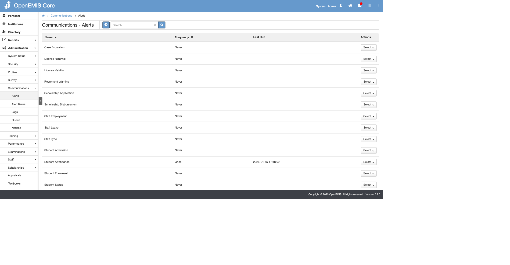
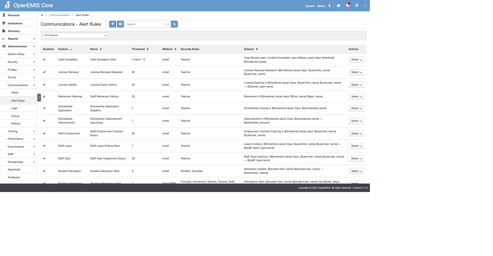
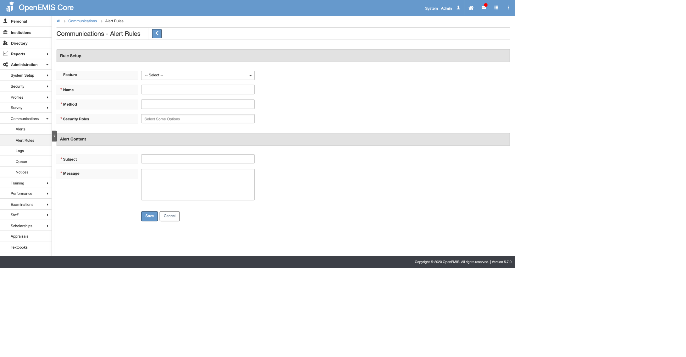
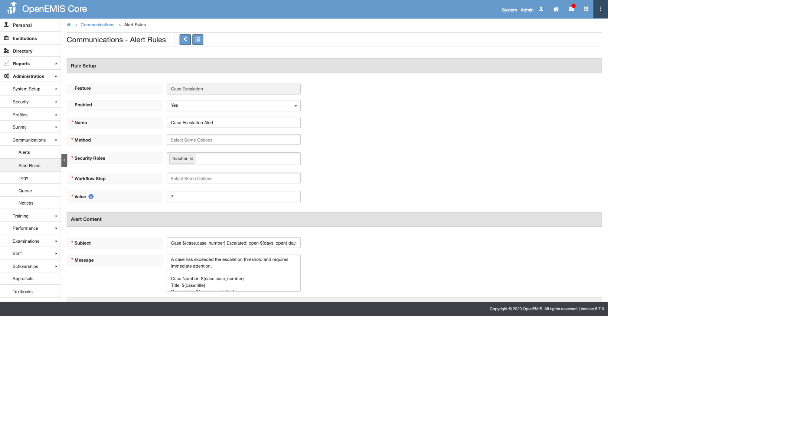
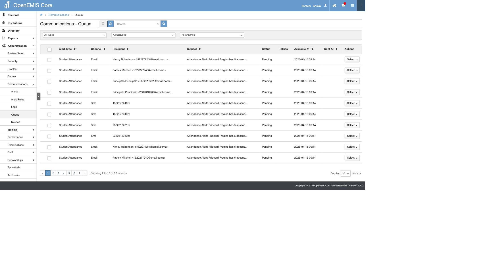
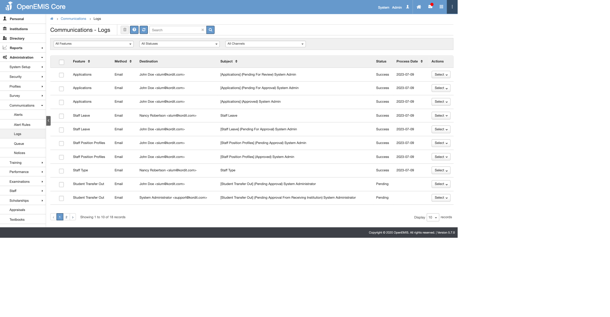
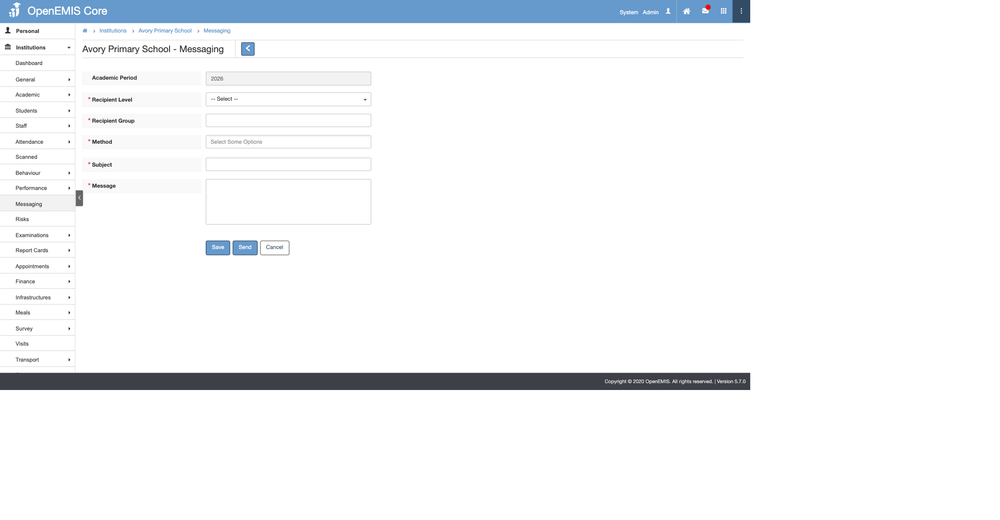

# OpenEMIS — Руководство администратора системы оповещений

Данное руководство является авторитетным справочником модуля оповещений OpenEMIS Core, представленного и расширенного в рамках POCOR-9509. Оно охватывает каждый тип оповещения, каждый вариант конфигурации и каждую операционную процедуру, необходимую администратору. Используйте оглавление для прямого перехода к разделу, релевантному Вашей задаче. На протяжении всего руководства приведены примеры и деревья решений для быстрого разрешения типичных проблем.

---

## Содержание

1. [Введение](#1-introduction)
   - [1.1 Что делает модуль оповещений](#11-what-the-alerts-module-does)
   - [1.2 Для кого предназначено данное руководство](#12-who-should-read-this-manual)
   - [1.3 Новое в POCOR-9509](#13-what-is-new-in-pocor-9509)
   - [1.4 Как читать данное руководство](#14-how-to-read-this-manual)
2. [Архитектура с первого взгляда](#2-architecture-at-a-glance)
   - [2.1 Пятиэтапный конвейер](#21-the-five-stage-pipeline)
   - [2.2 Оповещения, основанные на событиях, и плановые оповещения](#22-event-based-vs-scheduled-alerts)
   - [2.3 Два пути распределения](#23-the-two-dispatch-paths)
   - [2.4 Задействованные таблицы базы данных](#24-database-tables-involved)
3. [Навигация и пользовательский интерфейс](#3-navigation-and-ui)
   - [3.1 Местоположение модуля](#31-module-location)
   - [3.2 Четыре экрана](#32-the-four-screens)
   - [3.3 Права доступа](#33-permissions)
4. [Управление расписанием оповещений](#4-managing-alert-schedules)
   - [4.1 Список типов оповещений](#41-the-alert-types-list)
   - [4.2 Варианты частоты](#42-frequency-options)
   - [4.3 Запуск и остановка оповещения](#43-starting-and-stopping-an-alert)
   - [4.4 Почему «Никогда» — это безопасная настройка по умолчанию](#44-why-never-is-the-safe-default)
5. [Правила оповещений — конфигурирование содержимого](#5-alert-rules--configuring-what-to-send)
   - [5.1 Строение правила](#51-rule-anatomy)
   - [5.2 Создание правила](#52-creating-a-rule)
   - [5.3 Редактирование и удаление правила](#53-editing-and-deleting-a-rule)
   - [5.4 Несколько правил для одного типа оповещения](#54-multiple-rules-per-alert-type)
   - [5.5 Условия, прерывающие выполнение правила](#55-rule-conditions-that-stop-execution)
6. [Подстановочные токены](#6-placeholders)
   - [6.1 Синтаксис подстановочных токенов](#61-placeholder-syntax)
   - [6.2 Часто используемые токены](#62-common-tokens)
   - [6.3 Токены студентов](#63-student-tokens)
   - [6.4 Токены сотрудников и пользователей](#64-staff-and-user-tokens)
   - [6.5 Токены дел](#65-case-tokens)
   - [6.6 Токены лицензий](#66-license-tokens)
   - [6.7 Токены стипендий](#67-scholarship-tokens)
   - [6.8 Токены системных обновлений](#68-system-update-tokens)
   - [6.9 Поведение при нулевом или отсутствующем подстановочном токене](#69-behaviour-when-a-placeholder-is-null-or-missing)
7. [Пороги](#7-thresholds)
   - [7.1 Обзор форматов порогов](#71-threshold-formats-overview)
   - [7.2 Поле `value`](#72-the-value-field)
   - [7.3 Поле `condition`](#73-the-condition-field)
   - [7.4 Пороги этапов рабочего процесса](#74-workflow-step-thresholds)
   - [7.5 Фильтры по категориям и типам](#75-category-and-type-filters)
   - [7.6 Создание парных правил «до» и «после»](#76-creating-paired-beforeafter-rules)
8. [Справочник типов оповещений](#8-alert-types-reference)
   - [8.1 Отсутствие студента](#81-student-absence)
   - [8.2 Поступление студента](#82-student-admission)
   - [8.3 Зачисление студента](#83-student-enrolment)
   - [8.4 Изменение статуса студента](#84-student-status-change)
   - [8.5 Предупреждение о выходе на пенсию](#85-retirement-warning)
   - [8.6 Окончание трудоустройства сотрудника](#86-staff-employment-end)
   - [8.7 Окончание отпуска сотрудника](#87-staff-leave-end)
   - [8.8 Тип сотрудника](#88-staff-type)
   - [8.9 Срок действия лицензии](#89-license-validity)
   - [8.10 Возобновление лицензии](#810-license-renewal)
   - [8.11 Заявление на стипендию](#811-scholarship-application)
   - [8.12 Выплата стипендии](#812-scholarship-disbursement)
   - [8.13 Эскалация дела](#813-case-escalation)
   - [8.14 Системные обновления](#814-system-updates)
   - [8.15 Присутствие сотрудника — не реализовано](#815-staff-attendance--not-implemented)
9. [Оповещения, инициируемые рабочим процессом](#9-workflow-triggered-alerts)
   - [9.1 Чем оповещения рабочего процесса отличаются от оповещений на основе правил](#91-how-workflow-alerts-differ-from-rule-based-alerts)
   - [9.2 Условия, подавляющие оповещение рабочего процесса](#92-conditions-that-suppress-a-workflow-alert)
   - [9.3 Настройка оповещения рабочего процесса](#93-setting-up-a-workflow-alert)
10. [Очередь оповещений — конвейер доставки](#10-alert-queue--delivery-pipeline)
    - [10.1 Назначение экрана очереди](#101-purpose-of-the-queue-screen)
    - [10.2 Колонки очереди](#102-queue-columns)
    - [10.3 Коды статуса](#103-status-codes)
    - [10.4 Массовое удаление элементов очереди](#104-mass-deleting-queue-items)
    - [10.5 Диаграмма жизненного цикла очереди](#105-queue-lifecycle-diagram)
11. [Журналы оповещений — журнал аудита](#11-alert-logs--audit-trail)
    - [11.1 Назначение журналов оповещений](#111-purpose-of-alert-logs)
    - [11.2 Дедупликация через контрольные суммы SHA-256](#112-deduplication-via-sha-256-checksums)
    - [11.3 Просмотр и удаление отдельных записей журнала](#113-viewing-and-deleting-single-log-entries)
    - [11.4 Массовое удаление записей журнала](#114-mass-deleting-log-entries)
12. [Сообщения — уровень учебного заведения](#12-messaging--institution-level)
    - [12.1 Различие между оповещениями и сообщениями](#121-difference-between-alerts-and-messaging)
    - [12.2 Составление сообщения](#122-composing-a-message)
    - [12.3 История сообщений](#123-message-history)
13. [Операционная конфигурация](#13-operational-configuration)
    - [13.1 Ключи конфигурации](#131-configuration-keys)
    - [13.2 Ограничение пропускной способности через ALERTS_PROCESS_LIMIT](#132-throttling-via-alerts_process_limit)
    - [13.3 Ограничение распределения рабочими часами](#133-restricting-dispatch-to-working-hours)
    - [13.4 Соблюдение местных выходных дней](#134-respecting-local-weekends)
    - [13.5 Настройка Cron](#135-cron-setup)
14. [Тестирование и процедуры сухого запуска](#14-testing-and-dry-run-procedures)
    - [14.1 Запуск команды напрямую](#141-running-a-command-directly)
    - [14.2 Проверка очереди и системных процессов](#142-checking-the-queue-and-system-processes)
    - [14.3 Заполнение отсутствующих адресов электронной почты и номеров телефонов (только разработка/тестирование БД)](#143-populating-missing-emails-and-phone-numbers-devtest-databases-only)
    - [14.4 Проверка анонимизации базы данных](#144-verifying-database-is-anonymised)
    - [14.5 Принудительное выполнение всех плановых оповещений сейчас](#145-force-running-all-scheduled-alerts-now)
15. [Устранение неполадок](#15-troubleshooting)
    - [15.1 Оповещение активировано, но письмо не получено](#151-alert-fired-but-no-email-received)
    - [15.2 Правило оповещения включено, но оповещение никогда не активируется](#152-alert-rule-enabled-but-never-fires)
    - [15.3 Оповещение рабочего процесса не активируется](#153-workflow-alert-not-firing)
    - [15.4 Дублирование оповещений в очереди](#154-duplicate-alerts-in-queue)
    - [15.5 Массовое удаление не удаляет все выбранные строки](#155-mass-delete-does-not-remove-all-selected-rows)
    - [15.6 Очередь переполнена — сообщения не отправляются](#156-queue-backing-up--messages-not-sending)
    - [15.7 Чтение файлов журнала команд](#157-reading-the-command-log-files)
16. [Приложения](#16-appendices)
    - [A. Полный справочник команд Artisan](#a-full-artisan-command-reference)
    - [B. Контрольный список трёх карт команд](#b-three-command-maps-checklist)
    - [C. Справочные SQL-запросы](#c-sql-reference-queries)
    - [D. Глоссарий](#d-glossary)
    - [E. Дополнительная информация](#e-further-reading)

---

## 1. Введение {#1-introduction}

### 1.1 Что делает модуль оповещений {#11-what-the-alerts-module-does}

Модуль оповещений OpenEMIS доставляет автоматические уведомления школьному и министерскому персоналу при возникновении критических ситуаций. Уведомления распределяются по электронной почте, SMS или обоим способам, в зависимости от конфигурации правила. Примеры отслеживаемых условий включают накопление студентом установленного количества дней отсутствия, достижение трудовым договором сотрудника даты окончания, приближение профессиональной лицензии к истечению срока действия, приближение крайнего срока подачи заявления на стипендию и превышение неразрешённым делом своего порога эскалации. Модуль работает непрерывно без ручного вмешательства после настройки и ведёт постоянный журнал аудита каждого отправленного сообщения.

### 1.2 Для кого предназначено данное руководство {#12-who-should-read-this-manual}

Данное руководство предназначено для трёх категорий пользователей. Администраторы IT министерства, развёртывающие и поддерживающие инсталляцию OpenEMIS, найдут наиболее релевантными разделы об архитектуре, конфигурации и устранении неполадок. Старшие системные менеджеры, ответственные за политику коммуникаций, будут использовать справочник типов оповещений и разделы конфигурирования правил. Инженеры по развёртыванию, выполняющие начальную активацию, будут следовать разделам операционной конфигурации и тестирования. Все три категории получат пользу от чтения §2 и §8 перед работой над конкретными задачами.

### 1.3 Новое в POCOR-9509 {#13-what-is-new-in-pocor-9509}

POCOR-9509 предоставляет следующие изменения в инфраструктуру оповещений:

- **Пять новых типов оповещений**: эскалация дела, срок действия лицензии, возобновление лицензии, заявление на стипендию и выплата стипендии. Каждое полностью документировано в §8.
- **Экран очереди оповещений**: новый экран под Administration → Communications → Alert Queue обеспечивает видимость в реальном времени состояния конвейера доставки для каждого ожидающего, отправленного и сбойного сообщения.
- **Массовое удаление для журналов оповещений и очереди оповещений**: администраторы теперь могут выбрать несколько записей и удалить их в одной операции, обеспечивая быструю очистку после неправильно настроенного правила, создавшего нежелательные записи в очереди.
- **Выполнение на основе Laravel**: вся обработка оповещений перенесена из shell-скриптов CakePHP в чистые команды Laravel artisan под `api/app/Console/Commands/Alerts/`. Это обеспечивает согласованную обработку ошибок, отслеживание процессов и тестируемость.
- **Ограничение пропускной способности через `ALERTS_PROCESS_LIMIT`**: одна переменная `.env` управляет максимальным числом обрабатываемых сообщений за цикл планировщика, позволяя администраторам предотвратить спам без прямого редактирования кода.

### 1.4 Как читать данное руководство {#14-how-to-read-this-manual}

Данное руководство структурировано для просмотра, а не линейного чтения. Справочные таблицы появляются в верхней части каждого основного раздела для быстрого поиска. За справочными таблицами следуют рабочие примеры для читателей, которые учатся на примерах. Раздел устранения неполадок (§15) использует формат дерева решений, ориентированный на симптомы — перейдите прямо к заголовку симптома, затем выполняйте пронумерованные проверки по порядку. Для любого отдельного типа оповещения перейдите в §8 и найдите соответствующее H3; каждая запись автономна и включает её срабатывание, порог, получателей, подстановочные токены, рабочий пример и точную artisan-команду для тестирования.

---

## 2. Архитектура с первого взгляда {#2-architecture-at-a-glance}

### 2.1 Пятиэтапный конвейер {#21-the-five-stage-pipeline}

Все доставки оповещений проходят через следующие пять этапов, независимо от того, основано ли оповещение на событиях или планировании:

```
┌───────────────┐     ┌─────────────┐     ┌──────────────┐     ┌───────────┐     ┌──────────┐
│   1. Trigger  │────►│ 2. Rule     │────►│ 3. Data      │────►│ 4. Queue  │────►│ 5. Deliv-│
│               │     │    Match    │     │    Query     │     │           │     │    ery   │
│ afterSave /   │     │             │     │              │     │           │     │          │
│ cron job      │     │ alert_rules │     │ getPending   │     │ alert_    │     │ Email /  │
│               │     │ lookup      │     │ Items()      │     │ queue     │     │ SMS      │
└───────────────┘     └─────────────┘     └──────────────┘     └───────────┘     └──────────┘
```

**Этап 1 — срабатывание**: событие домена активируется (запись сохраняется в CakePHP) или планировщик вызывает `alerts:check` в установленном цикле.

**Этап 2 — сопоставление правил**: система загружает все записи `alert_rules`, у которых `feature` соответствует типу запущенного оповещения. Правила, отмеченные `Enabled = No`, пропускаются.

**Этап 3 — запрос данных**: команда artisan вызывает `getPendingItems()` для получения записей, удовлетворяющих условию порога. Для каждой записи `fillPlaceholders()` создаёт персонализированное сообщение на основе шаблона.

**Этап 4 — очередь**: команда вызывает `processContactList()` для каждого разрешённого получателя. Вычисляется контрольная сумма SHA-256 строки темы и тела сообщения. Если идентичная контрольная сумма уже существует в `alert_logs` со статусом `PENDING`, элемент молча пропускается. В противном случае строка вставляется в `alert_queue`.

**Этап 5 — доставка**: команда `alerts:send`, запускаемая каждую минуту планировщиком Laravel, читает строки `alert_queue` со статусом `PROCESSING` и распределяет их в почтовый сервис (SMTP) или SMS-шлюз (Twilio). Статус обновляется на `SENT` или `FAILED` при завершении.

### 2.2 Оповещения, основанные на событиях, и плановые оповещения {#22-event-based-vs-scheduled-alerts}

| Свойство | На основе событий | Плановые |
|----------|-------------|-----------|
| Источник срабатывания | Обратный вызов `afterSave()` модели CakePHP | Команда cron `alerts:check` |
| Частота в пользовательском интерфейсе | `Once` (срабатывает по каждому событию) | `Daily`, `Weekly` или `Monthly` |
| Задержка | Практически в реальном времени (секунды после сохранения) | До одного цикла планирования |
| Запуск/остановка в ПИ | Неприменимо — срабатывает от событий данных | Управляется параметром частоты |
| Примеры | Отсутствие студента, поступление, зачисление, изменение статуса | Предупреждение о выходе на пенсию, срок действия лицензии, эскалация дела |

### 2.3 Два пути распределения {#23-the-two-dispatch-paths}

| Путь | Срабатывание | Команды |
|------|---------|---------|
| **На основе событий** | CakePHP модель `afterSave` → `AlertLogsTable::triggerLaravelAlertFromCakePHP()` | `alerts:student-absence`, `alerts:student-admission`, `alerts:student-enrolment`, `alerts:student-status-change` |
| **Плановые** | `alerts:check` (cron или ручной вызов) | `alerts:retirement-warning`, `alerts:staff-employment`, `alerts:staff-leave`, `alerts:staff-type`, `alerts:system-updates`, `alerts:case-escalation`, `alerts:license-validity`, `alerts:license-renewal`, `alerts:scholarship-application`, `alerts:scholarship-disbursement` |

### 2.4 Задействованные таблицы базы данных {#24-database-tables-involved}

| Таблица | Роль в конвейере |
|--------|----------------------|
| `alerts` | Одна строка на тип оповещения; хранит частоту и статус включения |
| `alert_rules` | Одна или более строк на тип оповещения; хранит порог, роли, тему, сообщение |
| `alert_queue` | Временные строки доставки; статус `0` (ожидание), `1` (отправлено), `-1` (ошибка) |
| `alert_logs` | Постоянный журнал аудита; одна строка на отправленное сообщение с контрольной суммой SHA-256 |
| `alert_logs_roles` | Таблица связей, соединяющая `alert_logs` с `security_roles` |
| `security_groups` | Группировки пользователей на основе ролей для разрешения получателей |
| `security_group_users` | Членство пользователей в группах безопасности |
| `security_users` | Контактные записи; поля `email` и `mobile_number` управляют доставкой |
| `system_processes` | Одна строка на выполнение artisan-команды; хранит статус и путь к файлу журнала |

---

## 3. Навигация и пользовательский интерфейс {#3-navigation-and-ui}

### 3.1 Местоположение модуля {#31-module-location}

Модуль оповещений расположен в **Administration → Communications** в левой боковой панели. Все экраны, связанные с оповещениями, имеют общий родительский путь.

### 3.2 Четыре экрана {#32-the-four-screens}

**Скриншот 3.1** — список оповещений, показывающий все зарегистрированные типы оповещений.



| Экран | Путь | Назначение |
|--------|------|---------|
| **Alerts** | Administration → Communications → Alerts | Включение или отключение каждого типа оповещения; установка частоты |
| **Alert Rules** | Administration → Communications → Alert Rules | Создание, редактирование и удаление правил оповещений |
| **Alert Logs** | Administration → Communications → Alert Logs | Просмотр постоянного журнала аудита всех распределённых уведомлений |
| **Alert Queue** | Administration → Communications → Alert Queue | Мониторинг и управление ожидающими, отправленными и сбойными элементами доставки |

### 3.3 Права доступа {#33-permissions}

Три уровня разрешений управляют доступом к администрированию оповещений:

| Уровень | Возможности | Конфигурация |
|-------|-------------|---------------|
| Полный доступ | Просмотр, создание, редактирование, удаление оповещений, правил, журналов и элементов очереди | Security → Roles → назначить все функции оповещений `_view`, `_add`, `_edit`, `_delete` |
| Только выполнение | Просмотр и запуск оповещений; невозможно создавать или удалять правила | Назначить `_view` и `_execute` без `_add`, `_edit`, `_delete` |
| Только для просмотра | Доступ только для чтения ко всем четырём экранам | Назначить только функции `_view` |

Настройте права доступа в **Security → Roles**, затем назначьте роли пользователям в **Security → Users**.

---

## 4. Управление расписанием оповещений {#4-managing-alert-schedules}

### 4.1 Список типов оповещений {#41-the-alert-types-list}

**Скриншот 4.1** — список оповещений с колонкой частоты и индикаторами состояния.


Экран оповещений отображает каждый зарегистрированный в системе тип оповещения. Каждая строка показывает имя оповещения, текущую частоту и статус выполнения. Строки для оповещений на основе событий показывают частоту `Once` и не имеют управления запуском/остановкой, так как они срабатывают автоматически при изменении данных, а не по расписанию.

### 4.2 Варианты частоты {#42-frequency-options}

| Вариант | Поведение |
|--------|-----------|
| `Never` | Полностью отключено; оповещения не срабатывают независимо от конфигурации правил |
| `Once` | Срабатывает один раз на событие срабатывания; используется исключительно оповещениями на основе событий |
| `Daily` | Запускается максимум один раз в день по совпадающей записи |
| `Weekly` | Запускается максимум один раз за 7-дневный период по совпадающей записи |
| `Monthly` | Запускается максимум один раз в календарный месяц по совпадающей записи |

> **Примечание:** `SystemUpdates` — единственный тип оповещения, поставляемый с `Daily` в качестве частоты по умолчанию. Все остальные типы оповещений по умолчанию имеют `Never`.

### 4.3 Запуск и остановка оповещения {#43-starting-and-stopping-an-alert}

Для включения планового оповещения:

1. Перейдите в **Administration → Communications → Alerts**.
2. Нажмите **View** на тип оповещения, который Вы хотите включить.
3. Убедитесь, что частота установлена на `Daily`, `Weekly` или `Monthly`.
4. Нажмите **Start** в панели действий.

Для отключения оповещения откройте ту же запись и нажмите **Stop**. Тип оповещения переходит в остановленное состояние, но сохраняет параметр частоты. Существующие правила не удаляются.

> **Примечание:** типы оповещений на основе событий (отсутствие студента, поступление, зачисление, изменение статуса) не отображают управление запуском/остановкой. Они срабатывают автоматически при сохранении записей их срабатывания. Для их отключения установите частоту на `Never`.

### 4.4 Почему «Никогда» — это безопасная настройка по умолчанию {#44-why-never-is-the-safe-default}

Все типы оповещений, кроме `SystemUpdates`, по умолчанию имеют `Never`. Это предотвращает случайную доставку оповещений при новых инсталляциях или после миграций, когда правила могут быть не ещё настроены. Перед установкой любого типа оповещения на `Daily` или `Weekly` подтвердите, что для него существует хотя бы одно включённое правило и что порог и роли получателей правильно сконфигурированы.

---

## 5. Правила оповещений — конфигурирование содержимого {#5-alert-rules--configuring-what-to-send}

### 5.1 Строение правила {#51-rule-anatomy}

**Скриншот 5.1** — список правил оповещений, показывающий все настроенные правила.



Каждая запись правила оповещения содержит следующие поля:

| Поле | Тип | Назначение |
|------|------|---------|
| **Name** | Текст | Описательное имя для этого правила; сделайте его уникальным, если несколько правил имеют одну и ту же feature |
| **Enabled** | Да/нет | Отключённые правила никогда не выполняются, независимо от частоты оповещения |
| **Feature** | Выбор | Тип оповещения, которым управляет это правило; должен точно соответствовать ключу feature (см. §8) |
| **Method** | Выбор | `Email`, `SMS` или оба |
| **Threshold** | Текст/JSON | Условие, определяющее, какие записи квалифицируются; формат варьируется по типам оповещений (см. §7) |
| **Security Roles** | Множественный выбор | Роли, члены которых получают это уведомление |
| **Subject** | Текст | Строка темы уведомления; поддерживает токены `${placeholder}` |
| **Message** | Текст | Тело уведомления; поддерживает токены `${placeholder}` |

### 5.2 Создание правила {#52-creating-a-rule}

**Скриншот 5.2** — форма добавления правила оповещения со всеми видимыми полями.



1. Перейдите в **Administration → Communications → Alert Rules**.
2. Нажмите **Add** в панели действий.
3. Введите описательное **Name** для правила.
4. Установите **Enabled** на `Yes`.
5. Выберите **Feature** (тип оповещения) из раскрывающегося списка.
6. Выберите **Method**: `Email`, `SMS` или оба.
7. Введите **Threshold** в формате, требуемом выбранной feature (см. §7 и §8).
8. Выберите одну или несколько **Security Roles**, члены которых получат уведомление.
9. Введите шаблон **Subject**, используя токены `${placeholder}` где необходимо.
10. Введите шаблон **Message**, используя токены `${placeholder}` где необходимо.
11. Нажмите **Save**.

> **Важно:** все следующие поля являются обязательными: Method, Security Roles, Threshold (для типов оповещений, которые его используют), Subject и Message. Сохранение правила с отсутствующими обязательными полями создаёт ошибку валидации.

### 5.3 Редактирование и удаление правила {#53-editing-and-deleting-a-rule}

**Скриншот 5.3** — форма редактирования правила оповещения, показывающая правило эскалации дела.



Для редактирования существующего правила перейдите в **Alert Rules**, нажмите **View** на целевое правило, затем нажмите **Edit** в панели действий. Измените любое поле и нажмите **Save**.

Для удаления правила откройте запись правила и нажмите **Delete** в панели действий. Удаление необратимо. Связанные записи `alert_logs` сохраняются в целях аудита.

> **Важно:** удаление единственного правила для типа оповещения эффективно отключает этот тип оповещения. Ссылка подтверждения удаления не упоминает связанные записи журнала — проверьте, что правило больше не нужно, перед удалением.

### 5.4 Несколько правил для одного типа оповещения {#54-multiple-rules-per-alert-type}

Это самая важная концепция конфигурации в модуле оповещений. Один тип оповещения может иметь любое количество правил, каждое с разным порогом, разными ролями получателей и разным сообщением. Правила выполняются независимо — одна запись может соответствовать нескольким правилам в один день.

**Пример 1 — Срок действия лицензии: стратегия четырёхуровневой эскалации**

| Имя правила | Порог | Частота | Роли | Назначение |
|-----------|-----------|-----------|-------|---------|
| License Validity — 60 Days | `{"value": 60, "license_type": 3, "condition": 1}` | Weekly | HR Officer | Ранний горизонт планирования |
| License Validity — 30 Days | `{"value": 30, "license_type": 3, "condition": 1}` | Daily | HR Officer, Principal | Фаза активного напоминания |
| License Validity — 7 Days | `{"value": 7, "license_type": 3, "condition": 1}` | Daily | HR Officer, Principal, District HR | Срочная эскалация перед истечением срока |
| License Validity — Expired | `{"value": 7, "license_type": 3, "condition": 2}` | Daily | HR Officer, Principal, District HR, Ministry | Оповещение соответствия после истечения срока |

Сотрудник с лицензией, истекающей через 5 дней, активирует все три правила до истечения срока одновременно. Как только лицензия истекает, активируется правило после истечения срока. Все четыре правила имеют одно и то же значение feature `LicenseValidity`.

**Пример 2 — Эскалация дела: уведомление управления с послойной структурой**

| Имя правила | Порог | Роли | Назначение |
|-----------|-----------|-------|---------|
| Case Escalation — 3 Days | `{"value": 3, "workflow_steps": [12]}` | Principal | Немедленный толчок владельцу дела |
| Case Escalation — 7 Days | `{"value": 7, "workflow_steps": [12]}` | Principal, Coordinator | Путь стандартной эскалации |
| Case Escalation — 21 Days | `{"value": 21, "workflow_steps": [12]}` | Principal, District Officer, Ministry | Критическая эскалация для старшего управления |

Дело, находящееся в процессе 25 дней, активирует все три правила в один день и продолжает делать это каждый день, пока не изменится статус дела.

### 5.5 Условия, прерывающие выполнение правила {#55-rule-conditions-that-stop-execution}

Правило не выполняется, если выполняется любое из следующих условий:

| Условие | Эффект |
|-----------|--------|
| `Enabled = No` на правиле | Правило полностью пропускается при обработке |
| Частота типа оповещения установлена на `Never` | Ни одно правило для этого типа оповещения не выполняется |
| JSON порога неправильно сформирован или не может быть разобран | Правило молча пропускается; проверьте журналы |
| Нет назначенных ролей безопасности | Получатели не могут быть разрешены; сообщения не ставятся в очередь |
| Нет совпадающих записей `security_users` с назначенными ролями | Сообщения не ставятся в очередь; это не ошибка |

---

## 6. Подстановочные токены {#6-placeholders}

### 6.1 Синтаксис подстановочных токенов {#61-placeholder-syntax}

Подстановочные токены используют формат `${entity.field}`. Они чувствительны к регистру. Подстановочный токен заменяется во время генерации сообщения соответствующим значением из разрешённой записи данных. Если токен подстановочного токена не распознан или значение поля равно null, токен остаётся буквальной строкой в выходных данных — он не удаляется молча.

Одни и те же токены подстановочных токенов появляются одинаково в шаблонах темы и сообщения.

### 6.2 Часто используемые токены {#62-common-tokens}

| Токен | Пример значения | Источник |
|-------|--------------|--------|
| `${institution.name}` | `Sunrise Academy` | `institutions.name` |
| `${institution.code}` | `SA-001` | `institutions.code` |
| `${institution.address}` | `12 Education Street` | `institutions.address` |
| `${institution.phone}` | `+1-555-0100` | `institutions.telephone` |
| `${days.remaining}` | `14` | Вычислено: `ABS(DATEDIFF(NOW(), target_date))` |

### 6.3 Токены студентов {#63-student-tokens}

| Токен | Пример значения | Источник |
|-------|--------------|--------|
| `${student.name}` | `Ali Hassan` | Объединённое имя и фамилия |
| `${student.openemis_no}` | `OE-20241001` | `security_users.openemis_no` |
| `${student.first_name}` | `Ali` | `security_users.first_name` |
| `${student.middle_name}` | `Mohammed` | `security_users.middle_name` |
| `${student.last_name}` | `Hassan` | `security_users.last_name` |
| `${student.date_of_birth}` | `2010-05-14` | `security_users.date_of_birth` |
| `${student.gender}` | `Male` | `genders.name` |
| `${student.nationality}` | `Jordanian` | `nationalities.name` |
| `${student.identity_number}` | `A123456` | `security_users.identity_number` |
| `${student.identity_type}` | `National ID` | `identity_types.name` |
| `${student.status}` | `Enrolled` | `student_statuses.name` |
| `${total.days}` | `5` | Агрегированный подсчёт дней отсутствия за период |
| `${total.times}` | `7` | Агрегированный подсчёт случаев отсутствия |

### 6.4 Токены сотрудников и пользователей {#64-staff-and-user-tokens}

| Токен | Пример значения | Источник |
|-------|--------------|--------|
| `${staff.name}` | `Mohammed Al Farsi` | Объединённое имя сотрудника |
| `${staff.openemis_no}` | `OE-ST-001` | `security_users.openemis_no` |
| `${staff.email}` | `m.alfarsi@ministry.gov` | `security_users.email` |
| `${staff.position}` | `Deputy Principal` | `positions.name` |
| `${staff.employment_date}` | `2015-01-01` | `institution_staff.employment_date` |
| `${staff.employment_end_date}` | `2025-06-30` | `institution_staff.employment_end_date` |

### 6.5 Токены дел {#65-case-tokens}

| Токен | Пример значения | Источник |
|-------|--------------|--------|
| `${case.reference}` | `CSE-2025-00123` | `cases.case_number` или уникальный идентификатор |
| `${case.title}` | `Student Bullying Incident` | `cases.title` |
| `${case.created_date}` | `2025-01-15` | `cases.created` |
| `${case.days_elapsed}` | `47` | Вычислено: дни со дня создания |
| `${case.assigned_to}` | `Sarah Mitchell` | `security_users.first_name` + `last_name` назначенного пользователя |
| `${case.status}` | `In Progress` | `case_statuses.name` или этап рабочего процесса |

### 6.6 Токены лицензий {#66-license-tokens}

| Токен | Пример значения | Источник |
|-------|--------------|--------|
| `${license.number}` | `LIC-2020-45678` | `staff_licenses.license_number` |
| `${license.type}` | `Teaching Certificate` | `license_types.name` |
| `${license.issue_date}` | `2020-06-01` | `staff_licenses.issue_date` |
| `${license.expiry_date}` | `2025-06-01` | `staff_licenses.expiry_date` |
| `${license.days_remaining}` | `47` | Вычислено: дни до истечения срока действия |
| `${license.issuing_body}` | `Ministry of Education` | `staff_licenses.issuing_body` |

### 6.7 Токены стипендий {#67-scholarship-tokens}

| Токен | Пример значения | Источник |
|-------|--------------|--------|
| `${scholarship.name}` | `Merit Scholarship 2025` | `scholarships.name` |
| `${scholarship.reference}` | `SCHOL-2025-00456` | `scholarship_applications.application_number` |
| `${scholarship.amount}` | `2,500.00` | `scholarships.amount` |
| `${scholarship.currency}` | `USD` | `scholarships.currency_code` |
| `${scholarship.application_deadline}` | `2025-03-31` | `scholarships.application_deadline` |
| `${scholarship.award_date}` | `2025-04-15` | `scholarship_applications.awarded_date` |
| `${scholarship.disbursement_date}` | `2025-05-01` | `scholarship_disbursements.disbursement_date` |

### 6.8 Токены системных обновлений {#68-system-update-tokens}

| Токен | Пример значения | Источник |
|-------|--------------|--------|
| `${new_version}` | `v5.1.0` | Номер версии выпуска системы |
| `${release_date}` | `2025-04-15` | Дата доступности выпуска |
| `${current_version}` | `v5.0.2` | Текущая установленная версия |

### 6.9 Поведение при нулевом или отсутствующем подстановочном токене {#69-behaviour-when-a-placeholder-is-null-or-missing}

| Сценарий | Результат |
|---------|-----------|
| Токен распознан; значение поля не null | Подстановочный токен заменяется значением |
| Токен распознан; значение поля null | Подстановочный токен остаётся буквальной строкой (не удаляется) |
| Токен не распознан; не совпадает ни с каким полем сущности | Подстановочный токен остаётся буквальной строкой |
| Несвязанная сущность (например, `${license.*}` для оповещения об отсутствии студента) | Подстановочный токен остаётся буквальной строкой; это не ошибка |

---

## 7. Пороги {#7-thresholds}

### 7.1 Обзор форматов порогов {#71-threshold-formats-overview}

| Тип оповещения | Формат | Пример | Примечание |
|----------|--------|---------|----------|
| Отсутствие студента | Integer | `5` | Количество дней отсутствия |
| Поступление студента | None | (пусто) | Срабатывает при любом поступлении |
| Зачисление студента | None | (пусто) | Срабатывает при любом зачислении |
| Изменение статуса студента | JSON | `{"status_id": 2}` | Фильтрует по целевому статусу |
| Предупреждение о выходе на пенсию | JSON | `{"value": 90}` | Дни до пенсионного возраста |
| Окончание трудоустройства | JSON | `{"value": 30}` | Дни до конца контракта |
| Окончание отпуска | JSON | `{"value": 7}` | Дни до конца отпуска |
| Тип сотрудника | JSON | `{"staff_type_id": 3}` | Фильтрует по типу сотрудника |
| Срок действия лицензии | JSON | `{"value": 60, "license_type": 3, "condition": 1}` | Сложный порог с условием |
| Возобновление лицензии | JSON | `{"value": 30, "license_type": 3}` | Дни до возобновления |
| Заявление на стипендию | JSON | `{"value": 14}` | Дни до крайнего срока подачи |
| Выплата стипендии | JSON | `{"value": 7}` | Дни до плановой выплаты |
| Эскалация дела | JSON | `{"value": 7, "workflow_steps": [12]}` | С фильтром по этапу рабочего процесса |
| Системные обновления | None | (пусто) | Срабатывает при любом выпуске |

### 7.2 Поле `value` {#72-the-value-field}

Поле `value` в JSON порога имеет различное значение в зависимости от типа оповещения:

- **Для оповещений на основе дней** (отсутствие, пенсия, контракт, отпуск): целое число дней до или после события.
- **Для оповещений о лицензиях**: целое число дней до истечения срока действия (условие 1) или после истечения срока (условие 2).
- **Для оповещений о стипендиях**: целое число дней до события (крайний срок, выплата).

> **Важно:** `value` всегда рассчитывается как абсолютное количество дней. Система автоматически вычисляет разницу между текущей датой и целевой датой.

### 7.3 Поле `condition` {#73-the-condition-field}

Поле `condition` в JSON порога определяет направление сравнения дат:

| Значение | Значение | Использование |
|---------|---------|---------|
| `1` | **До** (before) | Используется для предупреждений: лицензия истекает через `value` дней |
| `2` | **После** (after) | Используется для напоминаний: лицензия истекла `value` дней назад |

**Пример:**
```json
{
  "value": 30,
  "license_type": 3,
  "condition": 1
}
```
Это срабатывает для лицензий типа 3, которые истекают в течение ближайших 30 дней.

```json
{
  "value": 7,
  "license_type": 3,
  "condition": 2
}
```
Это срабатывает для лицензий типа 3, которые истекли в течение последних 7 дней.

### 7.4 Пороги этапов рабочего процесса {#74-workflow-step-thresholds}

Оповещение эскалации дела поддерживает фильтрацию по этапам рабочего процесса. Порог включает массив идентификаторов этапов:

```json
{
  "value": 7,
  "workflow_steps": [12, 15, 18]
}
```

Это срабатывает для дел, находящихся в одном из этапов 12, 15 или 18 в течение более чем 7 дней.

Для запроса доступных ID этапов рабочего процесса используйте:

```sql
SELECT id, name FROM workflow_steps WHERE workflow_id = <workflow_id> ORDER BY id;
```

### 7.5 Фильтры по категориям и типам {#75-category-and-type-filters}

Некоторые пороги поддерживают категорию или фильтры типов для уточнения того, какие записи квалифицируются:

| Поле фильтра | Используется в | Примеры | SQL таблица |
|-----------|----------|---------|----------|
| `staff_type_id` | Тип сотрудника | `{"staff_type_id": 3}` | `staff_types` |
| `license_type` | Срок действия лицензии, возобновление лицензии | `{"license_type": 2}` | `license_types` |
| `staff_leave_type` | Окончание отпуска | `{"staff_leave_type": 5}` | `staff_leave_types` |
| `training_categories` | Только для справки | Используется в специализированных отчётах | `training_categories` |

### 7.6 Создание парных правил «до» и «после» {#76-creating-paired-beforeafter-rules}

Для оповещений на основе дат (истечение лицензии, окончание контракта) рекомендуется создавать парные правила: одно с `condition: 1` (до события) и одно с `condition: 2` (после события). Это обеспечивает предупреждение за определённое время до события и напоминание после того, как событие произошло.

**Пример для истечения лицензии:**

Правило 1:
```json
{
  "value": 30,
  "license_type": 2,
  "condition": 1
}
```
Срабатывает: лицензия истекает в течение ближайших 30 дней.

Правило 2:
```json
{
  "value": 14,
  "license_type": 2,
  "condition": 2
}
```
Срабатывает: лицензия истекла в течение последних 14 дней (после истечения срока).

---

## 8. Справочник типов оповещений {#8-alert-types-reference}

Каждый тип оповещения документирован ниже в единообразном формате. Используйте содержание для прямого перехода к интересующему Вас типу.

### 8.1 Отсутствие студента {#81-student-absence}

| Атрибут | Значение |
|---------|---------|
| **Срабатывание** | На основе события |
| **Ключ feature** | `StudentAttendance` |
| **Команда artisan** | `alerts:student-absence` |
| **Порог** | Целое число дней |
| **Получатели** | Роли с явным назначением (HR, Principal) |

**Описание:**
Оповещение отсутствия студента срабатывает, когда запись посещаемости сохраняется и общее количество дней отсутствия превышает установленный порог в течение выбранного периода.

**Подстановочные токены:**
- `${student.name}`, `${student.openemis_no}`
- `${institution.name}`, `${institution.code}`
- `${total.days}` (общее количество дней отсутствия)
- `${total.times}` (общее количество случаев отсутствия)

**Работающий пример:**

Имя правила: `High Absence Alert`
```json
Threshold: 5
```
Тема: `Student Absence Alert: ${student.name}`
Сообщение: `Student ${student.name} (${student.openemis_no}) at ${institution.name} has recorded ${total.days} days of absence.`

**Команда тестирования:**
```bash
docker exec poe-application /bin/sh -c "cd /var/www/html/emis/core/api && php artisan alerts:student-absence --force"
```

**Примечания:**
- Порог сравнивается с полем `total_days` из агрегации посещаемости.
- Оповещение срабатывает только в момент сохранения; историческое добавление записей в прошлое не срабатывает оповещение.
- Должен быть установлен фильтр по учебному заведению в контексте сессии.

---

### 8.2 Поступление студента {#82-student-admission}

| Атрибут | Значение |
|---------|---------|
| **Срабатывание** | На основе события |
| **Ключ feature** | `StudentAdmission` |
| **Команда artisan** | `alerts:student-admission` |
| **Порог** | Нет (оповещение срабатывает при любом поступлении) |
| **Получатели** | Роли с явным назначением |

**Описание:**
Оповещение поступления студента срабатывает, когда новая запись студента приступает к данному учебному заведению.

**Подстановочные токены:**
- `${student.name}`, `${student.openemis_no}`, `${student.status}`
- `${institution.name}`
- `${student.date_of_birth}`, `${student.gender}`

**Работающий пример:**

Имя правила: `New Student Admission Notification`
Тема: `New Student Admitted: ${student.name}`
Сообщение: `${student.name} has been admitted to ${institution.name}. Please complete enrolment procedures.`

**Команда тестирования:**
```bash
docker exec poe-application /bin/sh -c "cd /var/www/html/emis/core/api && php artisan alerts:student-admission --force"
```

---

### 8.3 Зачисление студента {#83-student-enrolment}

| Атрибут | Значение |
|---------|---------|
| **Срабатывание** | На основе события |
| **Ключ feature** | `StudentEnrolment` |
| **Команда artisan** | `alerts:student-enrolment` |
| **Порог** | Нет |
| **Получатели** | Роли с явным назначением |

**Описание:**
Оповещение зачисления студента срабатывает, когда студент зачисляется на класс или уровень в текущее учебное заведение.

**Подстановочные токены:**
- `${student.name}`, `${student.openemis_no}`
- `${institution.name}`
- Токены, относящиеся к классу (если доступны)

**Работающий пример:**

Имя правила: `Student Enrolment Confirmation`
Тема: `Enrolment Confirmed: ${student.name}`
Сообщение: `${student.name} has been enrolled at ${institution.name}.`

---

### 8.4 Изменение статуса студента {#84-student-status-change}

| Атрибут | Значение |
|---------|---------|
| **Срабатывание** | На основе события |
| **Ключ feature** | `StudentStatus` |
| **Команда artisan** | `alerts:student-status-change` |
| **Порог** | JSON с целевым статусом |
| **Получатели** | Роли с явным назначением |

**Описание:**
Оповещение изменения статуса студента срабатывает, когда статус студента меняется на установленное значение (например, выпуск, исключение, переводка).

**Порог формат:**
```json
{
  "status_id": 3
}
```

**Подстановочные токены:**
- `${student.name}`, `${student.openemis_no}`, `${student.status}`
- `${institution.name}`

**Работающий пример:**

Имя правила: `Student Graduated`
```json
Threshold: {"status_id": 5}
```
Тема: `Graduation Notification: ${student.name}`
Сообщение: `${student.name} has graduated from ${institution.name}.`

---

### 8.5 Предупреждение о выходе на пенсию {#85-retirement-warning}

| Атрибут | Значение |
|---------|---------|
| **Срабатывание** | Плановое |
| **Ключ feature** | `RetirementWarning` |
| **Команда artisan** | `alerts:retirement-warning` |
| **Порог** | JSON с количеством дней |
| **Получатели** | Роли (HR Officer, Principal) |

**Описание:**
Оповещение предупреждения о выходе на пенсию срабатывает ежедневно для сотрудников, которые достигнут пенсионного возраста в течение установленного количества дней.

**Порог формат:**
```json
{
  "value": 90
}
```
Срабатывает для сотрудников, которые выходят на пенсию в течение ближайших 90 дней.

**Подстановочные токены:**
- `${staff.name}`, `${staff.openemis_no}`, `${staff.email}`
- `${staff.position}`, `${staff.employment_date}`
- `${days.remaining}` (дни до пенсионного возраста)

**Работающий пример:**

Имя правила: `90-Day Retirement Notice`
```json
Threshold: {"value": 90}
```
Тема: `Retirement Notice: ${staff.name}`
Сообщение: `${staff.name} will retire in ${days.remaining} days. Please initiate handover procedures.`

**Команда тестирования:**
```bash
docker exec poe-application /bin/sh -c "cd /var/www/html/emis/core/api && php artisan alerts:retirement-warning --force"
```

---

### 8.6 Окончание трудоустройства сотрудника {#86-staff-employment-end}

| Атрибут | Значение |
|---------|---------|
| **Срабатывание** | Плановое |
| **Ключ feature** | `StaffEmployment` |
| **Команда artisan** | `alerts:staff-employment` |
| **Порог** | JSON с количеством дней |
| **Получатели** | Роли HR |

**Описание:**
Оповещение окончания трудоустройства срабатывает ежедневно для сотрудников, у которых трудовой договор истекает в течение установленного количества дней.

**Порог формат:**
```json
{
  "value": 30
}
```

**Подстановочные токены:**
- `${staff.name}`, `${staff.position}`
- `${staff.employment_end_date}`, `${days.remaining}`
- `${institution.name}`

**Работающий пример:**

Имя правила: `30-Day Employment End Notice`
```json
Threshold: {"value": 30}
```
Тема: `Employment Contract Expires: ${staff.name}`
Сообщение: `${staff.name}'s employment contract at ${institution.name} expires in ${days.remaining} days.`

---

### 8.7 Окончание отпуска сотрудника {#87-staff-leave-end}

| Атрибут | Значение |
|---------|---------|
| **Срабатывание** | Плановое |
| **Ключ feature** | `StaffLeave` |
| **Команда artisan** | `alerts:staff-leave` |
| **Порог** | JSON с количеством дней и типом отпуска (опционально) |
| **Получатели** | Роли с явным назначением |

**Описание:**
Оповещение окончания отпуска срабатывает ежедневно для сотрудников, отпуск которых заканчивается в течение установленного количества дней.

**Порог формат:**
```json
{
  "value": 7
}
```
или с фильтром по типу:
```json
{
  "value": 7,
  "staff_leave_type": 2
}
```

**Подстановочные токены:**
- `${staff.name}`, `${staff.position}`
- `${leave_end_date}`, `${days.remaining}`

**Работающий пример:**

Имя правила: `Leave Return Reminder`
```json
Threshold: {"value": 7}
```
Тема: `Return from Leave: ${staff.name}`
Сообщение: `${staff.name} will return from leave in ${days.remaining} days. Please prepare for resumption.`

---

### 8.8 Тип сотрудника {#88-staff-type}

| Атрибут | Значение |
|---------|---------|
| **Срабатывание** | Плановое |
| **Ключ feature** | `StaffType` |
| **Команда artisan** | `alerts:staff-type` |
| **Порог** | JSON с ID типа сотрудника |
| **Получатели** | Роли с явным назначением |

**Описание:**
Оповещение типа сотрудника срабатывает ежедневно для сотрудников определённого типа, позволяя отправлять целевые сообщения (например, учителям, администраторам, вспомогательному персоналу).

**Порог формат:**
```json
{
  "staff_type_id": 1
}
```

**Подстановочные токены:**
- `${staff.name}`, `${staff.position}`
- `${institution.name}`

**Работающий пример:**

Имя правила: `Teacher Professional Development Reminder`
```json
Threshold: {"staff_type_id": 1}
```
Тема: `PD Opportunity: ${staff.name}`
Сообщение: `A professional development workshop is available for ${staff.name}.`

---

### 8.9 Срок действия лицензии {#89-license-validity}

| Атрибут | Значение |
|---------|---------|
| **Срабатывание** | Плановое |
| **Ключ feature** | `LicenseValidity` |
| **Команда artisan** | `alerts:license-validity` |
| **Порог** | JSON с дней, типом лицензии и условием |
| **Получатели** | Роли HR |

**Описание:**
Оповещение действительности лицензии срабатывает ежедневно для лицензий, которые истекают или истекли в течение установленного количества дней. Поддерживает многоуровневую эскалацию с разными ролями и частотами.

**Порог формат:**
```json
{
  "value": 60,
  "license_type": 3,
  "condition": 1
}
```
Условие 1 = срабатывает до истечения срока действия (предупреждение).
Условие 2 = срабатывает после истечения срока действия (напоминание).

**Подстановочные токены:**
- `${staff.name}`, `${staff.position}`
- `${license.type}`, `${license.number}`, `${license.expiry_date}`
- `${days.remaining}` или `${days.elapsed}`
- `${institution.name}`

**Работающий пример — многоуровневая эскалация:**

| Имя правила | Порог JSON | Частота | Роли |
|-----------|-----------|-----------|------|
| License — 60 Days | `{"value": 60, "license_type": 3, "condition": 1}` | Weekly | HR Officer |
| License — 30 Days | `{"value": 30, "license_type": 3, "condition": 1}` | Daily | HR Officer, Principal |
| License — 7 Days | `{"value": 7, "license_type": 3, "condition": 1}` | Daily | HR Officer, Principal, Ministry |

**Команда тестирования:**
```bash
docker exec poe-application /bin/sh -c "cd /var/www/html/emis/core/api && php artisan alerts:license-validity --force"
```

---

### 8.10 Возобновление лицензии {#810-license-renewal}

| Атрибут | Значение |
|---------|---------|
| **Срабатывание** | Плановое |
| **Ключ feature** | `LicenseRenewal` |
| **Команда artisan** | `alerts:license-renewal` |
| **Порог** | JSON с дней до крайнего срока возобновления |
| **Получатели** | Роли HR |

**Описание:**
Оповещение возобновления лицензии напоминает сотрудникам и менеджерам о необходимости возобновления лицензий перед истечением срока действия.

**Порог формат:**
```json
{
  "value": 30,
  "license_type": 2
}
```

**Подстановочные токены:**
- `${staff.name}`, `${license.type}`, `${license.expiry_date}`
- `${days.remaining}`

---

### 8.11 Заявление на стипендию {#811-scholarship-application}

| Атрибут | Значение |
|---------|---------|
| **Срабатывание** | Плановое |
| **Ключ feature** | `ScholarshipApplication` |
| **Команда artisan** | `alerts:scholarship-application` |
| **Порог** | JSON с дней до крайнего срока подачи |
| **Получатели** | Роли с явным назначением |

**Описание:**
Оповещение заявления на стипендию напоминает студентам и семьям о предстоящих крайних сроках подачи заявлений на стипендии.

**Порог формат:**
```json
{
  "value": 14
}
```

**Подстановочные токены:**
- `${student.name}`, `${scholarship.name}`
- `${scholarship.amount}`, `${scholarship.currency}`
- `${scholarship.application_deadline}`, `${days.remaining}`

---

### 8.12 Выплата стипендии {#812-scholarship-disbursement}

| Атрибут | Значение |
|---------|---------|
| **Срабатывание** | Плановое |
| **Ключ feature** | `ScholarshipDisbursement` |
| **Команда artisan** | `alerts:scholarship-disbursement` |
| **Порог** | JSON с дней до плановой выплаты |
| **Получатели** | Роли финансов |

**Описание:**
Оповещение выплаты стипендии уведомляет финансовых менеджеров о предстоящих выплатах стипендий и позволяет точно управлять кассовыми потоками.

**Порог формат:**
```json
{
  "value": 7
}
```

**Подстановочные токены:**
- `${student.name}`, `${scholarship.name}`
- `${scholarship.amount}`, `${scholarship.currency}`
- `${scholarship.disbursement_date}`, `${days.remaining}`

---

### 8.13 Эскалация дела {#813-case-escalation}

| Атрибут | Значение |
|---------|---------|
| **Срабатывание** | Плановое |
| **Ключ feature** | `CaseEscalation` |
| **Команда artisan** | `alerts:case-escalation` |
| **Порог** | JSON с дней и ID этапов рабочего процесса |
| **Получатели** | Роли управления (Principal, District Officer) |

**Описание:**
Оповещение эскалации дела напоминает менеджерам случаев о делах, которые находятся в процессе дольше установленного порога. Поддерживает фильтрацию по этапам рабочего процесса и многоуровневую эскалацию.

**Порог формат:**
```json
{
  "value": 7,
  "workflow_steps": [12, 15]
}
```

**Подстановочные токены:**
- `${case.reference}`, `${case.title}`, `${case.status}`
- `${case.assigned_to}`, `${case.days_elapsed}`, `${days.remaining}`
- `${institution.name}`

**Работающий пример — трёхуровневая эскалация:**

| Имя правила | Порог | Роли | Частота |
|-----------|-----------|-------|---------|
| Case — 3 Days | `{"value": 3, "workflow_steps": [12]}` | Principal | Daily |
| Case — 7 Days | `{"value": 7, "workflow_steps": [12]}` | Principal, Coordinator | Daily |
| Case — 21 Days | `{"value": 21, "workflow_steps": [12]}` | Principal, District Officer, Ministry | Daily |

**Команда тестирования:**
```bash
docker exec poe-application /bin/sh -c "cd /var/www/html/emis/core/api && php artisan alerts:case-escalation --force"
```

---

### 8.14 Системные обновления {#814-system-updates}

| Атрибут | Значение |
|---------|---------|
| **Срабатывание** | Плановое (один раз в день по расписанию выпусков) |
| **Ключ feature** | `SystemUpdates` |
| **Команда artisan** | `alerts:system-updates` |
| **Порог** | Нет |
| **Получатели** | Роли администрирования системы |

**Описание:**
Оповещение системных обновлений уведомляет администраторов о доступных обновлениях версий OpenEMIS. Это единственный тип оповещения с частотой по умолчанию `Daily`.

**Подстановочные токены:**
- `${new_version}` (номер версии выпуска)
- `${release_date}` (дата доступности)
- `${current_version}` (текущая установленная версия)

**Работающий пример:**

Имя правила: `System Update Available`
Тема: `OpenEMIS Update Available: ${new_version}`
Сообщение: `OpenEMIS version ${new_version} is now available (current: ${current_version}). Please review release notes and plan upgrade.`

**Команда тестирования:**
```bash
docker exec poe-application /bin/sh -c "cd /var/www/html/emis/core/api && php artisan alerts:system-updates --force"
```

---

### 8.15 Присутствие сотрудника — не реализовано {#815-staff-attendance--not-implemented}

| Атрибут | Значение |
|---------|---------|
| **Статус** | **Не реализовано** |
| **Ключ feature** | `StaffAttendance` |
| **Команда artisan** | Недоступна |

**Примечание:**
Оповещение присутствия сотрудника включено в архитектуру системы, но не реализовано в текущем выпуске POCOR-9509. В будущих выпусках оно позволит отправлять оповещения о посещаемости сотрудников и отсутствиях.

---

## 9. Оповещения, инициируемые рабочим процессом {#9-workflow-triggered-alerts}

### 9.1 Чем оповещения рабочего процесса отличаются от оповещений на основе правил {#91-how-workflow-alerts-differ-from-rule-based-alerts}

Оповещения рабочего процесса срабатывают автоматически, когда запись переходит между этапами (шагами) в определённом рабочем процессе. В отличие от оповещений на основе правил, которые сравнивают данные с пороговыми условиями, оповещения рабочего процесса реагируют исключительно на события переходов статуса.

| Свойство | Оповещения правил | Оповещения рабочего процесса |
|----------|-------------|-----------|
| Срабатывание | Сравнение с пороговым условием | Переход между этапами |
| Конфигурация | Правила оповещений UI | Workflow Steps → Notifications tab |
| Гибкость порогов | Полная (JSON, целые числа) | Не применяется (только переход) |
| Получатели | Определяются ролями в правиле | Определяются уведомлением, назначенным этапу |

### 9.2 Условия, подавляющие оповещение рабочего процесса {#92-conditions-that-suppress-a-workflow-alert}

Оповещение рабочего процесса не срабатывает в следующих сценариях:

| Сценарий | Причина |
|---------|--------|
| Первый переход из Open к первому этапу | Первоначальное создание; не считается переходом |
| Целевой этап не имеет уведомления | Уведомление не настроено для этапа |
| Определённые роли не имеют членов в текущей инстанции | Нет адресатов для отправки |
| Адресат не имеет предпочтительного адреса электронной почты | Невозможно доставить |

### 9.3 Настройка оповещения рабочего процесса {#93-setting-up-a-workflow-alert}

1. Перейдите в **Administration → Workflow Configuration → Workflows**.
2. Откройте интересующий рабочий процесс (например, **Case Management Workflow**).
3. На вкладке **Steps**, нажмите **View** на целевой этап.
4. Перейдите на вкладку **Notifications**.
5. Нажмите **Add** для создания нового уведомления этапа.
6. Выберите **Notification Type** из доступных вариантов.
7. Выберите **Recipient Roles** — пользователи с этими ролями получат уведомление при переходе на этот этап.
8. Настройте **Subject** и **Message** (если применимо).
9. Нажмите **Save**.

Как только этап уведомления настроен и сохранён, оновления будут срабатывать автоматически при переходе на этот этап в любом экземпляре рабочего процесса.

---

## 10. Очередь оповещений — конвейер доставки {#10-alert-queue--delivery-pipeline}

### 10.1 Назначение экрана очереди {#101-purpose-of-the-queue-screen}

**Скриншот 10.1** — экран очереди оповещений, показывающий все ожидающие, отправленные и сбойные элементы доставки.



Экран очереди оповещений предоставляет администраторам видимость в реальном времени в конвейер доставки сообщений. Каждая строка представляет одно сообщение в его пути от создания к отправке. Администраторы используют этот экран для:

- **Мониторинга статуса доставки**: быстро идентифицируют ожидающие, отправленные и неудачные сообщения.
- **Отладки неудачи доставки**: просмотрите соответствующий журнал для детали ошибки.
- **Очистки после ошибок конфигурации**: массово удалите элементы, чтобы предотвратить отправку нежелательных сообщений.

### 10.2 Колонки очереди {#102-queue-columns}

| Колонка | Тип данных | Описание |
|--------|-----------|---------|
| **Recipient** | Email или телефон | Адрес получателя (маскируется для конфиденциальности в рабочей системе) |
| **Subject** | Текст (из сокращения) | Первые 80 символов темы сообщения |
| **Feature** | Текст | Тип оповещения (StudentAbsence, LicenseValidity и т.д.) |
| **Method** | Email / SMS | Канал доставки |
| **Status** | 0 / 1 / -1 | Статус: 0=Pending, 1=Sent, -1=Failed |
| **Created** | Дата/время | Когда был создан элемент |
| **Sent At** | Дата/время (или null) | Когда был успешно отправлен |
| **Attempts** | Integer | Количество попыток отправки |

### 10.3 Коды статуса {#103-status-codes}

| Код | Значение | Поведение при повторных попытках |
|-----|---------|---------|
| **0** | Pending | Элемент ждёт первой попытки отправки |
| **1** | Sent | Элемент успешно доставлен; повторные попытки не предпринимаются |
| **-1** | Failed | Элемент не доставлен; планировщик будет повторять попытку до 3 раз или пока не пройдёт 24 часа |

Статус обновляется командой `alerts:send` каждую минуту. Для сбойных элементов система ждёт экспоненциального времени между повторными попытками перед окончательным отказом.

### 10.4 Массовое удаление элементов очереди {#104-mass-deleting-queue-items}

Если неправильно настроенное правило создало множество нежелательных элементов в очереди:

1. Перейдите в **Administration → Communications → Alert Queue**.
2. Установите флажки рядом с элементами, которые Вы хотите удалить (или выберите **Select All** для выбора всех).
3. Нажмите **Delete Selected** в панели действий.
4. Подтвердите удаление в диалоговом окне.

Удалённые элементы удаляются из очереди постоянно и не отправляются.

> **Важно:** массовое удаление удаляет элементы из `alert_queue`, но НЕ влияет на уже отправленные записи в `alert_logs`. Для очистки журналов см. §11.4.

### 10.5 Диаграмма жизненного цикла очереди {#105-queue-lifecycle-diagram}

```
┌─────────────────────────────────────────────────────────────────┐
│                    Queue Lifecycle                              │
└─────────────────────────────────────────────────────────────────┘

  [Created by rule]
         ↓
    [Status: 0 PENDING]
         ↓
   [alerts:send runs, attempts delivery]
         ├─→ [SUCCESS] → [Status: 1 SENT] → [archived after 30d]
         │
         └─→ [FAILURE] → [Status: -1 FAILED]
                          ↓
                   [Retry after backoff]
                          ├─→ [Attempt 2, 3, ...] → [SENT] or [Give up after 24h]
                          │
                          └─→ [Moved to failed logs]
```

---

## 11. Журналы оповещений — журнал аудита {#11-alert-logs--audit-trail}

### 11.1 Назначение журналов оповещений {#111-purpose-of-alert-logs}

**Скриншот 11.1** — экран журналов оповещений, показывающий полный журнал аудита всех отправленных и неудачных сообщений.



Журнал оповещений представляет собой постоянный архив каждого оповещения, когда-либо обработанного системой. В отличие от временной очереди, журнал сохраняет все записи (успешные и неудачные) с полной информацией о содержимом, получателе, времени и попытках.

Администраторы используют журналы для:

- **Аудита соответствия**: доказывают, что оповещение было отправлено для целей соответствия.
- **Отладки**: проверяют полное содержание сообщения, которое было отправлено.
- **Проверки дублирования**: проверяют, что один и тот же логический процесс не привёл к дублям сообщений.

### 11.2 Дедупликация через контрольные суммы SHA-256 {#112-deduplication-via-sha-256-checksums}

Когда правило срабатывает и генерируется сообщение, система вычисляет контрольную сумму SHA-256 комбинации `subject + message_body`. Перед вставкой нового элемента в очередь, система проверяет, существует ли идентичная контрольная сумма в `alert_logs` со статусом `PENDING` (ожидание отправки).

| Сценарий | Действие |
|---------|--------|
| Контрольная сумма не существует в логах | Вставить новый элемент в `alert_queue` |
| Контрольная сумма существует со статусом PENDING | Молча пропустить (дедупликация) |
| Контрольная сумма существует со статусом SENT | Вставить новый элемент (разрешить повторное отправление) |
| Контрольная сумма существует со статусом FAILED | Вставить новый элемент (повторить неудачную отправку) |

Эта схема предотвращает спам, когда одно и то же правило срабатывает несколько раз в одном цикле обработки, но позволяет повторным попыткам и естественным повторам через разные дни и циклы.

### 11.3 Просмотр и удаление отдельных записей журнала {#113-viewing-and-deleting-single-log-entries}

1. Перейдите в **Administration → Communications → Alert Logs**.
2. Нажмите **View** на любую запись журнала, чтобы просмотреть полные детали содержимого сообщения.
3. Для удаления отдельной записи откройте её, затем нажмите **Delete** в панели действий.

Удаление одной записи журнала не влияет на соответствующие элементы в `alert_queue`, если они ещё не были отправлены.

> **Примечание:** удаление записей журнала не влияет на дедупликацию будущих оповещений. Система использует контрольную сумму, а не ID записи.

### 11.4 Массовое удаление записей журнала {#114-mass-deleting-log-entries}

1. Перейдите в **Administration → Communications → Alert Logs**.
2. Используйте фильтры (дата, статус, feature) для сужения результатов.
3. Установите флажки рядом с записями для удаления (или нажмите **Select All**).
4. Нажмите **Delete Selected** в панели действий.
5. Подтвердите удаление.

Массовое удаление часто используется для очистки архивов по истечении периода хранения (например, удаление записей старше 1 года).

> **Важно:** удаление записей журнала необратимо. Перед удалением убедитесь, что Вы выполнили необходимое резервное копирование для целей аудита.

---

## 12. Сообщения — уровень учебного заведения {#12-messaging--institution-level}

### 12.1 Различие между оповещениями и сообщениями {#121-difference-between-alerts-and-messaging}

| Свойство | Оповещения | Сообщения |
|----------|----------|---------|
| **Срабатывание** | Автоматическое (на основе условий или событий) | Ручное (составлено администратором) |
| **Получатели** | Определяются правилом и ролями | Выбираются вручную из групп или ролей |
| **Содержимое** | Шаблон с подстановочными токенами | Пользовательский текст для этого события |
| **Когда использовать** | Повторяющиеся уведомления; политика молча отправлять | Специальные объявления; срочные сообщения; опросы |

### 12.2 Составление сообщения {#122-composing-a-message}

**Скриншот 12.2** — экран составления сообщения, показывающий форму создания нового сообщения.



Для отправки сообщения вручную:

1. Перейдите в **Administration → Communications → Messaging**.
2. Нажмите **Compose** или **New Message**.
3. Введите **Subject** (тема сообщения).
4. Введите **Message Body** (тело сообщения — обычный текст или HTML, в зависимости от системной конфигурации).
5. Выберите **Recipient Groups** или **Recipient Roles** из доступных вариантов.
6. Установите **Priority** (обычно или срочно).
7. Опционально установите **Schedule for Later** (если система это поддерживает).
8. Нажмите **Send**.

Сообщение немедленно отправляется на адреса электронной почты всех пользователей в выбранных группах или ролях.

### 12.3 История сообщений {#123-message-history}

Нажмите **Message History** на основном экране обмена сообщениями, чтобы просмотреть все ранее отправленные сообщения. История включает тему, дату отправки и количество получателей.

---

## 13. Операционная конфигурация {#13-operational-configuration}

### 13.1 Ключи конфигурации {#131-configuration-keys}

Следующие параметры конфигурации контролируют поведение системы оповещений. Они установлены в `.env` файле корня приложения (`.env`) или через переменные окружения Docker.

| Ключ | Тип | Значение по умолчанию | Описание |
|-----|------|-----------|---------|
| `ALERTS_PROCESS_LIMIT` | Integer | `100` | Макс. сообщений для обработки в одном цикле `alerts:send` |
| `ALERTS_RETRY_LIMIT` | Integer | `3` | Макс. попыток переотправки перед окончательным отказом |
| `ALERTS_QUEUE_TTL_HOURS` | Integer | `24` | Часов для сохранения элементов очереди перед удалением |
| `ALERTS_LOG_TTL_DAYS` | Integer | `365` | Дней для сохранения записей журнала перед удалением |
| `SMTP_HOST` | String | `localhost` | Хост почтового сервера (используется для отправки Email) |
| `SMTP_PORT` | Integer | `587` | Порт SMTP |
| `TWILIO_ACCOUNT_SID` | String | (не установлено) | Учётные данные Twilio для SMS (если включена отправка SMS) |
| `TWILIO_AUTH_TOKEN` | String | (не установлено) | Токен проверки подлинности Twilio |

### 13.2 Ограничение пропускной способности через ALERTS_PROCESS_LIMIT {#132-throttling-via-alerts_process_limit}

Переменная `ALERTS_PROCESS_LIMIT` управляет максимальным количеством сообщений, обрабатываемых за одну минуту. Это предотвращает перегрузку почтовых серверов или SMS-шлюзов.

| Значение | Use case |
|---------|----------|
| `0` | Аварийный режим: оповещения отключены (очередь не обрабатывается) |
| `10` | Режим разработки: медленная обработка для отладки |
| `100` | Стандартное производство: умеренная нагрузка |
| `500` | Высокая нагрузка: для крупных систем с 10k+ пользователями |
| `∞` (нет предела) | Обработать все ожидающие элементы; рискованно без контроля |

**Изменение значения:**

1. Отредактируйте `.env` файл:
   ```
   ALERTS_PROCESS_LIMIT=250
   ```

2. Очистите кэш конфигурации:
   ```bash
   docker exec poe-application /bin/sh -c "cd /var/www/html/emis/core/api && php artisan config:cache"
   ```

3. Новое значение вступает в силу при следующем запуске планировщика.

### 13.3 Ограничение распределения рабочими часами {#133-restricting-dispatch-to-working-hours}

Для предотвращения отправки оповещений в нерабочие часы отредактируйте `Kernel.php` планировщика Laravel:

```php
// api/app/Console/Kernel.php
$schedule->command('alerts:send')
    ->everyMinute()
    ->weekdays()
    ->between('08:00', '18:00');  // Send only 8 AM to 6 PM
```

После редактирования пересоберите контейнер:
```bash
docker compose up -d --build poe-application
```

### 13.4 Соблюдение местных выходных дней {#134-respecting-local-weekends}

Если Ваша страна соблюдает выходные, отличные от стандартного выходного дня (Saturday-Sunday):

```php
// For Friday-Saturday weekend
$schedule->command('alerts:send')
    ->everyMinute()
    ->days(['Sunday', 'Monday', 'Tuesday', 'Wednesday', 'Thursday']);
```

Обновите метод `days()` в Kernel.php для отражения Вашего местного расписания рабочих дней.

### 13.5 Настройка Cron {#135-cron-setup}

Если система развёрнута без контейнеризации или требует дополнительного управления cron, добавьте следующую строку в системный crontab хоста:

```bash
* * * * * docker exec poe-application /bin/sh -c "cd /var/www/html/emis/core/api && php artisan schedule:run >> /var/log/emis-schedule.log 2>&1"
```

Эта строка запускает планировщик Laravel каждую минуту, который затем вызывает все зарегистрированные команды (включая `alerts:send`).

---

## 14. Тестирование и процедуры сухого запуска {#14-testing-and-dry-run-procedures}

> **Предупреждение:** этот раздел содержит процедуры, которые вводят синтетические данные или вынужденно срабатывают оповещения. Используйте **только в разработке и тестовых базах данных**, никогда в производстве, если явно не указано иное.

### 14.1 Запуск команды напрямую {#141-running-a-command-directly}

Чтобы протестировать конкретное оповещение без ожидания планировщика:

```bash
docker exec poe-application /bin/sh -c "cd /var/www/html/emis/core/api && php artisan alerts:student-absence --force"
```

Флаг `--force` обходит проверку расписания и запускает команду немедленно, обрабатывая все ожидающие записи, которые соответствуют условию оповещения.

Доступные команды:
```bash
alerts:student-absence
alerts:student-admission
alerts:student-enrolment
alerts:student-status-change
alerts:retirement-warning
alerts:staff-employment
alerts:staff-leave
alerts:staff-type
alerts:license-validity
alerts:license-renewal
alerts:scholarship-application
alerts:scholarship-disbursement
alerts:case-escalation
alerts:system-updates
```

### 14.2 Проверка очереди и системных процессов {#142-checking-the-queue-and-system-processes}

Для проверки состояния очереди и логов процессов используйте прямые SQL-запросы:

```bash
mysql -h 127.0.0.1 -P 8136 -u root -prootpassword openemis_core_v5 << EOF
SELECT COUNT(*) AS pending FROM alert_queue WHERE status = 0;
SELECT COUNT(*) AS sent FROM alert_queue WHERE status = 1;
SELECT COUNT(*) AS failed FROM alert_queue WHERE status = -1;
EOF
```

Для просмотра последних логов процессов:

```bash
mysql -h 127.0.0.1 -P 8136 -u root -prootpassword openemis_core_v5 << EOF
SELECT id, name, status, created, log_file FROM system_processes 
ORDER BY id DESC LIMIT 10;
EOF
```

### 14.3 Заполнение отсутствующих адресов электронной почты и номеров телефонов (только разработка/тестирование БД) {#143-populating-missing-emails-and-phone-numbers-devtest-databases-only}

> **Максимальное предупреждение:** эта процедура модифицирует реальные данные учебного заведения. Используйте только на развёртывании для разработки или полностью анонимной тестовой базе.

Часто тестовые базы данных имеют нулевые или пустые поля электронной почты и номеров телефонов. Чтобы протестировать доставку оповещений, заполните эти поля синтетическими значениями, используя защищённый суффикс:

```sql
-- Update emails (safe suffix: @test.example.comz)
UPDATE security_users 
SET email = CONCAT('user_', id, '@test.example.comz') 
WHERE email IS NULL OR email = '';

-- Update mobile numbers (safe suffix: .zz)
UPDATE security_users 
SET mobile_number = CONCAT('+1-555-', LPAD(RAND() * 9000, 4, '0'), '.zz') 
WHERE mobile_number IS NULL OR mobile_number = '';
```

Суффиксы `.comz` и `.zz` предотвращают случайную отправку сообщений на реальные адреса электронной почты (no MX record exists для `.comz`).

### 14.4 Проверка анонимизации базы данных {#144-verifying-database-is-anonymised}

Перед развёртыванием тестового сервера убедитесь, что БД полностью анонимизирована:

```sql
-- Check for real-looking email addresses (not test suffixes)
SELECT COUNT(*) AS count FROM security_users 
WHERE email LIKE '%.com' OR email LIKE '%.org' OR email LIKE '%.edu' 
AND email NOT LIKE '%.comz' AND email NOT LIKE '%.zz';

-- Check for real-looking phone numbers
SELECT COUNT(*) AS count FROM security_users 
WHERE mobile_number LIKE '+%' AND mobile_number NOT LIKE '%.zz';
```

Если count > 0, БД содержит реальные контактные данные. Не развёртывайте на тестовом сервере.

### 14.5 Принудительное выполнение всех плановых оповещений сейчас {#145-force-running-all-scheduled-alerts-now}

Чтобы запустить все плановые оповещения независимо от их расписания:

```bash
docker exec poe-application /bin/sh -c "cd /var/www/html/emis/core/api && php artisan alerts:check --force --sync"
```

Флаги:
- `--force`: игнорировать расписание и всегда выполнять.
- `--sync`: блокировать до завершения вместо асинхронного выполнения.

Эта команда полезна для быстрого заполнения очереди в целях тестирования.

---

## 15. Устранение неполадок {#15-troubleshooting}

### 15.1 Оповещение активировано, но письмо не получено {#151-alert-fired-but-no-email-received}

**Проверка 1: Подтвердите, что правило включено**

Перейдите в **Alert Rules** и проверьте, что `Enabled = Yes` для релевантного правила.

**Проверка 2: Проверьте статус очереди**

```bash
mysql -h 127.0.0.1 -P 8136 -u root -prootpassword openemis_core_v5 << EOF
SELECT * FROM alert_queue WHERE feature = 'StudentAbsence' ORDER BY created DESC LIMIT 5;
EOF
```

Если нет строк, правило не сработало (см. Проверку 5). Если есть строки со статусом 0, очередь ещё не обработана. Если статус -1, произошла ошибка отправки.

**Проверка 3: Проверьте SMTP-конфигурацию**

```bash
docker exec poe-application /bin/sh -c "cd /var/www/html/emis/core/api && php artisan tinker"
# In tinker shell:
config('mail');
```

Убедитесь, что `MAIL_HOST`, `MAIL_PORT`, `MAIL_FROM_ADDRESS` установлены.

**Проверка 4: Проверьте наличие предпочтительного адреса электронной почты получателя**

```bash
mysql -h 127.0.0.1 -P 8136 -u root -prootpassword openemis_core_v5 << EOF
SELECT id, openemis_no, email, preferred_email FROM security_users 
WHERE id IN (
  SELECT DISTINCT user_id FROM security_group_users 
  WHERE group_id IN (
    SELECT id FROM security_groups 
    WHERE id IN (
      SELECT role_id FROM security_role_functions 
      WHERE id = <alert_rule_role_id>
    )
  )
);
EOF
```

Если `email` и `preferred_email` оба NULL, адресат не получит сообщение.

**Проверка 5: Проверьте журнал процесса**

```bash
docker exec poe-application /bin/sh -c "tail -50 /var/www/html/emis/core/logs/alert_student_absence.log"
```

Журнал содержит детали о том, почему команда не срабатывала или не нашла совпадающие записи.

### 15.2 Правило оповещения включено, но оповещение никогда не активируется {#152-alert-rule-enabled-but-never-fires}

**Проверка 1: Убедитесь, что частота оповещения не установлена на «Never»**

Перейдите в **Administration → Communications → Alerts** и проверьте столбец Frequency. Если установлено `Never`, измените на `Daily`, `Weekly` или `Monthly`.

**Проверка 2: Убедитесь, что имеются совпадающие записи данных**

Например, для оповещения об отсутствии студента проверьте, есть ли в БД студенты с отсутствием ≥ порога:

```bash
mysql -h 127.0.0.1 -P 8136 -u root -prootpassword openemis_core_v5 << EOF
SELECT COUNT(*) FROM institution_students 
WHERE DATEDIFF(NOW(), absent_from_date) >= 5;
EOF
```

**Проверка 3: Убедитесь, что выбранным ролям назначены пользователи**

Проверьте, что `security_roles` в правиле фактически имеют членов:

```bash
mysql -h 127.0.0.1 -P 8136 -u root -prootpassword openemis_core_v5 << EOF
SELECT r.id, r.name, COUNT(sgu.user_id) AS member_count 
FROM security_roles r 
LEFT JOIN security_group_users sgu ON r.id = sgu.role_id 
WHERE r.id = <rule_role_id> 
GROUP BY r.id;
EOF
```

Если `member_count = 0`, нет адресатов для отправки.

**Проверка 4: Проверьте, что порог JSON правильно сформирован**

Скопируйте пороговое JSON из **Alert Rules** и проверьте его синтаксис в JSON-валидаторе.

**Проверка 5: Запустите команду вручную с флагом `--force`**

```bash
docker exec poe-application /bin/sh -c "cd /var/www/html/emis/core/api && php artisan alerts:student-absence --force"
```

Если сообщение по-прежнему не создаётся, проверьте журнал команды.

### 15.3 Оповещение рабочего процесса не активируется {#153-workflow-alert-not-firing}

**Проверка 1: Убедитесь, что уведомление настроено на этап**

Перейдите в **Workflow Configuration → Workflows → [Your Workflow] → Steps → [Your Step] → Notifications tab**. Должна быть хотя бы одна запись уведомления.

**Проверка 2: Проверьте, является ли переход первым переходом из Open**

Оповещения рабочего процесса не срабатывают для первоначального создания. Переход из статуса Open к первому этапу не считается переходом.

**Проверка 3: Убедитесь, что назначенные роли имеют членов**

Использование той же SQL из Проверки 3 выше.

**Проверка 4: Проверьте предпочтительный адрес электронной почты назначенного пользователя**

```bash
mysql -h 127.0.0.1 -P 8136 -u root -prootpassword openemis_core_v5 << EOF
SELECT email, preferred_email FROM security_users WHERE id = <assigned_user_id>;
EOF
```

Если оба NULL, уведомление не может быть доставлено.

### 15.4 Дублирование оповещений в очереди {#154-duplicate-alerts-in-queue}

**Проверка 1: Проверьте контрольную сумму в журналах**

Экран очереди должен показывать дедупликацию SHA-256. Если видны идентичные сообщения (одна и та же тема и тело), это может быть:
- Легитимные события (разные студенты, одна и та же сообщение); это нормально.
- Ошибка в цикле обработки; проверьте журналы.

**Проверка 2: Проверьте, не запускается ли команда несколько раз**

```bash
ps aux | grep 'artisan alerts'
```

Если видны несколько процессов, планировщик может запускать команду параллельно. Это редко.

**Проверка 3: Проверьте журнал cron**

```bash
docker exec poe-application /bin/sh -c "grep 'alerts:' /var/log/syslog | tail -20"
```

### 15.5 Массовое удаление не удаляет все выбранные строки {#155-mass-delete-does-not-remove-all-selected-rows}

**Проверка 1: Обновите страницу**

Иногда UI не сразу отражает удаление. Нажмите F5 для обновления после подтверждения удаления.

**Проверка 2: Проверьте права доступа**

Убедитесь, что Ваша роль имеет разрешение `alert_queue._delete`.

**Проверка 3: Проверьте, нет ли блокировок БД**

Если система имеет высокий трафик, операция удаления может истечь по времени. Попробуйте снова во время низкого трафика.

### 15.6 Очередь переполнена — сообщения не отправляются {#156-queue-backing-up--messages-not-sending}

**Проверка 1: Проверьте значение ALERTS_PROCESS_LIMIT**

Если значение слишком низкое (например, 10), увеличьте его:

```bash
# Edit .env
ALERTS_PROCESS_LIMIT=500

# Clear config cache
docker exec poe-application /bin/sh -c "cd /var/www/html/emis/core/api && php artisan config:cache"
```

**Проверка 2: Проверьте работоспособность SMTP/SMS-шлюза**

```bash
docker exec poe-application /bin/sh -c "cd /var/www/html/emis/core/api && php artisan mail:send"
```

Если обслуживание недоступно, увеличение лимита не поможет.

**Проверка 3: Проверьте размер очереди**

```bash
mysql -h 127.0.0.1 -P 8136 -u root -prootpassword openemis_core_v5 << EOF
SELECT COUNT(*) AS queue_size FROM alert_queue;
SELECT COUNT(*) AS pending FROM alert_queue WHERE status = 0;
EOF
```

Если очень много (> 100k), рассмотрите массовое удаление неправильно настроенных правил.

**Проверка 4: Проверьте, запускается ли планировщик**

```bash
docker logs poe-application | grep 'schedule:run' | tail -10
```

Если лог не показывает недавние записи, планировщик может быть убит или зависнуть.

### 15.7 Чтение файлов журнала команд {#157-reading-the-command-log-files}

Все команды оповещений записывают свои журналы в `/var/www/html/emis/core/logs/`:

| Команда | Файл журнала |
|--------|------------|
| `alerts:student-absence` | `logs/alert_student_absence.log` |
| `alerts:student-admission` | `logs/alert_student_admission.log` |
| `alerts:check` | `logs/alert_check_and_queue.log` |
| `alerts:send` | `logs/alert_process.log` |

Для чтения журнала:

```bash
docker exec poe-application /bin/sh -c "tail -100 /var/www/html/emis/core/logs/alert_student_absence.log"
```

Строки журнала содержат отметку времени, уровень (INFO, WARNING, ERROR) и сообщение. Поиск по "ERROR" для быстрого выявления проблем.

---

## 16. Приложения {#16-appendices}

### A. Полный справочник команд Artisan {#a-full-artisan-command-reference}

| Команда | Срабатывание | Ключ feature | Обязательные параметры | Опции |
|--------|---------|---------|---------|--------|
| `alerts:student-absence` | На основе события | `StudentAttendance` | Нет | `--force` |
| `alerts:student-admission` | На основе события | `StudentAdmission` | Нет | `--force` |
| `alerts:student-enrolment` | На основе события | `StudentEnrolment` | Нет | `--force` |
| `alerts:student-status-change` | На основе события | `StudentStatus` | Нет | `--force` |
| `alerts:retirement-warning` | Плановое | `RetirementWarning` | Нет | `--force` |
| `alerts:staff-employment` | Плановое | `StaffEmployment` | Нет | `--force` |
| `alerts:staff-leave` | Плановое | `StaffLeave` | Нет | `--force` |
| `alerts:staff-type` | Плановое | `StaffType` | Нет | `--force` |
| `alerts:license-validity` | Плановое | `LicenseValidity` | Нет | `--force` |
| `alerts:license-renewal` | Плановое | `LicenseRenewal` | Нет | `--force` |
| `alerts:scholarship-application` | Плановое | `ScholarshipApplication` | Нет | `--force` |
| `alerts:scholarship-disbursement` | Плановое | `ScholarshipDisbursement` | Нет | `--force` |
| `alerts:case-escalation` | Плановое | `CaseEscalation` | Нет | `--force` |
| `alerts:system-updates` | Плановое | `SystemUpdates` | Нет | `--force` |
| `alerts:check` | Планировщик | Все | Нет | `--force`, `--sync` |
| `alerts:send` | Планировщик (каждую минуту) | Нет | Нет | `--limit=500` |

### B. Контрольный список трёх карт команд {#b-three-command-maps-checklist}

При добавлении нового типа оповещения убедитесь, что команда отображена в трёх местах:

1. **AlertLogsTable::triggerAlertCommand()** (для событий)
   ```php
   // api/app/Models/AlertLogs.php
   case 'StudentAbsence':
       return 'alerts:student-absence';
   ```

2. **CheckAndQueueAlerts::queueAlertCommand()** (для плановых)
   ```php
   // api/app/Console/Commands/Alerts/CheckAndQueueAlerts.php
   case 'RetirementWarning':
       return 'alerts:retirement-warning';
   ```

3. **AlertTriggerService::triggerAlertCommand()** (утилита)
   ```php
   // api/app/Services/AlertTriggerService.php
   case 'StudentStatus':
       return 'alerts:student-status-change';
   ```

Если команда отсутствует в любом из этих мест, оповещение не срабатывает.

### C. Справочные SQL-запросы {#c-sql-reference-queries}

**Найти ID этапов рабочего процесса для фильтра workflow_steps:**

```sql
SELECT id, workflow_id, name FROM workflow_steps 
WHERE workflow_id = 5 
ORDER BY id;
```

**Список типов отпусков сотрудников (для фильтра staff_leave_type):**

```sql
SELECT id, name FROM staff_leave_types ORDER BY name;
```

**Список типов сотрудников (для фильтра staff_type_id):**

```sql
SELECT id, name FROM staff_types ORDER BY name;
```

**Список типов лицензий (для фильтра license_type):**

```sql
SELECT id, name FROM license_types ORDER BY name;
```

**Найти все пользователей с пустым адресом электронной почты:**

```sql
SELECT id, openemis_no, email FROM security_users 
WHERE email IS NULL OR email = '' LIMIT 20;
```

**Список членов определённой роли:**

```sql
SELECT su.id, su.openemis_no, su.email FROM security_users su 
INNER JOIN security_group_users sgu ON su.id = sgu.user_id 
INNER JOIN security_roles sr ON sgu.group_id = sr.id 
WHERE sr.id = 10;
```

### D. Глоссарий {#d-glossary}

| Термин | Определение |
|--------|-----------|
| **Ключ feature** | Строка, идентифицирующая тип оповещения (например, `StudentAttendance`); используется внутри системы для маршрутизации |
| **Имя процесса** | Строка, идентифицирующая работающий artisan-команду в таблице `system_processes` |
| **Контрольная сумма** | 64-символьное представление SHA-256, вычисленное из темы и тела сообщения; используется для дедупликации |
| **Адресат с разрешением получателя** | Функция, которая разрешает пользователей на основе его роли в контексте учебного заведения |
| **JSON порога** | Структурированный объект, содержащий критерии для проверки (значение, типы, условия); парсится при выполнении правила |
| **Элемент очереди** | Одна строка в таблице `alert_queue`, представляющая одно сообщение в пути доставки |
| **Система процесс** | Запись в таблице `system_processes`, отслеживающая выполнение artisan-команды (начало, конец, состояние) |

### E. Дополнительная информация {#e-further-reading}

- **README.md** (в репозитории POCOR-9509): архитектурный обзор для разработчиков.
- **ALERTS_GUIDE.md** (в `api/storage/release-docs/`): техническое руководство для интеграторов.
- **OpenEMIS Core Documentation** (основной портал): документация по другим модулям и функциям.

---

**HAIKU RU DONE — MANUAL_RU.md written**
